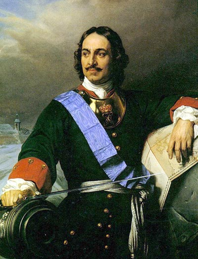
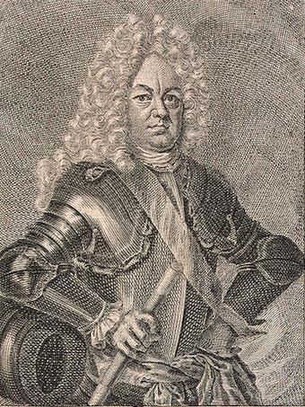
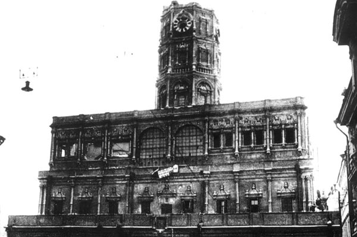
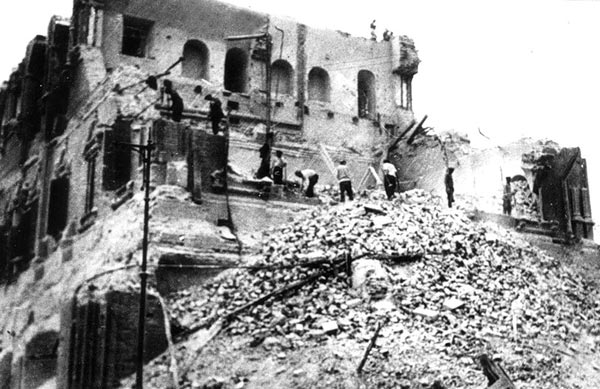
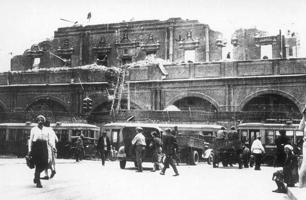
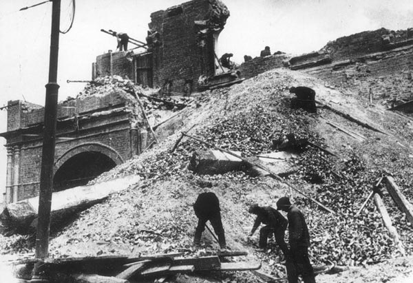
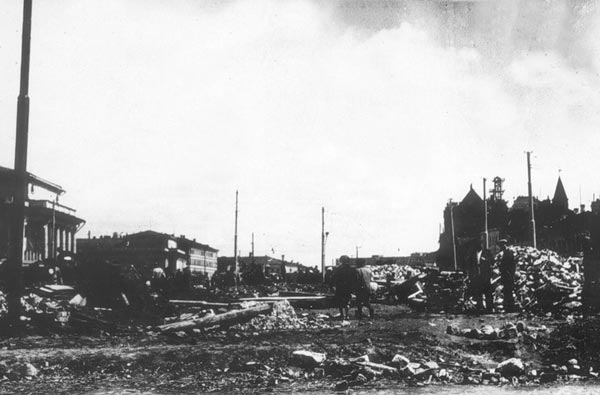

# Масоны, братство вольных каменщиков
> Время выхода в эфир: 04 НОЯБРЯ 2009, 00:08

Н. АСАДОВА: 00:08 в Москве. У микрофона Наргиз Асадова. Мы действительно начинаем цикл передач «Братья», передачу о масонах. Всё, что вы хотите знать об этом тайном обществе, мы будем об этом говорить. В частности, как масоны повлияли на историю России и всей Европы. И нашим экскурсоводом в мир масонов будет Леонид Александрович Мацих.

Л. МАЦИХ: Добрый вечер.

Н. АСАДОВА: Здравствуйте. Я просто скажу нашим слушателям то, что Леонид Александрович является доктором теологии и филологии. И я знаю, что Вы уделяли довольно долгое время изучению влияния, истории масонов, как они влияли на европейскую цивилизацию. И, когда Вы работали в Америке, даже познакомились с некоторыми масонами и работали в масонских архивах.

Л. МАЦИХ: Да, это правда. Дело в том, что мне всегда было интересно, каким образом идёт цивилизационное соревнование между разными культурами, историческими общностями. И, изучая это дело, я пришёл к выводу, что религия является движущей силой всякой цивилизации. Но с другой стороны, ни одна цивилизация в строго предписанным рамкам не идёт. И поскольку европейская цивилизация мне по понятным причинам ближе остальных, я её изучал особенно пристально и я убедился в том, какое огромное влияние масонская идеология, практика, масонские идеалы и их воплощение имели на ту цивилизацию, в рамках которой мы все живём.

Н. АСАДОВА: Когда мы готовились к передаче, мы поняли, что ничего не знаем про масонов. И свидетельством тому может служить опрос, который провёл Алексей Дурново на улицах Москвы.

А. ДУРНОВО: Получается, как у Довлатова – «имя Лев мне определённо знакомо, фамилию Каценеленбоген слышу впервые». Вот и с масонами так. Слово-то вроде где-то встречалось, но где, когда и что оно значит – совершенно неясно. Так что, едва я произносил этот загадочный термин, как люди разевали рты и пожимали плечами. Так Ольга о масонах знает две вещи. Первая – они как-то связаны с религией, второе – живот они в основном в Штатах.

ОЛЬГА: Одно из религиозных ответвлений. В основном распространение у них в Америке. Там достаточно давно и до сих пор они развиваются.

А. ДУРНОВО: Михаил Иванович о масонах ничего никогда не слышал. Однако, упоминание этого слова почему-то заставило его задуматься о жизни и смерти.

МАХАИЛ ИВАНОВИЧ: Что они из себя представляют, какую они ведут политику – это философское дело. Действительно, есть ли жизнь после смерти или нет, это трудно говорить. Этого никто не знает.

А. ДУРНОВО: Виталий о масонах когда-то слышал. Помнит, что они как-то связаны с ложами и вольными каменщиками. К числу членов общества он отнёс известного российского актёра и не менее известного градоначальника.

ВИТАЛИЙ: Вольные каменщики, куда они денутся, конечно есть! А вот о новых я не слышал ничего. Имён много. Смотря какое ложе конкретно. Ширвиндт, Лужков тоже.

А. ДУРНОВО: Алексей про масонов помнит, по его мнению, их история уходит корнями далеко в средние века. Всё начиналось, уверен Алексей, с крестоносцев, Ланкастеров и Йорков.

АЛЕКСЕЙ: Свободные каменщики, последователи Розенкрейцеров. Это было течение Ордена Белой и Красной розы, которые изначально основывали крестовые походы в Иерусалим за гробом Господним.

А. ДУРНОВО: Николай уверен, что масоны вынашивали и вынашивают до сих пор какие-то заговоры, что-то о повелителях всего мира и недобрых замыслов.

НИКОЛАЙ: Это организация, которая была основана на рубеже XVIII, XIX века с целью править миром. Я думаю, что в общественном смысле это со знаком минус, это относится, как писал Карл Маркс, к заговору богатых.

А. ДУРНОВО: О недобрых замыслах говорил и Николай Леонтьевич. Он уверен, что ещё каких-то полтора десятка лет назад масоны правили Россией и делали что-то недоброе. Однако, у Николая Леонтьевича есть надежда, что сейчас общество не решает никаких судьбоносных вопросов.

НИКОЛАЙ ЛЕОНТЬЕВИЧ: Я полагаю, что это ложа в настоящее время малоспособна. Раньше, лет 15-20 назад, они много наделала и в нашей стране. А сейчас, я думаю, что они отстранены от руководства.

А. ДУРНОВО: Лучше всех о масонах осведомлён Зураб. Относится он к ним в общем хорошо. Однако, ему не даёт покоя то, что их общество овеяно тайной. Если оно приносит людям пользу, — думает он, — то зачем его члены скрываются ото всех?

ЗУРАБ: Отрицательные ассоциации – это заговоры, секреты, закулиса мировая. А положительное то, что очень много достойных людей было в их списке. Почти все президенты США, из наших, из Временного правительства очень многие были масонами. Слышал о том, что и Чубайс в третьей ложе, главный масон России, типа того. Меня единственное что смущает – любое общество, которое тайное, меня смущает. Если они делают что-то хорошее, я хотел бы это знать. Если бы только хорошее они делали, то какой смысл себя скрывать и скрывать, кто входит в их список, кто нет?

А. ДУРНОВО: В общем, до вольных каменщиков людям дела нет. Тайное общество оказалось таким тайным, что имя его людям почти ничего не говорит.

Н. АСАДОВА: Вот. Это был Алексей Дурново и московская улица, которая, как выяснилось, ничего не знает про масонов. У меня тоже такой вопрос всегда возникал. Если они так много добра приносят миру и так много среди них известных, влиятельных фигур, то зачем скрываться?

Л. МАЦИХ: Во-первых, хотел бы заступиться за московскую улицу. По-моему, весьма изрядно, как раньше говорили в гимназиях, оценивая успешных учеников. Вполне нормально! А Михаил Иванович меня просто потряс! Вот – о жизни и смерти. Он был, по-моему, ближе всех к истине. На самом деле масоны влияли на политику, но не так непосредственно, как думает кто-то из слушателей передачи. А насчёт тайн – это очень и очень всё преувеличено.

Если бы организация была такой таинственной, как это принято считать, то они бы ничего из своей деятельности не публиковали бы. Но это совсем не так. О масонах только на английском языке опубликовано больше 60 тысяч разных источников. Это только исследовательские работы. Архивы почти всех крупных лож давно опубликованы на разных языках, они переведены, в открытом доступе.

Каждый, кто хочет заняться историей масонства, он вполне это может сделать. Нет никаких таких особо скрываемых моментов. Есть обычный момент любой корпоративной конфиденциальности. За исключением каких-то вещей, касающихся масонской доктрины. Но тут надо понять, что такое тайна. Ведь когда происходит некий ритуал, а масонство стоит на ритуале, то его подлинный смысл, этого ритуала, может быть понятен только тому, кто внутри ритуала находится и кто себя с ним полностью отождествляет.

Представьте себе – вы смотрите спектакль на иностранном языке, и все те страсти, которые там происходят, они вас, разумеется, не трогают. Или вы зашли в храм иной религии, вы понимаете, что это храм, но что происходит там, богослужение или это проповедь. Или момент публичного общения людей между собой, это вам не ясно. Масоны всегда говорили так, что объяснить законы природы по-настоящему можно только тому, кто внутри изучения законов природы находится.

Например, физику, химику, ботанику. А человеку извне это объяснить довольно тяжело. И они никогда к этому особенно и не стремились. Не оттого, что скрывали какие-то злобные замыслы, а потому что понять, что происходит, можно находясь только внутри.

Н. АСАДОВА: «Вот! Настоящая ночная тема!» — пишет нам Аня. Что подтверждает нашу мысль о том, что нас сейчас как раз смотрят не братья, а сёстры, потому что все братья смотрят матч ЦСКА – Манчестер.

Л. МАЦИХ: Ну, надеюсь, что хоть какая-то малая часть братьев отвлеклась. Там уже дело сделано. Но и братьям, и сестрам посылаем наш привет.

Н. АСАДОВА: Давайте уже ближе к Москве, к России. Когда появились в России масоны?

Л. МАЦИХ: Тут надо, Наргиз, уточнить одну дефиницию. Дело в том, что масоны, как организация, организация очень формальная, строгая и официальная. И если ложа возникает, она должна получать определённые верительные грамоты, некие документы, которые свидетельствовали бы её легитимности. Тогда ложа называется регулярной, она входит в юрисдикцию Великой Ложи Англии. Такой порядок.

Н. АСАДОВА: Надо сказать нашим слушателям, что Великая Ложа Англии была создана в 1717 году.

Л. МАЦИХ: Да, это правда. Это правда. Все остальные ложи они в статусе самопровозглашённых. Ну и отношение к ним соответствующее. Поэтому с этой точки зрения первое упоминание о масонстве российском в 1731 году. Тогда некий Джон Филипс был назначен как бы надзирателем в хорошем смысле этого слова, над российскими масонами. Потом позже, в 1740 году, адмирал Джеймс, или как его в России называли, Яков Кейт, он тут учредил ложу вполне официальную.

Но масонская идеология, практика, протомасонские организации начались гораздо раньше. И, как большинство преобразований в западном духе, они начались при Петре Великом.

Н. АСАДОВА: Я лишь хотела напомнить нашим слушателям номер нашего телефона для смс, чтобы они писали нам какие-то вопросы по поводу масонов — +7-985-970-45-45. Как мы выяснили, масоны в России появились вместе с Петром I. Я так понимаю, что это всё пришло к нам сюда после Великого Посольства, когда Пётр отправился на Запад.

Л. МАЦИХ: Ну, и так, и не так. Есть учёные, по этому поводу есть целая полемика между разными научными школами. За недостатком времени я её обзор сокращу. Скажу только, что есть исследователи, которые говорят, что в немецкой слободе, которая тогда называлась Немецкая или Кукуева слобода, а потом стала называться Лефортова, по имени Франца Лефорта, любимца Петра Великого.

Там, вполне возможно, существовали такие цеховые организации или гильдии, которые тоже являлись некими прототипами масонских лож. И это потом облегчило проникновение масонской идеологии в собственном её виде. Великое Посольство, конечно, было переломным моментом, когда в 1696 году отправился Пётр не только в Голландию, а и по всей Европе. Он же хотел поднять новый крестовый поход, объединить всех христиан против басурман, с тем, чтобы Россия завоевала Стамбул и сделала её Константинополем.

Но не нашёл он отклика у европейских владык. Из всех европейских стран более всего его потрясла Голландия. И он влюбился в неё абсолютно на всю жизнь. Любимое своё место, детище своё, он называл Санкт-Петербург – Новый Амстердам, он же Новый Парадиз, Новый Рай. А в самом этом Новом Раю было любимейшее место его, единственный рукотворный остров в Петербурге, который он называл Новая Голландия. Тут комментарии излишне. Но у него в спутниках, у Петра Великого, помимо Лефорта, Головина и других людей, был человек, который очень повлиял и на самого Петра, и на внедрение масонских идей в Россию, и без преувеличения, на всю российскую историю. Это Яков Вилимович Брюс.

Н. АСАДОВА: Мы о нём будем подробно говорить в этой передаче. Я, например, слышала такие слухи о том, что и сам Пётр был масонов, и Лефорт был масоном.

Л. МАЦИХ: Это не более, чем слухи. Если отделять мух от котлет или зёрна от плевел, слухи от проверенной информации, агнцев от козлищ, в общем, производить процесс разделения, то не подтверждается документально ни членство Франца Лефорта, ни членство Петра Великого в масонской ложе.

Н. АСАДОВА: А членство Якова Брюса?

Л. МАЦИХ: Да. Членство Якова Брюса – совершенно другая история. Если говорить подробнее, то лучше это отложить. С Петром какая была история… Его в Англию позвал сам король Вильгельм III. Но он поехал туда неохотно, ему не нравилась такая чопорная церемонная Англия, а весёлая, бесшабашная, разудалая Голландия нравилась ему куда больше.

Н. АСАДОВА: Да, кстати говоря, сохранились воспоминания и описи тех зданий, комнат, в которых побывал в Англии Пётр. Он оставлял абсолютно разгромленные дворцы после себя, которые представляли ему его родственники.

Л. МАЦИХ: А это ваш Лефорт, это всё он. Его не зря называли «дебошан французский». Он был великий мастер организаций разных увеселений. Сейчас бы ему цены не было на корпоративных вечеринках. У него всё живое веселилось. И иной раз, пишут, по трое суток народ там не просыхал. Лефорт никаких других функций и не мог выполнять. Это была единственная его задача – быть увеселителем Петра. Хотя формально он посольство возглавлял. А Пётр соблюдал инкогнито и был под именем Петра Михайлова, бомбардира и волонтёра.

Брюс был иным человеком, иного духа. И он поехал учиться. Ему Англия понравилась больше Голландии. Брус был шотландского царского рода.

Н. АСАДОВА: Если говорить о том, что нам известно об Якове Брюса, то в основном это какие-то… его считают самым главным московским чародеем в московском фольклоре. Говорят о том, что он летал на метле, о том, что он по тайному ходу пробирался из Сухаревой башни к своему дому в Мещанской слободе. Говорят о том, что он был чернокнижником, естественно, и он замуровал свои таинственные книги, которые показывали, где золото спрятано, предсказывали просто все войны, события и катастрофы. Эти книги были замурованы в Сухаревской башни.

Мы подходим плавно к этой башне, о которой мы делали опрос на веб-странице, где есть блог нашей передачи «Братья». И в частности, у нас там была небольшая викторина. Мы выложили несколько фотографий окрестностей Сухаревской площади, то, что сейчас мы можем там видеть. И было предложено угадать, в каком месте раньше была Сухарева башня. И надо сказать, что…

Л. МАЦИХ: Угадали?

Н. АСАДОВА: Угадали, да! И главное, что мне очень понравилось, что отвечали в основном люди молодые, т.е. я сейчас объявлю победителей наших.

Л. МАЦИХ: Это здорово.

Н. АСАДОВА: Пименов Павел, Москва, 33 года, телефон начинается на 767, московский телефон. Петренко Денис, Брянск, 36 лет, телефон начинается на 905-177, Антон Воронцов, Москва, 26 лет, телефон начинается на 910-450, четвёртый наш победитель Андрей Колычев из Санкт-Петербурга, менеджер, 35 лет, телефон начинается на 921-955, пятый наш победитель, мы обещали, что пять первый правильно ответивших получат книжку про храмы, Алексей Грек, Самара, 26 лет, телефон начинается на 927-261. Вы все получите свои призы за правильные ответы.

Следующий вопрос к следующей передаче вы можете увидеть на сайте завтра. Мы приглашаем вас участвовать в обсуждении, задавайте вопросы, отвечайте, получайте призы.

Л. МАЦИХ: Очень радует меня, что среди правильно ответивших не только московские люди. Это здорово. Это действительно хорошо.

Н. АСАДОВА: Да, то есть, масонами интересуются не только в Москве и Санкт-Петербурге.

Л. МАЦИХ: Весьма похвально.

Н. АСАДОВА: Вернёмся к Сухаревой башне. Когда она была построена, кем и зачем.

Л. МАЦИХ: Я бы с Вашего разрешения, исключительно из академического занудства поправил бы. Брюс летал не на метле. Метла – это женское орудие, это скорее для сестёр. Ему приписывались полёты на печной трубе или на подзорной трубе.

Н. АСАДОВА: На крыльях железных ещё.

Л. МАЦИХ: И на крыльях железных, на драконах, на железных бабах, он на всём был мастер летать! Но если эту всю чепуховину, плод народных фантазий, отбросить, судьба Брюса и судьба Сухаревой башни, места, где он работал, очень характерно для судьбы всего масонства. То есть, в народном сознании научный подвиг Брюса, а мы скажем о том, сколь много он сделал и в каком большом числе областей был пионером в российской науке, а вот в народной памяти он отобразился только как чародей, как летающий на метле или на печной трубе, как разговаривающий с чёртом. Это очень характерный момент.

Тут надо отделить серьёзно зёрна от плевел для того, чтобы нам стала понятна масштабность личности Якова Брюса, как соратника и советчика Петра, как идеолога петровских реформ. И чтобы мы чётко понимали, что в простом, обыденном, обывательском сознании всё то, что непонятно, принимает вид чего-то зловредного.

Н. АСАДОВА: Но прежде чем Вы это расскажете, давайте послушаем, что нам известно из школьных учебников об Якове Брюсе. Алексей Дурново подготовил портрет нашего героя Якова Брюса.

А. ДУРНОВО: Кажется странным, что такой человек, как Яков Брюс мог иметь отношение к чему-то, кроме войны и политики. Ведь в учебниках истории, пусть это звучит и странно, он значится главным образом, как сподвижник Ветра Великого, крупный военный начальник и политический деятель. Действительно, Брюс сделал блестящую карьеру при российском дворе, всех его титулов, чинов, званий и достижений не перечислить. Можно назвать лишь основные из них. Во-первых – человек фактически создавший артиллерийские войска российской армии.

Именно он командовал батареями в знаменитой Полтавской битве. Ещё был Орден Андрея Первозванного, титул графа, должность сенатора и руководителя Берг-коллегии и Мануфактур-коллегии, т.е. едва ли ни всей отечественной промышленности. А ещё чин генерал-фельдмаршала. Прямо скажем, при Петре Брюсу во всём сопутствовала удача, а несчастья обходили стороной. И даже когда он попал под обвинение в хищении из казны, то бишь был назвал расхитителем государственной собственности, никакого серьёзного наказания не последовало. Брюса освободили по личному приказу Петра.

И всё же, самое интересное началось именно после смерти царя-императора, когда уже немолодой Брюс вышел в отставку и посветил себя любимому делу – науке. Тут-то и выяснилось, что этот человек не только полководец и политик, но и один из самых образованных людей своего времени. В каких только науках он себя ни пробовал! И в астрономии, и в географии, и в лингвистике. Свободно говорил на шести языках, создал первую в Россию обсерваторию, а позднее начертил подробную карту Москвы и окрестных земель до самой Азии. И естественно, народ всю эту деятельность Брюса связывал с присутствием каких-то потусторонних сил.

Потому что давно известно, что если кто-то слишком умный и успешный, то значит тут не без нечистой силы. А потому в народе Брюса называли и чернокнижником, и колдуном, и посланцем мира иного. Это всё, конечно, домыслы, но личность Брюса действительно была довеяна тайной. И неслучайно он считается одной из самых загадочных фигур в российской истории. И возможно именно поэтому его причисляют к масонам, причём, к самым высокопоставленных из них, тем, кто посвящён во все дела общества, открыл великую тайну и обрёл страшное могущество.

Н. АСАДОВА: Так вот, это была история или портрет о первом масоне в России Якове Брюсе. Всё-таки странно, посмотрите, мальчишка, который родился в семье, кстати говоря, потомков шотландских королей, но тем не менее, он родился в немецкой слободе.

Л. МАЦИХ: По одним сведениям в немецкой слободе в Москве, по другим – во Пскове, где тогда стоял полк его отца.

Н. АСАДОВА: Да. И отец его достаточно рано умер.

Л. МАЦИХ: В 1680 году.

Н. АСАДОВА: И он участвовал в различных военных походах, ещё при князе Голицыне. По некоторым сведениям он был записан в Потешные войска Петра I.

Л. МАЦИХ: Не подтверждаются эти сведения. Противоречивая его биографии я.

Н. АСАДОВА: Ну откуда такие знания, которые опережали очень сильно его время?

Л. МАЦИХ: Таких знаний, я думаю, было немного. Давайте с самого начала. Он действительно из королевского рода. И брат его Роман, старший, сделал блестящую карьеру. Он был первым обер-комендантом Петропавловской крепости в Петербурге, перестроил её из земляной в каменную, там он и похоронен. Тоже был по-своему выдающийся человек, хороший полководец, хозяйственник. Практически руководил всем Петербургом, поскольку генерал-губернатор Меньшиков всё время был в отлучках.

Но слава о Романе померкла в лучах славы его младшего брата Якова. Во-первых, он был гений, надо это со всей очевидностью признать. Во-вторых, он из дому, видимо, вынес замечательное образование. Он говорил, будучи ещё подростком, на трёх языках свободно – на немецком, английском и русском. И, видимо, в доме полковника Тейнерда, к которому он поступил на воспитание после смерти отца, видимо там ему преподали и латынь. А латынь была ключом к тогдашней учёности.

Кроме того, у него было качество, которое отличает подлинного гения. Он умел учиться. И он всю жизнь неустанно учился. Давайте вернёмся чуть-чуть назад, к Посольству Великому. Когда Брюс попал в Англию, его, как потомка шотландских королей, приняли самые высокопоставленные люди. И парадоксальным образом он выступал в качестве протектора. Пётр ждал его месяц, пока тот прибудет в Амстердам, беспрецедентный случай, никогда Пётр никого не ждал.

А во-вторых, он был гораздо больше, чем просто переводчик или толмач. Он был человеком, который ввёл Петра в общество властителей дум английских. И там Петра приняли два самых великих человека той эпохи. Они оба являлись масонами высокопоставленными – это сэр Кристофер Рен, великий архитектор, строитель собора Святого Павла в Лондоне и сэр Исаак Ньютон, который не нуждается в дополнительных комментариях. Но Пётр на них не произвёл большого впечатления.

Н. АСАДОВА: Но он спрашивал, насколько я читала и Вы мне рассказывали, спрашивал у Исаака Ньютона, как вытащить Россию из пропасти.

Л. МАЦИХ: Он – это Брюс.

Н. АСАДОВА: Нет, он – это Пётр.

Л. МАЦИХ: Нет. Об этом нет документальных известий, как нет известий о том, что Пётр был посвящён в масонство. Есть антимасонская мифология, а есть масонская. По масонской мифологии Кристофер Рен Петра в масоны посвятил. Но документальных свидетельств нет ни одного. Может быть мы пока их не знаем, они дремлют в архивах и дожидаются своего часа. Но пока их в обиходе, в обороте научном, нет.

А вот Брюс был, поскольку он из шотландских королей, значит он автоматически тамплиер. Поскольку шотландские короли из рода Брюсов, они не все автоматически были тамплиерами и последователями ложи Святого Андрея, покровителя Шотландии. Кстати, Андреевская символика, которая с Петра начинается, Андреевский флаг, который потрясающе похож на флаг Шотландии, Орден Андрея Первозванного, первым кавалером был Брюс, и вообще наличие Святого Андрея в русской геральдике, символике и в русском обиходе – это начинается как раз после Великого Посольства. И это, разумеется, не простое совпадение.

Россию не то чтобы вытащить из пропасти, осуществить реформы – об этом шла речь. Об этом спрашивал Брюс, Пётр не говорил ни на одном языке, не умел ни ступить, ни молвить, этикет никогда не был его сильной стороной, а Англия – страна чопорная. А Брюс этими всеми навыками очень обладал. И с ним говорили, может быть, не на равных, но как с очень способным и перспективным учеником, и Рен, и Ньютон. Согласно какому-то кругу источников, Брюс спросил у Ньютона, возможно ли осуществить реформы, о которых думает молодой государь.

И Ньютон сказал тогда свою знаменитую фразу: «Да, это возможно». И сказал, что начинать, по его, ньютонову, времени, надо с двух вещей. Это будут два архимедовых рычага, которые смогут Россию вытащить – это деньги и церковь.

Н. АСАДОВА: Об этом мы поговорим в будущих передачах, где мы будем говорить о том, как масонские идеи, практики, как они оказали влияние на то, что происходило в России в разные века, начиная с Петра. А сейчас я хотела бы вернуться к Сухаревой башне. Ведь она была построена при Петре в 1692 по 1695 гг.

Л. МАЦИХ: Михаил Иванович Чоглоков, был такой архитектор, тогда очень модный.

Н. АСАДОВА: Почему мы о ней говорим? Потому что это было первое светское учебное заведение в Москве и оно очень связано с Брюсом, с Лефортом. И там заседало Нептуново общество, которое многие причисляют к протоложе.

Л. МАЦИХ: Тут давайте наведём некоторый порядок. Занудная моя сущность требует навести некоторый структурный порядок. Когда башню строили, она строилась, как всякая башня, с многообразными функциями. Она могла и оборонительные функции выполнять, могла быть и складом, она ведь не просто так возникла, это бойкое было место, это дорога на Ярославль, на Сергиев Посад, торговый люд там был, таможенная граница Москвы.

Там когда-то был земляной вал, т.н. Скородом. В общем, это место не случайное. Место было бойкое, хотя уже оборонительного значения она такого не имела. Она очень выделялась, эта башня, на фоне патриархальной архитектуры Москвы тогдашней, где только Кремль башнями был представлен. И Чоглоков, видимо, с самого начала, поскольку он строил по прямому указанию Петра, он её предназначал для учебного заведения. Но знал ли он сам, и знал ли сам Пётр Великий тогда о том, какого рода заведение будет, это большой вопрос. Да, Наргиз, Вы абсолютно правы, там образовалось первое специализированное светское учебное заведение в России. Это был абсолютный прорыв цивилизационный. Это надо со всей определённостью сказать. Навигацкая школа.

Н. АСАДОВА: И мы опять попросили нашего корреспондента Алексея Дурново выйти на московскую улицу, в этот раз мы его отправили на Сухаревскую площадь…

Л. МАЦИХ: Разумно!

Н. АСАДОВА: …чтобы спросить у прохожих, что они знают о Сухаревской башне.

А. ДУРНОВО: Сухаревской башни нет уже давно, но местные жители про неё помнят. Не все, конечно. Многие и вовсе не подозревали, что здесь когда-то могло находиться что-то, кроме шоссе, по которому едут автомобили, выстраиваясь в привычную столичную пробку. Однако, что бросилось в глаза – образ башни людям пришёлся по вкусу. Посмотрев на рисунок, они не жалели эпитетов для того, чтобы похвалить это произведение архитектуры. Екатерине башня понравилась просто потому, что она похожа на памятник старины. А вот Абдурасум Рахимович, едва увидев башню, загорелся желанием восстановить её, чтобы сохранить память о предках.

АБДУРАСУМ РАХИМОВИЧ: Восстановить исторические эти… обязательно надо. Это предки наши старались для нас, для будущего. Мы должны стараться для предков, чтобы их все помнили.

А. ДУРНОВО: О самой башне людям известно немного. Юрий помнит причину, по которой её снесли. Однако, он уверен, что на пересечении Сретенки и Садового кольца не стоит вешать доску с напоминанием о башне.

ЮРИЙ: Сухаревскую башню снесли году в 31-ом, она мешала движению на площади Колхозной тогда. Я не знаю, что это даст, вряд ли это вернёт эту башню или кто-то о чём-то будет думать. Не уверен, что она что-то изменит.

А. ДУРНОВО: Марина Петровна помнит, что в царские времена в башне обучались гардемарины. Она полагает, что это архитектурное сооружение нужно восстановить. Столичному движению это всё равно не повредит.

МАРИНА ПЕТРОВНА: Там была школа гардемаринов. Я за старину. Так что сейчас творится – это вообще безобразие, а не Москва. По-моему, сегодняшнему движению ничто не помешает. Как стояли, так стоять и будут.

А. ДУРНОВО: А вот Александр Алексеевич с историей башни хорошо знаком. Он даже помнит, кто такой Сухарев, имя которого носило здание.

АЛЕКСАНДР АЛЕКСЕЕВИЧ: По-моему, при Петре построено. Там было военно-морское училище. Сухарев был руководителем стрельцов, которые поддержали Петра. Это как бы в честь него. А снесли его в 32-ом, она мешала коммунистам.

А. ДУРНОВО: Настоящим знатоком оказался археолог Александр. Он прекрасно знаком с историей Сухаревской площади, известна ему и тайна, которую то ли хранил, то ли нет, один из самых известных обитателей башни.

АЛЕКСАНД: Насколько я знаю, одно время в этой башне жил, его по-разному называют, одни называют его масоном, другие алхимиком, третьи просто авантюристом – Яков Брюс, личность достаточно неоднозначная. В Москве в то время ходили слухи о том, что Брюс связан с чёрной силой, обладает какой-то магической книгой. Считалось, что обладатель этой книги получает неограниченную власть над всем.

А. ДУРНОВО: И всё же Сухаревская башня всем пришлась по вкусу. Жаль только, что люди оценили не настоящее здание, которого нет уже более 70 лет, а лишь его образ с картинки. Впрочем, никто из них не отказался бы, если бы городская администрация вдруг решила бы восстановить этот памятник архитектуры.

Н. АСАДОВА: Да, и мы тоже на сайте ставили опрос. Считаете ли вы, что нужно восстановить Сухареву башню. Результаты получились такие – 65,3% зашедших к нам на сайт и проголосовавших, ответили, что да.

Л. МАЦИХ: Браво!

Н. АСАДОВА: И 27,4% сказали, что нет, не стоит. Кстати говоря, люди комментировали это на сайте нашем, на форуме, и говорили о том, что… я даже процитирую: «Отвечаю нет. Восстановленная башня будет новоделом, как обком Христа Спасителя. Надо сохранять то, что есть, а не отстраивать заново утраченное. Прошу понять меня правильно. Башню безумно жаль». Да, безумно жаль башню. Кстати говоря, о ней упоминается в русской классической литературе и в поэзии.

Л. МАЦИХ: Во множестве. Лермонтов писал про ней, писал очень проникновенно Гиляровский, уже смертельно больной, когда её сносили в 1934 году. Она очень обширна представлена вообще в русском искусстве, не только в литературе. Во-первых, башня была очень красивая. Кроме того, народ называл её не Сухарева башня, а Сухарева барышня, она сравнивалась с красавицей. Её перекрашивали по моде VIII-XIX вв. в разные цвета яркие, красные, жёлтые, зелёные. Это придавало ей сходство с красавицей, которая платья меняет.

Она издали была как бы маяком для людей, идущих в Москву. Ну, не говоря уже о её морской славе. Да, там была Навигатская математическая школа. Это кузница кадров для славного русского флота. Там готовились русские военные инженеры, картографы, штурманы, капитаны. Как можно об этом забыть!

Н. АСАДОВА: Там работал Брюс.

Л. МАЦИХ: Он не преподавал в Школе, но он оборудовал там для себя библиотеку, научный кабинет и построил обсерваторию, первую в Москве и в России. Оттуда начиналась русская школа астрономии. Это место наиславнейшее. Я не вижу большой беды, если это будет новодел.

Н. АСАДОВА: Надо же сказать, что её разрушили в 1934 году по указу Сталина. Причём, тоже А.А. Венедиктов приводил в нашем форуме пример переписки Кагановича со Сталиным, Каганович выступал против того, чтобы Сухареву башню снесли. Но Сталин был непреклонен. И буквально я процитирую, что он написал в письме. «Письмо с предложением не разрушать Сухареву башню получил. Решение о разрушении башни было принято в своё время правительством. Лично считаю это решение правильным, полагая, что советские люди сумеют создать более величественные и достопамятные образцы архитектурного творчества.

Надо сказать, когда её разобрали, мы обязательно опубликуем на нашем сайте фотографии 1934 года, когда эту башню разбирали. Они потрясают…

Л. МАЦИХ: Снимки Вы имеете в виду?

Н. АСАДОВА: Да. Очень больно на это смотреть. Знаете, обыденная жизнь идёт вокруг. На заднем фоне разбирают по кирпичикам башню, которая была построена при Петре, а мимо идёт женщина с авоськой.

Л. МАЦИХ: Когда сносили Храм Христа Спасителя, чей снос должен был бы вызвать куда больший резонанс в сердцах людей, тоже жизнь не останавливалась.

Н. АСАДОВА: Разные есть мнения на сайте. Некоторые говорят, что действительно очень красивая башня и что если бы её восстановили, это никому бы не помешало. Если говорить, где она была расположена, тот вопрос, который мы задавали в нашей викторине, на фотографии изображён часть сквера. Конечно, она занимала большую площадь и частично находилась на том месте, где сейчас Садовое кольцо.

Но её ступени, гульбище, заканчивались там, где сейчас начинается метро.

Л. МАЦИХ: Я скажу супер-причину, по которой башню нужно восстановить. Дело в том, что народ называл её красавицей-барышней и невестой Ивана Великого. Был такой поэт в середине XIX века Михаил Дмитриев, не первого ряда, но знаменитый в своё время поэт. Он писал, я цитирую близко к тексту: «Народ наш добряк, любит весёлую шутку. Вот говорят, Иван наш Великий надумал жениться. И за себя, слышно, красавицу-башню берёт». Получается, Иван теперь соломенный вдовец? Надо обязательно вернуть ему невесту.

Н. АСАДОВА: А я предлагаю сейчас нам тоже проголосовать. Считаете ли вы, что Сухареву башню нужно восстановить?

Л. МАЦИХ: Я именно так и считаю.

Н. АСАДОВА: Да. Вы – да, мы уже поняли Ваше мнение. Я хочу спросить наших слушателей. Если вы считаете, что да, то ваш телефон 660-06-64, если нет, не нужно делать эти новоделы, никакая Сухарева башня не нужна – 660-06-65.

НАЧАЛСЯ ПОДСЧЁТ ВАШИХ ГОЛОСОВ

Н. АСАДОВА: Пока идёт наше голосование про Сухареву башню, давайте вернёмся к Якову Брюсу, к Нептунову обществу, о том, что происходило в этой башне.

Л. МАЦИХ: В башне шёл учебный процесс, говоря современным языком. Её приспособили к нуждам беспрецедентного и нового для России учебного заведения. Там преподавал протеже Брюса, его соотечественник Эндрю Фархварсон, математик, там были английские навигаторы, там был Леонтий Магницкий, составитель знаменитой арифметики, которую называл Ломоносов вратами учёности. Там учились всякие юноши, парни, мальчики разных возрастов и способностей, что очень важно – разных сословий, вот в чём ещё была принципиальная новизна этой башни и в чём, несомненно, усматривается масонское влияние с идеей равенства. Там работал Брюс.

Насчёт чернокнижия, всяких полётов на трубе и на прочих подсобных инструментах, у того же Дмитриева, чей прах мы сегодня уже потревожили, есть замечательные строки по этому поводу. Я процитирую близко к тексту. «Старый народ, как младенец, любит чудесные сказки. Тут говорят старики, жил колдун-чернокнижник, доныне все целы книги его, но закладены в башне. Добрые люди, не верьте! Тут прадеды ваши учились, как по морскому пути громоносные править громады».

Н. АСАДОВА: То есть, ничего тайного….

Л. МАЦИХ: Ничего тайного не было. Как замечательно сказал один из слушателей наших – это было военно-морское училище. Просто названное навигатской школой в духе того времени. И никаких там ужасных тайн не имелось. Но такова судьба Брюса и всех новых знаний, что они навлекают на себя подозрение в чём-то мрачном и потустороннем. Вообще, для масонов тема дьявола интересна. Они ведь дьявола не признавали и в него не верили. Но парадоксальным образом их более всего как раз подозревали в связях с этим самым дьяволом, существование которого они отрицали.

Н. АСАДОВА: Я повторю вопрос для голосования. [Повтор вопроса и номеров телефонов]. Голосование продолжается, оно будет идти ещё буквально одну минуту. Если вам есть, что сказать по этому поводу – пожалуйста, звоните и проголосуйте. Вы знаете, ведь Яков Брюс действительно оказал большое влияние на то, что происходило в России. В частности, он, как уже было сказано в «Портрете», который нам делала Алексей Дурново, он занимался усовершенствованием российской артиллерии. И насколько я помню, он даже работал над металлом для пушек, чтобы пушки не так быстро нагревались и чтобы они эффективней работали. То есть то, что очень нужно было Петру, он всячески поощрял.

Л. МАЦИХ: Для барышни потрясающие познания в артиллерийском деле. Виват! – сказали бы гардемарины. Он действительно этим занимался. И не только этим. Вообще, он же был пионером в целом ряде областей. Он и порох усовершенствовал, он готовил для пушек новые сплавы, пушки лили из меди, не совсем из меди, скорее из бронзового сплава и из чугуна. Что такое Берг-коллегия, которую он возглавлял? Это горная коллегия. Он практически первый наладил в России разведку и добычу полезных ископаемых.

Для артиллерии он был просто крёстным отцом. Он командовал артиллерией при Полтаве, 72 орудия, и внёс огромный вклад в победу над Карлом XII в 1709 году и именно за это он был удостоен ордена Андрея Первозванного. Для артиллерии он сделал очень много, как, пожалуй, никто ни до, ни после. Он был пионер этого дела.

Н. АСАДОВА: Говоря об учёности Якова Брюса, можно провести такой пример, когда он умер, а умер он уже задолго после смерти Петра I, он удалился в своё имение и там умер. Кстати, он там врачеванием занимался, помогал крестьянам из соседних деревень, в частности, да? Правильно? Вы так улыбаетесь…

Л. МАЦИХ: Одни говорят, что он вредил крестьянам, урожай портил, девок превращал в растения, а другие говорят, что наоборот, врачевал. Я думаю, что ему было по большому счёту всё равно. Он ничего не делал для опровержения легенд, которые о нём складывались. Наоборот, он над этим любил посмеяться и народное легковерие высмеять.

Н. АСАДОВА: После его смерти в его кабинете произвели опись имущества и что нашли… Я цитирую: «Зеркало кругловитое, небольшое, в котором кажется большое лицо. Гриб каменный, тыква индейская, кость мамонтовой головы, янтари, в которых есть мушки. Коробочка с маленькой натуральной змейкой. И вообще, надо сказать, что его коллекция пополнила Кунсткамеру.

Л. МАЦИХ: Да, он завещал. Здесь был любопытный эпизод, по его же поводу всегда ходили легенды. На рубеже XIX века некий замечательный человек, который укрылся за дивным псевдонимом Григорий Книголюбов, крестьянин села Завидово, он опубликовал роспись книг, которые, якобы, по его мнению, были закладены в Сухареву башню из библиотеки Брюса. Откуда он их видел? Не выдумки ли? Он там любопытнейшие книги приводит.

Всякие там шестокрылы, воронограи, остромии, альманах, книга сохранялась от потопа Ноева на морском дне, на горючем камне Алатыре. Вот так!

Н. АСАДОВА: Но если вернуться к описи, то там были достаточно загадочные книги, например, «Философия и мистика» на немецком языке или «Небо новое» на русском языке. И ещё там была найдена некая древняя книга, состоящая из семи деревянных дощечек с неизвестными письменами.

Л. МАЦИХ: Он не чурался оккультных знаний, и помимо огромной библиотеки, кстати, если быть точным, а Брюс любил точность, 1579 томов, гигантская библиотека даже по нынешним временам.

Н. АСАДОВА: Сделаем приятное старику Брюсу.

Л. МАЦИХ: И по тем временам просто огромная! И подавляющее большинство – это справочная литература разных сортов. Это математика, физика, артиллерия, фортификация.

Н. АСАДОВА: Он до конца жизни переписывался с Лейбницем.

Л. МАЦИХ: До конца жизни Лейбница переписывался. И с Ньютоном. И они принимали его как равного. То есть, если раньше вероятно он был младший коллега и ученик в чём-то, то потом он стал общепризнанным европейским учёным. Его можно сравнить в этом смысле с Франклином, который тоже был великим масоном. Франклин формально имел два класса образования, а был принят во всех академиях тогдашнего мира. Вот и Брюс своей учёностью заслужил такое же международное мировое признание.

Н. АСАДОВА: Кстати, нас спрашивают на смс-ках, кто из американских президентов были масонами. Насколько я знаю, масонами были 13 американских президентов, включая Джорджа Вашингтона, Рузвельта, Форда и т.д. Но надо сказать, что 9 человек из подписавших Декларацию о независимости американскую, были масонами.

Л. МАЦИХ: И отцы-основатели США почти все были масоны. А самое главное – их мозговой организатор, самый, пожалуй, умный человек, теоретик, человек, который прочертил будущее США – Бенджамин Франклин, он был в таких масонских чинах, что ему любая светская должность была не с руки.

Н. АСАДОВА: Я хочу объявить результаты голосования. Мы спрашивали, нужно ли восстановить Сухареву башню в Москве. 80,3% позвонивших сказали, что да, нужно. И только 19,7% позвонивших нам слушателей сказали, что нет, не нужно восстанавливать, нам не нужен очередной новодел.

Л. МАЦИХ: Великолепная новость! Лучше может быть новость о том, что завтра наша сборная победит с разгромном счётом команду Словении. Я не сомневался в здравом смысле и чувстве ответственности исторической наших слушателей. Разумеется, надо восстановить.

Н. АСАДОВА: Вы знаете, я хочу, у нас закончится передача через пять минут. Я бы хотела принять несколько звонков наших слушателей. Предлагаю вам звонить нам в студию и спрашивать, возможно вас что-то интересует на эту тему. Телефон 363-36-59. А пока я Вам задам вопрос, Леонид Александрович. Скажите, пожалуйста, этот вопрос нам задают наши слушатели по смс-кам. Объясните термин «жидо-масонство». Что это за связка такая?

Л. МАЦИХ: Термин «жидо-масонство», если коротко, впервые внедрил аббат Огюстен Борюэль. Это был иезуит, он жил во времена Французской революции в конце XVIII века. От зверств революции убежал в Англию и там написал «Мемуар по истории якобинства» в четырёх томах. Книга была переведена на все языки мира. И там, по словам одного исследователя, его соотечественника Фористье, «он смешал крупицы истины с Монбланами лжи». Он был основателем т.н. теории заговора. И все ужасы и зверства Французской революции, реально происходившие, объяснял действиями внешних сил. Не просчётами церкви, не глупостью господствующих классов, не чудовищной тиранией и подкупом, которые царили, не дикостью народа и его невежеством, а внешними силами, которые великолепный, прекрасный французский народ развратили.

Он писал, что масоны, о которых он наплёл кучу небылиц, действовали на деньги каких-то мифических еврейских банкиров. Это абсолютно не подтверждается. Еврейские банкиры, как во время всякой революции, были первые жертвы революционных погромов. Но тогда термин такой «иудио-массонские» заговоры, связки, которые хотят разрушить христианство, мировой порядок, разрушить всё течение общественной жизни, этот термин был впервые запущен. Потом его продолжили и огромный вклад в популяризацию этого термина внёс доктор Иозеф Геббельс, который в пропаганде очень понимал.

Он популяризировал термин «жидо-масонство», и с тех пор он на вооружении у всех людей, которые в той или иной степени разделяют нацистскую или фашистскую идеологию.

Н. АСАДОВА: У нас есть звонок. Алло! Здравствуйте! Вы в прямом эфире. Представьтесь, пожалуйста.

СЛУШАТЕЛЬ (по телефону): Здравствуйте! Я Ольга из Ярославля.

Н. АСАДОВА: Очень приятно, что Вы дозвонились до нас. Какой у Вас вопрос, Ольга?

СЛУШАТЕЛЬ (по телефону): А мне тем более приятно. Я хотела бы узнать самое главное – какова именно цель масонства?

Н. АСАДОВА: Спасибо. У нас осталось на ответ полторы минуты.

Л. МАЦИХ: Я уложусь даже в меньшее время. Цель масонства прекрасно формулируется пресловутой масонской триадой, которую, я уверен, все наши слушатели знают – свобода, равенство и братство. Это и есть главная цель масонства в политическом смысле. А в духовном, в мистическом – это самосовершенствование познания божественной истины, познание человеком своей миссии и слияние с божественным абсолютом.

Н. АСАДОВА: Я думаю, что мы не успеем принять ещё звонки, но я обещаю нашим слушателям, что в будущем я постараюсь хотя бы по три звонка в конце передачи принимать. Сейчас я бы хотела объявить о том, что в следующей передаче, которую вы услышите на следующей неделе, в ночь со вторника на среду, мы будем говорить о масонском Питере, о том, как Пётр создавал этот город, о том, какие масонские знаки вы можете видеть на зданиях в Питере и мы так же обещаем вам рассказать о некоторых масонских знаках, которые, кстати, можно встретить довольно часто и на московских зданиях.

А сейчас у нас остаётся одна минута до конца передачи. Я хочу у Вас спросить. Тот знак, который мы разместили как аватар нашей передачи – циркуль и угольник и посередине буковка «Ж», что это значит?

Л. МАЦИХ: Циркуль, угольник и буковка «G», они означают вот что. Буква «G» латинская – got — это бог, творец Вселенной. Циркуль и треугольник с одной стороны инструменты масонского труда, с другой стороны, как всегда у масонов, они означают вещи, гораздо более глубокие, а именно – расположенный снизу угольник – это человеческая мудрость, человеческий разум, который вмещает в себе всю ту сумму информации, которую он способен вместить. Но угольник не может быть раздвинут, он поломается. А циркуль, он очерчивает круг, но он может очертить прямую противоположность круга.

Циркуль – это божественная премудрость. Сочетание угольника и циркуля – это человеческий ум и божественная премудрость. Ум человеческий понимает, божественный разум объемлет.

Н. АСАДОВА: Спасибо. Это была передача «Братья», её провела Наргиз Асадова. И нашим экскурсоводом в мир масонов был Леонид Александрович Мацих. До встречи на следующей неделе.

Л. МАЦИХ: Всего наилучшего!

Сухаревская башня в процессе разборки:

Фото — http://immortal-ru.livejournal.com/3354.html