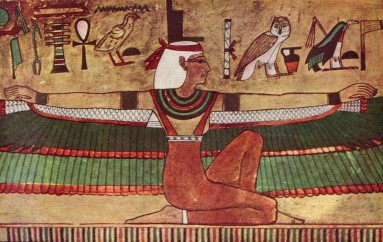

# Пирамида и лабиринт. 

?> Египетские инициации. Изида – непорочная дева Мира. Совлечение покрова Изиды. Корпорация жрецов и иерархия степеней посвящения.

> Мацих: Так, у нас сегодня очередная тема про Изиду – деву Мира и про лабиринт. 

Про пирамиды и лабиринт, как два типа строений, полных всяких тайн, хранителей сокровищ и вместилищ знаний тайных, скрытых, изотерических. И будем говорить о двух традициях – о египетской и греческой, которые частично пересекались одна с другой, заимствовали одна из другой. Обычно считается, что египтяне, мол, на всех влияли, а на них никто. Это оно же не так, конечно. Еще даже до эпохи эллинизма, когда Александр завоевал полмира и внедрил греческую культуру, язык, нравы по всей ойкумене, по всей обитаемой вселенной, еще до этого, конечно, у греков очень многие народы заимствовали и технологические инновации (например, греки были лучшие в мире строители кораблей и мореплаватели), и многие разные другие вещи. И среди технологических новаций, среди вещей, необходимых в повседневной жизни, были, разумеется, и идеи. И заимствование идей шло весьма и весьма широко, в чем мы с вами и убедимся. Кто был в прошлом курсе на лекции про Изиду, я надеюсь, не успели забыть, а кто не был, то те слышали про нее. Это была очень достойная женщина. Она была богиня – это бывает с женщинами. Посмотрим одно из не совсем канонических изображений Изиды. Вы знаете, что в иконографии, в изображении богов, героев, святых есть обычно несколько направлений, и не все жестко канонические. Ну, если мы будем говорить, например, об искусстве христианском, которое нам ближе, скажем так, географически, то там была жестокая борьба по поводу того, какой канон, какой способ изображения на иконах, на картинах, на фресках сделать главным и единственным. Чтоб вы понимали, что такое канон: канон есть «правило» в переводе с греческого. Посмотрите на то, как, например, развивалась жизнь в России, в Советском Союзе, и она, собственно, идет сейчас по той же модели. Всякая форма деятельности должна иметь некий установленный образец. Вот, скажем, театр – должен быть как у Станиславского, все остальное – это не театр, живопись должна быть как в академии, все остальное – это «задница с ушами», как говорил Никита Сергеевич про абстракционистов. В пластических искусствах это должен быть балет, причем балет версальский, как он был в восемнадцатом веке, всякие новые выкрутасы – это все порнография. Музыка должна быть как у композиторов девятнадцатого века, все остальное это издевательство над музыкой, это крики бешеного кабана и все прочее, вопли загнивающего класса. Есть некий канонический образец в любом виде деятельности. Это колоссально сковывает науку, искусство, мысль любую, а это идет из Византии, из православного убеждения, что у всякого искусства и вообще у всякого направления мысли может быть только одно единственно правильное движение, направление. Его нужно определить и уже потом совершенно «непокобелимо» отстаивать, и все поползновения на этот единственно верный канон отвергать. Но раньше было не так, поэтому в греческом, в египетском, вавилонском искусстве не сложилось понятия канона. И, например, изображение одной и той же богини, бога, героя, сцены некой мифологической могут быть очень разными, и разные традиции могут описывать похождения героя в этой или в какой-то иной жизни. Поэтому вы не удивляйтесь, отчего изображения богов и богинь могут так между собой разниться. Это вот именно по этой причине.

Вот изображение Изиды крылатой.

Вы знаете, зачем она летала? Она собирала своего мужа Осириса, который был зверски убит его братом, и куски тела, фрагменты были там разбросаны по всему Египту – сюжет для НТВ. А она, значит, летала, собрала это все и его оживила1. О сюжете воскрешения из мертвых и собирания

покойника по частям мы говорили много раз и будем обязательно возвращаться.

Мы потихоньку, с течением времени, подойдем к масонскому ритуалу, каковой есть, по убеждению всех специалистов, вершина всех ритуалов, которые человечество создало – самый емкий, самый концептуально богатый. И он включает в себя все то богатство символов и ритуальной практики, которое человечество выработало. И там присутствует, просто как краеугольный камень, идея про мастера Хирама2. Может быть, вы слышали? Нет? Вы не переживайте, мы об этом обязательно скажем, у нас на эту тему специальная лекция предусмотрена. Вот этот мастер был убит, расчленен, похоронен неправильно, потом его извлекли (эксгумировали), сложили его тело, уже такое разложившееся, заново и похоронили правильно. И в каждом из этих действий есть колоссальное символическое значение. Поэтому сюжет, когда

расчлененное тело собирают заново, а потом это тело оживает, наполняется дыханием жизни и становится опять живым существом, это сюжет исключительно важный для всего Средиземноморья. Христианская легенда на этом основана, то же самое все. Поэтому пусть это вас не удивляет.

Изида – дева Мира одна из первых божеств женских, которая будучи замужем и имея при этом детей, тем не менее, сохраняла девственность. Это вещь абсолютно невозможная, как мы понимаем, это возможно только для богов. Потом-потом, через тысячи лет это станет возможным для земных женщин, и на этом будет основана христианская легенда, один из ее краеугольных камней – непорочное зачатие, и так далее. Но по египетским представлениям, конечно, для земных женщин это невозможно, а для богинь можно. И она как бы вечно дева. В том смысле, что сколько бы раз она ни делила ложе со своим мужем, сколько бы она ни рожала детей, она все равно остается девственницей. Ее девственность не одноразовая вещь как у земных красавиц, а это постоянно присущий атрибут, ну как красота. Помните, мы говорили об этом с вами на прошлом занятии, для богов не течет время, они живут во вневременном измерении, поэтому богини вечно молодые, они не старятся, они не теряют красоты первозданной свежести. Не успели забыть обряд посвящения зеркала Афродите или Венере? Это все из этой же серии, то есть у богинь есть ряд свойств, которыми смертные не могут по определению обладать. И вечная девственность она оттуда, это как раз та черта, которая смертных от богов и отличает. «Дева мира» означает, что она вечно пребывает в своем первозданном состоянии и, тем не менее, она всегда претерпевает изменения. Это символ самой природы, которая остается постоянно неизменной и, вместе с тем, всегда меняется.

Любопытно проследить за девственными богинями, если уж мы эту тему деликатную затронули. Никогда девственных богинь не было в Греции, то есть греки относились к этим вещам вполне прагматически. Они понимали, что если уже потерял, то потерял, и дальше только стол находок поможет. А вот восточные народы – египтяне, вавилоняне, финикийцы, евреи – они полагали, что нет, все можно восстановить. Обычно девственные богини самые злобные. У угаритов3 была богиня Анат, которая постоянно вела войны и не успокаивалась, пока она не была по колено в крови своих врагов. И у вавилонян, у угаритов, у хананейских народов (хананеи это те, кто жил до евреев на территории нынешней Палестины, давным-давно), вот у них у всех девственность богини означает крайнюю ее злобность. Сравните характер старых дев, они же отличаются изумительной мягкостью, правда? Ну не все берутся за оружие, но они ж не все и богини.… То есть это правильно подмеченная черта, только перенесенная в иную, мифологическую плоскость. А вот Изида не такова, у нее нет агрессивности.

И ее девственный характер не влияет на ее злобность, она не желает проливать крови, а она желает смертным добра. Но она согласна принять смертных, как выражались красиво египтяне: «Принять смертного в свое лоно». Это не надо понимать буквально. То есть она может смертного (мужчину) сделать своим собеседником при каком условии – если он пройдет определенные испытания, инициации. Инициации посвященных в братство Изиды были еще более жесткими, чем те, о которых мы говорили с вами, когда речь у нас шла, помните, об эливсинских или там дионисийских мистериях.

У нас тут есть несколько изображений Изиды. Вот она же, это уже более известное изображение, здесь мы легко опознаем египетскую богиню. И золотое украшение, и вот этот вот шар с рогами.

Из этих рогов потом произошел нимб в иконографии многих народов. Нимб здесь – не что иное как рога. И ее жезл, жезл – непременный атрибут жреца, как мы знаем.

И вот этот крест, который называется коптским – анкх4. На самом деле он не имеет никакого отношения, конечно, к христианству, это просто некая фигура, и он гораздо, гораздо старше христианского исповедания. Это все атрибуты Изиды как богини.

Ну и далее. Вот она же молится верховным богам и прежде всего богу солнца Ра, чтобы он рассказал ей, где находятся фрагменты тела ее возлюбленного мужа Осириса. И здесь она, видите, как простая женщина, возносящая молитвы, мало в ней от богини.

G:\Великие Идеи и Книги Расшифровка\Л.3 Лабиринт и Пирамида\Презентация_Isida\Слайд3.JPG

Давайте щелкнем предыдущую. Смотрите, какая разная, какая тут величественная осанка. Ну, это королева, царица. Даже не знать что она богиня, то понятно, что эта женщина обладает наивысшим из возможных статусов.

При приближении к ней все, наверное, падают на колени, кланяются до земли, никто не осмелится первым заговорить, всячески отдают ей все, так сказать, оммажи5. А теперь посмотрим вот следующую: совершенно другой человек. Вот насколько разные каноны, то, о чем я вам говорил, насколько разные манеры изображения, это практически два разных существа. Здесь абсолютно земная и не только поза, но и душевное состояние очень знакомое многим женщинам, когда женщина молит богов, судьбу, не знаю, начальство о том, чтобы даровали возможность еще раз увидеть возлюбленного – это так понятно. И здесь ничего от богини нет, а вот вся такая земная женщина, страдающая от того, что сгинул неизвестно куда возлюбленный.

И дальше.

Ну, конечно, надписи не были по-английски, английским не все владели в Древнем Египте в таком совершенстве. Здесь написано: «Я – Изида, я – все то, что уже было, все то, что будет. И ни один из смертных да не узреет меня без покрова, не увидит меня непокрытой». Но это такой вольный перевод. Была действительно статуя Изиды, она изображалась в рост, и она была как бы голой, то есть угадывались все детали тела ее, но на ней был покров. И иной раз она изображалась сидящей, и тоже этот покров был от ключиц до лодыжек. И надпись эта была обязательно: «Этого покрова никто из смертных да не совлечет». Совлечь покров с Изиды означало стать ее собеседником, стать в чем-то вровень с богами, означало овладеть всеми секретами, которые в мире существуют. Но для этого, помимо мудрости, нужно было обладать еще и мужеством и смелостью и пройти колоссальный ряд испытаний. Вот эта Изида – Изида испытательница, Изида, которая согласна принимать к себе смертных в собеседники. С момента, когда идея этой статуи стала понятна грекам, греки сделали ее достоянием всего остального человечества, и так это попало через римское, латинское наследие в Европу и дошло до наших дней. Такого рода Изида стала символом. И выражение «совлечь покров Изиды» означает овладеть всеми тайнами мироздания, как явленными, так и эзотерическими. Для всех, кто занимается эзотерикой, то, о чем мы говорили с вами на самой первой лекции, (там были разноцветные полосочки) (см. схему к лекции 2 Орфей. Атлантида) для всех тех, кто желает познать оккультное, их самая заветная цель, как они ее формулируют, это как раз совлечь покров с Изиды. Это может трактоваться и как преступание определенных сексуальных запретов, безусловно, потому что, мол, запреты существуют для простых, а для подвинутых это все не действует; так же как преодоление пищевых запретов, преодоление поведенческих запретов – то есть тебе можно то, чего нельзя остальным. Но самое главное в этом, конечно, не бытовые, не житейские вещи. Совлечь покров с Изиды – означает узнать, как на самом деле устроен мир. Он устроен совсем не так, как люди думают. И каждый раз на новом уровне науки люди узнают, что все совсем не так, как они думали раньше.

> Студент: А как-нибудь этот образ преобразовался, когда его сначала осмыслили греки, потом он прошел через средневековье? Или он так и остался?
> Мацих: Он так и остался. Греки же его не приняли в пантеон своих богов и богинь. Она осталась чуждой богиней.
> Студент: В каком статусе?
> Мацих: В статусе древнего божества, хранительницы мудрости. Какие греки знали про Изиду? Те немногочисленные представители интеллектуальной элиты – орфики, члены пифагорейского кружка, сколько их там было... Как было написано на дверях Платоновской Академии6: «Не геометр да не войдет!» Представьте сейчас надпись: «Не знающие высшей математики – все пошли вон!» Или: «Кто не знает 16 компьютерных языков, просьба не беспокоиться. Для вас, для простых, вон, видите, кафе с давленными мухами. А кто знает, будьте любезны – для вас рестораны, вино в номер». Равенства никакого не было. И те греки, о которых вы говорите и которых я упомянул, это не широкие массы греческих трудящихся. Для них Изида была, если они вообще о ней знали, чужеземным божеством и не более того. Мало ли какие божества есть! Они относились к этому терпимо, они не разбивали статуи, это уже потом пришло. Но, во всяком случае, они ей не поклонялись, никак ее не праздновали. А вот интеллектуальная часть – для них Изида была хранительницей всей тайны египетской мудрости, которой они стремились овладеть. Скажем, тот же Пифагор, который по Египту путешествовал. Не с него ли все и началось? Мы дойдем в свое время до Пифагора. Поэтому нет, образ остался тем же – и он очень такой интересный, поскольку наукой-то занимались мужчины, и для них сам образ – совлечь покров с женщины – привлекательный сам по себе. Это означает ее завоевать. Причем, взять не силой, а очаровать как бы, заслужить ее доверие. Образ удачный и многозначный, поэтому он никаких особых изменений не претерпевал.

Вот пирамида. Пирамида и лабиринт.

До лабиринта мы дойдем через 7-8 слайдов. Пирамида и лабиринт принципиально одно и то же, только лабиринт бывает открытым и часто открыт, и мы увидим с вами образцы таких, а пирамида всегда закрыта. Но это собственно и все различие, различие чисто количественное, а качественно одно и то же.

Это некое сооружение, построенное специально так, чтобы непосвященный не мог найти выход. Вход есть, понятно, а потом попробуй, выйди. И чем дальше ты заходишь, тем с меньшей вероятностью ты выйдешь назад. Это в чем-то метафора знания. То есть лучше вообще знаниями не овладевать, потому что ты не знаешь, как далеко ты зайдешь. Ты не сможешь вернуться назад в то первозданное состояние блаженной глупости, в котором большинство людей пребывает. Уже самим фактом хождения по этим всем ходам, переходам, по комнаткам и закоулкам лабиринта, ты уже становишься другим и не вернешься назад. Но найдешь ли ты выход? Далеко не факт. Это очень емкая и устрашающая метафора для тех, кто желает с Изиды совлечь покров. А ты подумай, останешься ли ты в живых? Ты, однозначно, не будешь таким, как раньше, ты больше не сможешь быть таким как раньше. А вот выйдешь ли живым? пойдет ли это тебе на пользу? будешь ли ты счастлив? обретешь ли ты, что искал? – никто тебе не гарантирует. Очень емкая метафора. Смелость нужна для того, чтобы к лабиринту стремиться. Нужна еще и путеводная нить – нить Ариадны, мы о ней поговорим попозже. Это когда Тесей зашел в свой лабиринт, то он выбрался назад разматывая клубок, который ему дала Ариадна. Но у тех, кто углубляется в лабиринт познания, никакого клубка Ариадны нет, они идут на свой страх и риск. Поэтому очень многие люди во все эпохи говорили о том, что лучше не знать вообще. «Во многой мудрости много печали, – говорил Соломон, мудрейший из людей, – и умножающий познания умножает скорбь7»: чем дальше ты идешь по лабиринту, тем хуже тебе становится, и надвигается отчаяние: ты же вон сколько прошел, а выхода все не видно. Это один из соблазнов – приобретение знаний, мои дорогие. Когда вы, которые зашли в лабиринт уже достаточно далеко, теперь с ужасом оглядываетесь назад, а там ничего не видно, то я (а я, если вы обратили внимание, летаю над вами в образе огромной, уродливой летучей мыши – поднимите глаза, и вы увидите – это я), так вот я вам... Летучая мышь какие звуки издает? Пищит? Орет?

> Студент: Орет.

> Мацих: Орет.

Вот я ору вам сверху противным голосом летучей мыши о том, что не отчаивайтесь! Идите лучше вперед! Исходя из того, сколько вы прошли, вам проще и лучше продолжать идти вперед, чем пытаться идти назад.
В эпоху создания лабиринтов как зданий, как строений, и лабиринта как метафоры, тогда, конечно, не было никакой авиации. Но в авиации есть такой термин – точка невозврата. Чтобы оторваться от земли, самолет набирает скорость до огромных оборотов и если, набрав эту скорость, он не сможет взлететь по каким-то причинам, ну, например, плохая полоса или вдруг построили забор (это бывает: где-нибудь в Иркутске очень любят взять и построить забор перед самолетами – а просто, чтоб стоял), то самолет, однозначно, разобьется. Потому что когда он набрал уже такую огромную скорость, а взлететь не может, то столкновение с любым препятствием это, однозначно, гибель. Надо понимать, где существует точка невозврата, когда уже или вверх, в небеса, или – труба. Но если у тебя есть хвост и крылья, и ты считаешь себя самолетом, ты заправил полные баки, то не стоит высчитывать каждый километр в час, имеет смысл набирать скорость и взлетать. Ну, разумеется, проверив предварительно полосу, чтобы там не было сараев, пристроек и заборов. В вашей ситуации точка невозврата почти пройдена. И тут не надо трусливо тормозить, чтобы точно разбиться, а надо давить на газ, и – штурвал на себя и вы взлетели! Вот такая вот ситуация.

Древние учителя, наставники, которые беседовали с учениками, разумеется, авиационные метафоры никак не использовали, но для лабиринта у них были другие метафоры. Египетская религия, очень мрачная, жестокая и зловещая, абсолютизировала смерть, то есть практически для египтян жизнь была приготовлением к смерти. Для многих ныне существующих доктрин это то же самое, не исключено, что оттуда и пошло. Поэтому исполинская гробница стала символом той культуры. Грекам не пришло бы в голову такое увидеть. Ведь эта гробница представляла собой как бы дом, в котором живет после смерти фараон и его жена, слуги, наложницы. По греческим представлениям, разве может быть счастлив человек в помещении, где нет солнца? Для греков самое большое проклятие, когда солнца нет. Именно так они представляли себе ад, свой Гадес и Аид – царство вечного мрака, дождя и туч. А здесь помещение строится так, чтобы вообще свет не проникал: никаких окон, никакого воздействия внешнего мира не ощущается. Вот это очень египетская черта мировоззрения: полная закрытость, автаркия культуры – самодостаточность, пирамида, пусть огромная, которая ни с чем и ни с кем не общается. Есть культуры пирамидального типа, которые считают, что все наше – самое лучшее и должно остаться внутри, а солнце пусть не проникает, потому что оно злобное и враждебное. Но греческая культура стала великой как раз благодаря своей открытости, в том числе открытости ветру, солнцу и прочим вещам.

Те же пирамиды (для масштаба, просто чтоб вы сравнили), как люди смогли создать своими мягкими пальцами эти сооружения.

Рядом стоит вагончик, в котором, видимо, живут нынешние арабы, – понятно, что арабы ничего б в жизни подобного не создали, – а вот тот древний народ без особых технических приспособлений, смотрите, какую сделал штуку. И для чего? Для того чтобы обожествить смерть. Вот удивительная вещь, сколько потрачено было сил! Для обожествления жизни никто ничего такого не делает. Есть миф, исторический, что пирамиды строили рабы. Я думаю, рабы ничего похожего не построили бы. Все великие сооружения на свете строили люди свободные. Рабы могли рыть каналы, могли сооружать стены, какие-нибудь простые глинобитные, возделывать поля под жарким солнцем – это я охотно верю. Убирать дерьмо из клоак – вот это рабская работа. Но они не могли создать величественные сооружения, потому что создать такую вещь может только человек, который проникся всем величием замысла. Это могут создать только люди, искренне верящие в величие и в грандиозность того, что они делают. Ни за какие бабки, ни за какой египетский паек – ни за рыбу, ни за чеснок, ни за огурцы и лук такого не сделаешь. Надо верить, что это истинно божественное строительство. Люди, которые строили Саяно-Шушенскую ГЭС, конечно, получали деньги (очень смешные, кстати, по сравнению, например, с их коллегами-гидростроителями в Канаде или в Мексике), но они никогда не построили бы такого грандиозного сооружения, если бы не были искренне убеждены, что это великий памятник социализму, что это приближает светлое будущее человечества, и они работают не просто за зарплату или за тряпочку, которая называется «переходящее красное знамя», а они работают ради грядущих поколений. Я думаю, такого рода сооружения, а это вещи одного порядка на самом деле, просто здесь никакой пользы нет, а там польза практическая есть, зато и вреда больше, – так вот, такого рода сооружения могут создать только люди, которые убеждены в исключительной важности, полезности, в божественности того, что они делают.

Поэтому я призываю вас не верить в сказки о рабах – это строили только свободные люди. Кто построил лабиринт царю Миносу на Крите? Дедал – величайший в мире изобретатель, который, если верить мифам, все на свете поизобрел. И он сам построил лабиринт вместе со своим, тогда еще живым, сыном Икаром! И никаких рабов! Это было его гениальное изобретение, которое он изумительно воплотил. Вот тут схвачена суть: такое только гений может придумать и группа талантливых людей воплотить. Вот что кажется мне очень важным сказать при анализе формы пирамиды.

И мы попытаемся заглянуть в ее нутро. Люди уже заглядывали: и воры музейные там бывали, конечно, и экспедиции научные. Там есть система переходов, комнат, ловушек: то провалится пол (ну, все, как в фильме про Индиану Джонса), то что-то падает сверху. Все как положено, чтоб ты далеко не ушел, если надумал что- нибудь пограбить, – какие-то ложные стены, тупики, чтобы заблудиться. Заходишь, на четвертый камень от входа наступаешь, дверь за тобой захлопывается – все эти вещи, конечно, есть. А помимо этого? А помимо этого там собственно жилые помещения и храм. Вот, собственно, и все, что есть внутри пирамиды. А внутри лабиринта не то же ли самое? Не совсем, и мы дойдем до этого. То есть пирамида внешне представляется штукой исключительно загадочной, а на самом деле она изнутри очень проста.

Я имею в виду не план строительства, а саму концепцию. Там ничего особенного нет. Посетителей ожидает жестокое разочарование. Люди думали там обнаружить какие-то неслыханные вещи, какие-то послания к человечеству, какие-то великие сокровища. Ничего особенного. Обычные комнаты, с египетским представлением о комфорте. И храм. Вот на храм мы сейчас посмотрим. Примерно так он выглядел.

Это реконструкция, конечно, позднейшая. Уже при Цезаре8, лет за двести до нашей эры, египетских храмов почти не было. И Клеопатра9 жаловалась, что «храмы отцов моих и предков моих разрушены». Что говорить о нынешних временах? Но, судя по словесным описаниям, описаниям в папирусах, судя по уцелевшему, все-таки, можно более или менее реконструировать вот таким образом. Пиктограммы10, рисуночное письмо и изображения на стенах, хотя Шампольон11 расшифровал, но до сих пор не очень понятно, о чем эти пиктограммы говорят. Нет уверенности, что мы правильно понимаем египетские послания. Кошки, как священные животные, а кошка считалась в Египте священным животным. У нее было много названий, одно из имен Имутуфру – это та, которая наиболее приближена к божествам. Песочные часы, как символ текущего времени, которое течет для смертных и не течет для богов. И, в общем, никаких иных особенных красот в храме нет. Да ведь и греческий храм был почти пуст. Ничего особенного не было там. Со временем сама идея храма как помещения очень усложнилась. Если мы посмотрим на масонский храм, вы увидите, какой он сложный и хитрый, и как каждый элемент имеет там символическое значение. Именно потому, что удалось осуществить синтез из всех традиций и впитать все то, что было в традициях предшествующих. А здесь вот такие вот штуковины. Но мы можем только гадать, как это было, приносились ли жертвы. По- видимому, когда-то, давным-давно приносились и человеческие. Это было во всех культурах, тут не надо питать иллюзий. Во всех культурах были человеческие жертвоприношения. Которые, кстати, прекраснейшим образом существовали до 19 века. В славянских деревнях, у народов Севера, на Алтае. Это все зафиксировано экспедициями. В Индии, я уж не говорю про Африку. Там сам бог велел. Или на островах Океании. Но потом проклятые белые колонизаторы это прекратили, задавили местную культуру. Были ли другие кровавые жертвоприношения каких-нибудь козлят, телят, быков? Наверное. Вообще у египетской традиции была одна особенность – большинство жертв приносили люди частным образом, у себя дома, на своих домашних алтарях. А фараон как верховный жрец, его называли еще «великий дом», то есть, это тот дом, в котором все боги находят свою часть, он приносил тоже жертвы у себя, в своем величественном храме. Но не было понятия храма, как места сбора всех молящихся. Может быть, потому храм относительно скромно и скудно выглядит. Думаю, что были песни и пляски, ибо без этого никакое богослужение, никакая литургия не происходит. Жрецы непременно поют божествам, делают какие-то телодвижения и танцуют. Уже только в нынешних религиях, которые возникли смешное время тому назад, две тысячи лет – иудаизм, христианство, ислам – никто не танцует, движения такие чинные. Хотя во многих христианских, в протестантских церквях, в храме пляшут и пляшут очень так истово. В исламе – нет, зато дервиши12 пляшут. В иудаизме вроде бы плясок нет, зато хасиды13 любят поплясать, правда, не во время богослужения, чуть позже, но в том же здании, в синагоге. То есть, это никуда не ушло, это в человеческой природе – порадовать пляской божество. А пение прекраснейшим образом сохранилось. А мазали ли они этим кошкам священным губы, например, живыми мышами или, скажем, салом или рыбой, украшали ли они их венками, поили ли их розовой водой – этого мы не знаем, можем только догадываться.

image

image

 Как выглядел египетский культ, мы не знаем. Но заметьте, это не имело никакого отношения к Изиде. Получалась любопытная штуковина: и в египетской, и в греческой религиях народный культ, простой, с архаическими, древними кровавыми корнями, шел своим путем, а параллельно ему или, если хотите, даже в расходящемся направлении от него уходила интеллектуальная, философская традиция. В Греции это были просто философы. Они так и называли себя. Первым так назвал себя Пифагор, человек, который хотел узнать, как устроен мир, для которого мудрость была самым главным на свете занятием. А в Египте это удивительным образом были жрецы. Они как жрецы должны были отправлять службу в храме, а, с другой стороны, они же прекрасно понимали, что главное их предназначение в жизни – это хранить Знание. Сделать так, чтобы оно не умерло никогда. Пересказывать из уст в уста и записывать, хотя они не больно были мастера записывать. Эти пиктограммы, видимо, никто адекватно истолковывать не мог. Они любили в основном изустную передачу. Жрецы вербовали новых достойных и, проводя их через цепь инициаций, погружали их в старое Знание. Они постоянно пытались

рекрутировать все новых и новых людей для того, чтобы было кому совлекать покров с Изиды.

Реконструкция в духе гравюр Гюстава Доре и его иллюстраций к Библии.

Вот так, по представлению людей 19 века должны были выглядеть египтяне, по их мнению. Видите, крупные звезды, каких не бывает над проклятой Европой. Очень далеко они сидят от пирамид. Какими небольшими кажутся пирамиды! Если б она была рядом, то занимала бы весь горизонт. Дворцы. Египтяне не строили таких дворцов и не умели строить, строители они были очень специфические. Да, никто не скажет, что народ строить не умел – вот пирамиды. А дворцы были гораздо скромнее, чем у тех же греков, не говоря уже про вавилонян. Пылает огонь на жертвеннике, это обязательно. Пылающий огонь – непременная часть любого храма у любого исповедания. Вот жрецы, по-видимому, они какой-то гимн хвалебный поют, песнь небесам. Сидит ли это на троне живое существо или это статуя – не берусь вам сказать. Новые жрецы какие-то подходят. Но это не более чем реконструкция. Это мы так себе представляем.

Египетский жрец - аутентичное изображение.

Жрецы были двух видов: некоторые брили голову, это была их отличительная особенность, некоторые нет, но заплетали волосы затейливо. Вот посмотрите на лицо этого человека, и есть у нас еще один там дальше мужичок.

Вот, это римский портрет египетского жреца.

Ну, как вам кажется, такой человек будет верить в жертвоприношение козлят? Это лицо очень умного человека и много думавшего, и много понявшего в этой жизни. Кстати, и первый (хотя первый, заметьте, гораздо моложе) тоже парень очень непростой. Видите, у него зверек, леопард. Египетские жрецы носили одеяния из леопардовых шкур, облачение из шкур с хвостом, в знак того, что он владел некими знаниями об этой, земной жизни. А у кого была шкура и с мордой, тот, значит, овладел уже и знаниями небесными. Этот, видимо, крут, несмотря на молодость. Рядом с ним – сокол, божественная птица бога Сета.

> Студентка: Где они леопардов брали?
> Мацих: Леопардов они брали в Нубийской пустыне, южнее, на территории нынешнего Судана. Там они до сих пор есть, а уж тогда! Кроме того, то, что теперь Ливия и пустыня, где живет Муамар Каддафи, второй после Лукашенко по интеллекту государственный деятель. Нет, третий. Конечно, первый идет Чавес, безусловно. Это я обидел, обидел. Личный выпад. Это сейчас пустыня в Ливии, Ливийская пустыня, а она же была тогда даже не лесостепью, а лесом, как описывают римляне – Нума Помпилий14, Агриппа15, о том, что там был лес натуральный. Но его извели потихоньку на пастбища. Не столько кони, сколько козы. Козы – беспощадное животное абсолютно. Недаром дьявола изображают в виде козла. А козел – это довольно тяжелое оскорбление в некоторых языках. Козел уничтожает все, что видит. И козы, они же чем плохи?

image

Они могут неожиданно высоко дотянуться, когда становятся на задние лапы. Я видел их в Израиле, как они едят, забираясь на какие-то ничтожные выступы скал, жрут все, блин, что только чуть-чуть зазеленело. Остается только обглоданная, как арматура, система веток. Коза – это страшное дело, хуже саранчи, они ж прожорливые. «Бежала через мосточек, ухватила кленовый листочек»… И они выедают все полностью.

И вот козы, наряду вообще с человеческой деятельностью, извели ливийскую растительность. А север Африки был весь лесистый. Там водились и львы, которых распинали карфагеняне. Львы, и тигры, и пантеры. И черные, и пятнистые – леопарды. И множество иных всяких животных. На них охотились. Сейчас там пустыня. Вот это как раз плоды человеческой деятельности. И, заметьте, без всякого потепления климата, без нефти.

> Студентка: Ливанский кедр?
> Мацих: Кедр - не знаю, рос ли там, но допускаю, что да. И кедр рос, уж во всяком случае, в самом Ливане. Вся территория нынешнего Израиля была вся покрыта лесами. Сейчас там пытаются леса насаждать, но это уже вторичные леса. Поэтому и не удивляйтесь, там было множество зверья вокруг. И с леопардом у них не было большой проблемы, также как и с крокодилом. Крокодил плавал, рыбку…. И леопард находил свой интерес. Поэтому леопард не был экзотическим животным, недалеко от них водился.

Но я говорю вам сейчас не про зверя, а как раз про человека. Я редко вам говорю про них, скорее наоборот. Но в данном случае я хочу обратить ваше внимание на лица этих двух людей, помоложе и постарше. Мне кажется, это очень умные люди. Я не думаю, что все египетские жрецы были уж так необыкновенно умны. Но при той системе отбора, которая существовала, я думаю, это была подлинная интеллектуальная элита. Вот это вот интересная вещь. Жречество мыслилось как самая образованная, ученая, интеллектуальная часть общества. Потом, конечно, все стало не так. Кого сейчас берут в священники? Все на свете: и протестанты, и католики, и православные? Самых благочестивых, то есть, наименее умных, мягко говоря, тех, кто менее всего задумывается.

«Нам умные не надобны, – говорил когда-то один по- настоящему мудрый человек, – нам надобны верные».

А здесь совершенно другая ситуация. Жречество – оно же и интеллектуальная элита. Вот такой был египетский путь, а в Греции – нет. Жрецы, я думаю, были людьми самыми обычными. Вполне, наверное, благочестивыми, или жадными, как все на свете жрецы, о которых складывают анекдоты. А в отдельную касту выделились философы, люди, которые о мире рассуждали, которые, конечно, не верили ни в какой обряд, видя в нем просто ритуал. А обряд переосмысляли философски, наполняя его совершенно иным содержанием. Они видели в обряде вещи куда более глубокие, чем простые люди, которые этот обряд исполняли.

Вот очень важная мысль, которую я хотел бы внедрить в ваше угасающее сознание. Таким путем.

Вам нравится этот мужчина? У нас, в основном дамы, поэтому я к ним адресуюсь.

> Студент: Очень строгий.
> Мацих: Строгий. Вам не нравятся такие?
> Студент: Он немного похож на Перикла, но это же греческий оратор.
> Мацих: Перикл, он и государственный деятель, не только оратор.
> Студент: Римляне изображали же.
> Мацих: Этот человек не мог быть римлянином, потому что у него борода. Для римлянина борода была символом варварства, римляне все брились. Варвары носили бороду. Кроме того курчавость волос, черты лица, хотя немножко пострадало, но какая тонкость работы! Это восточный человек, восточный. И, мне кажется, интересно очень передан интеллект. Для меня это важно, потому что среди священнослужителей не так часто встречаются люди умные, не тот критерий отбора. Вот как раз у египтян это наблюдалось.

Служение Изиде не было пустым звуком, это, действительно, был подвиг. И что требовалось от человека перед тем, как он станет вот таким? Смотрите сколько у него морщин. Это ж морщины. Обратите внимание на выраженную носогубную морщину. Это бывает обычно у людей, которые страдали в жизни и принимали важные решения, судьбоносные, во всяком случае, для себя. У человека, который прожил стабильную, обычную жизнь, такая морщина просто не образуется, это доказанный факт. Видимо, человек не только книжный, не только человек размышления, но и человек действия.

Человек поступал в жрецы, он хотел совлечь с Изиды покров. Его принимали, естественно, как всяких новичков, в статус послушника. И какие-то у него обязанности были. Я думаю, обслуживал тех, кто был старше его, дедовщина такая типичная. Потом потихонечку он чему-то научивался, обогащал разум свой знаниями, начинал понимать закон и проходил систему инициации. Она была очень и очень длинной, и очень сложной. Туда поступали юноши. Египетская система набора жрецов не предусматривала, что человек в годах приходил и говорил: «Я тоже хочу стать жрецом». – «Уже поздно, голубчик. Все». То есть это не как в монастырь: можно прийти в любом возрасте, тебя примут. Как далеко ты пойдешь – это другой вопрос, но тебя примут. Ворота монастыря перед тобой будут открыты. А тут – нет, у них были ограничения. Поступающий в послушники должен быть молодой, как в университет, скажем. Учиться ты можешь всю жизнь, но формально поступить в университет можно до определенного возраста.

И в определенном возрасте, как правило, лет где-то в 25 (расцвет жизни, молодой мужик), его спрашивали, согласен ли он посвятить всю жизнь Изиде. И это означало колоссальное самоограничение. Прежде всего, конечно, отказ от семьи, от брака и от секса. Для молодого мужика исключительно тяжело. Но это надо было обдуманно и сознательно выбрать. Выбрать и понимать, что ты принимаешь на себя всю полноту этих обязательств и в дальнейшем должен будешь жить совсем не так, как нормальные люди. Даже в голову не должно было прийти, что я могу хитро что-то сделать, никто меня не разоблачит, никто не поймает. Отказ от собственности – это прообраз монашества. Потом от египетских жрецов произошла община терапевтов16, то есть «внутренних», живущих внутренней жизнью, а не внешней.

image

Терапевты ведь таковы. А потом из них - ессеи17, а из ессеев уже современное христианское монашество. Значит, отказ от собственности, отказ от своей воли и отказ от секса. Какие- то житейские удовольствия оставались, я думаю, этому человеку, но среди них самое главное было – колоссальное ощущение наслаждения от того, что ты не похож на других, ты принадлежишь касте избранных. Я думаю, в этом они, главным образом, находили компенсацию всех своих лишений как физических, так и духовных.

> Студент: Это были только мужчины? Женщины не могли быть жрецы?

image

> Мацих: Это даже не обсуждалось. Конечно, будь я на месте их, жрецов, я бы принял только женщин, но меня не спрашивали.
> Студент: А ведь были какие-то жрицы. В Греции, в Египте?
> Мацих: Нет, нет, жриц не было. Но когда царица Клеопатра, например, как самая вам известная, или другие, когда они приносили жертвы египетским богам на своих домашних алтарях, то у них были прислужницы, которые, строго говоря, исполняли роль младших жрецов. Как дьякон в церкви, как помощник при храме. Но они никак не считались жрицами, нет. Жрецом мог быть только мужчина, конечно.
Жрецы жили в специальных даже не помещениях, – они жили в специальных городах, города, населенные исключительно жрецами. Был такой город, греки называли его Гелиополис18 – «город солнца». Но не в смысле утопии Кампанеллы, а просто потому, что там жили жрецы, которые поклонялись богу Ра как верховному божеству египетскому. Они называли его город Он – «сила». Вот в этом городе жили только жрецы мужчины, там была, наверное, и какая-то прислуга, но, думаю, что женщин не было вовсе, их просто не было. Вот такая была жизнь!

image

Заключительная часть испытаний – ее описывает Эдуард Шюре19 в книге «Великие посвященные», но это, собственно, единственное, что мы знаем по этому поводу. Что там Шюре выдумал, сочинил, а что правда – это такое дело... Но надо вам сказать, что французы сделали более всех остальных народов для исследования тайн Египта, мир узнал о том, что такое египетская цивилизация от французов.

Шюре писал, что обряд этот выглядел так: жрец, уже посвященный в какую-то степень инициации, уже продвинутый, говоря по-современному, офицер, не курсант, а офицер. Не лейтенант (молодой выпускник), а уже майор, доказавший верность службе. Это очень условное сравнение, просто чтобы понятно было, что не новичок. Его спрашивали, согласен ли он быть среди узкого круга самых посвященных? Например, иметь право носить леопардовую шкуру с хвостом и мордой. Но это внешний знак отличия, а самое главное, готов ли он внутренне к этому. И если он говорил «да», он отделялся даже от всех жрецов, он жил в совершенно особом помещении, и последняя часть испытаний длилась несколько месяцев.

image

 Представляете как это было долго? А у нас сейчас все за пять минут. Человек проходил процесс, который, я думаю, правильней всего назвать внутренним перерождением. Он становился другим! И завершалось это все тем, что его запирали на сутки-двое-трое без питья и без еды в каких-то темных лабиринтах. И когда он постом, молитвой, сосредоточением доходил до нужного состояния и возвращался к братьям, его укладывали в гроб. Он находился в полном убеждении, что умрет, поскольку был вполне к этому готов физически, а ему говорили, что вот сейчас Изида примет тебя в свои объятья. Шюре так описывает со слов тех людей, которые, пройдя эти испытания, рассказали когда-то грекам. А греки записали на папирусах.

>Cтудент: А у греков был папирус в этот момент?
> Мацих: Папирус был у всех. Папирус был у египтян, писали на папирусе потому, что больше ни на чем особенно писать было нельзя. Это был основной писчий материал в Европе, до пергамента, а уж потом пришла бумага – другого не было. Потому свитки так ценились, стоили очень дорого.
Так вот, тот, которого укладывали в гроб, был убежден, что он сейчас умрет. То есть последний переход – это переход уже в другой мир. Все было построено именно как обряды перехода. Порог за порогом, «помещение» в кавычках, за «помещением», новый мир все более и более высокий, и, наконец, он доходил до того мира, где жили одни боги. Человек готовился к свиданию с Изидой, и в этот-то момент его из гроба и подымали. Оказывается, что надо не умереть ради богини, а жить ради нее! Вот это вот мощный момент переосмысления! Потому что традиция, в которой мы воспитаны, говорит, что если ты что-то по- настоящему любишь – ты должен ради этого умереть. Ты должен быть готов ради этого умереть. А на самом деле, если ты нечто любишь – ты должен ради этого жить. А умереть – это не трудно. И человек, таким образом, воскресал!

Какие такие особые знания были у египетских жрецов? Мы же не знаем полностью этого. Думаю, они хорошо знали яды и противоядия. Они знали способы внушения – индивидуальные и массовые. Могли, например, небольшую группу молящихся или большую толпу ввести в состояние транса, владели этими приемами. Умели играть на музыкальных инструментах, среди которых главным, конечно, было что? – Барабан. И разные прочие ударные! Потому что ритм разный это самое близкое к человеческой природе звучание. Мы давно не слышали хороших барабанов. Но если услышать, как звучит барабан вживую я думаю, это сильная штука. Я слышал, как звучит бубен, я вам рассказывал, на Ольхоне. Когда реальный шаман, не ряженый, а натуральный шаман, вонючий как наша жизнь, прогрел свой бубен, от чего запахло еще лучше, и стал бить в разные (а бубен здоровенный), в разные части бубна своей колотушкой мохнатой или рукой – как по- разному эта кожа звучала! В живом звучании, не по телевизору и не «под фанеру», живой звук бубна, барабана, а тем более группы барабанов, которые подобраны по звучанию, я думаю, производят на человека ошеломляющее впечатление! И жрецы этим всем блестяще владели. Не надо было им никакого оркестра, никаких хитрых компьютерных эффектов. Они добивались эффекта блестящим владением ударными инструментами. Думаю, жрецы знали элементарную медицину. Хорошо владели психосоматикой, то есть могли человека ввести в нужное состояние и вывести из него. Были, наверное, неплохими гипнотизерами, хорошими манипуляторами во всех смыслах этого слова. И, возможно, знали какие-то древние секреты эпохи строительства пирамид, которых мы сейчас уже не знаем.

Одна из замечательных идей, которая могла бы быть реализована в наше время – это Храм утраченного знания. Предложил такое сделать один совершенно замечательный английский исследователь. Temple of the Lost Wisdom – Храм утраченного знания, утраченной мудрости. Этот храм был бы очень велик, и там можно бы было многообразно служить самым разным богам и богиням. Часть из этого утраченного знания, конечно, была в Египте. Что-то из эзотерической традиции передалось, а что-то, я думаю, утрачено навсегда.

> Студент: Извините, пожалуйста. А что, вы считаете, может быть утрачено кроме чисто таких любопытных ритуалов что ли?
> Мацих: Ритуалы, я думаю, Леша, это последняя вещь, поскольку ритуал мы более себе или менее представляем. Как раз ритуалы дошли до нас лучше, чем мы думаем. Они дошли не прямо, а в виде мифов. Что такое миф? – Отображение ритуала. Что такое рассказы древние, древние сказания? – Тоже все ритуалы, которые как-то описаны. Это как раз мы знаем иной раз и неплохо. А ушел, например, секрет изготовления красок, которые столетиями, тысячелетиями не тускнеют; секрет ковки металла – бронзы, железа; секрет обработки драгоценных камней. Свойства драгоценных камней, о которых сейчас только начинают догадываться. То есть уже ясно, что эти свойства есть, это не выдумки, но в чем они состоят, на чем основаны, мы не знаем. О свойствах растений, минералов, о полезных и вредоносных свойствах разных животных и частей их организма, там какая-нибудь всякая медвежья печень, паучья желчь, змеиный язык. Нам кажется иной раз смешным, все эти «лягушачьи лапки». Но не может же быть тысячелетняя мудрость основана просто на ерунде и предрассудках. Конечно, что-то за этим стоит. Тем более, что вся современная медицина – это те же лягушачьи лапки, только в сгущенном виде.

> Студент: Ну, если отложить в сторону потребительскую составляющую древнего знания, например, как красить, как покрывать тонким слоем золота что-нибудь, то остается какая-то не научная медицина, которая, в общем- то, и работала, наверно, больше на внушении…
> Мацих: Нет, Леш. Слово «научная» лишнее в вашем вопросе. Вопрос я ваш понимаю, то есть, стоит ли жалеть об утраченной мудрости?
> Студент: Вот именно.
> Мацих: Безусловно, да. Вот почему. Все, что мы называем сейчас «научным» это один из аспектов человеческого мышления, одна из картин мира, один из способов мир воспринимать. Они воспринимали мир по- другому, и вот это, может быть, и есть самое важное. Самое важное, может быть, не конкретные вещи, как красить… вы так немножко уничижительно об этом, мне кажется и за этим стоит погоняться, …ну, скажем, те практические вещи типа краски, ковки и так далее…. Но! Принципиальный момент – как эти люди рассуждали. Их система мышления была совершенно иной. Вот в этом, наверное, самое важное – это утраченная мудрость – способность воспринимать мир без научных шор. Мы же науку воспринимаем как очки, которые мы надели, и все стало ясно. А это, может быть, такие же шоры, как наглазники на извозчичьей лошади. И часто, кстати говоря, наука ничем иным и не является. 
> 
> Сама система мышления, когда боги есть часть жизни, когда человек живет одной жизнью с природой, не вычленяет себя из нее, когда человек растворяется в ритуале, когда он полностью верит этому. Для нас научное мировоззрение – это, прежде всего, возможность сказать: «Я в это не верю, этого не может быть. Это все фигня. Меня обманывают и разводят. Так, покажи, где ты меня кидаешь?» Для нас научность мировоззрения это именно такой разъедающий скепсис. Как если мы сами бы лили себе на руку, в душу, в пузо кислоту. Ну, мы б чего добились? Научность ничего, кроме разъедающего эффекта, не дает. А они жили в атмосфере гораздо более сбалансированной. Их система мышления – вот что самое важное, это и есть утраченная мудрость. Как нам этим овладеть? На самом деле задача эзотерики, как ее понимали все «посвященные», говоря словами Шюре, это, как раз, восстановить систему мышления. До-научную и даже до-религиозную в нашем понимании. И прежде всего это заключается в чем? В том, что на свете могут быть много истин. Наши религии, которые две тысячи лет уже существуют: иудаизм, христианство и ислам, и потом наука, которая выросла из этих же религий как их отрицание, приучили к тому, что истина есть только одна. Это то, с чего я начал. А вот возможность жить в атмосфере множественности истин, это, мне кажется, главное, что есть в Храме утраченной мудрости. Но как такое мировоззрение воспитать? То есть, «я бы с удовольствием поверил, …но не могу», – так многие говорят. И это вполне понятно, да?

Я приведу такое сравнение. В одной книге спорят между собой старый католический священник, умный и в меру циничный, не ортодокс, не идиот, вменяемый мужик (такие, кстати, во множестве среди католических священников попадаются) и молодой скептический ученый. Но такой крепкий ученый, он уже многого достиг, и он понимает, у него нет огульного отрицания. Они говорят о вере, о том, как воспринимать мир. И священник говорит ученому такую фразу: «Фактами ты ничего не докажешь, (потрясающе для нас звучит!) ибо, во-первых, ничего так легко не подтасовывается как факты (Хорошая фраза, да? Факты, они ж как карты у хорошего шулера, сейчас это очень ценится). А, во-вторых, для того, чтобы поверить, никаких фактов не нужно, а нужна определенная склонность. Для того чтобы полюбить, не нужно еще больше знать о своей возлюбленной: можно увидеть один раз и влюбиться на всю жизнь». Можно вообще не видеть, влюбиться по переписке, или там он приводит пример с медальоном, как влюбился один из предводителей крестового похода, и влюбился до смерти. Такая средневековая история поэтическая, такого рода любовь. «…Для того чтобы полюбить нужны…» И тут он делает жест, который всем нам понятен. Вот то самое, что мешает плохому танцору. (Он говорит о мужчинах, женщинам даже этого не надо. Да, собственно, это бы им и мешало). Если этого нет, то ты не полюбишь! А это никакими, так сказать, фактами не дается: оно или есть, или нет. «…А ты, уже став евнухом, – говорит этот старик молодому, священник ученому – ты, став кастратом, теперь говоришь: «Минуточку, я ж не могу полюбить?!» Уже теперь никак. А нечем уже». Теперь уже нечем, вот в чем штука. Очень жесткие слова, но очень, мне кажется, верные. Это то, что произошло с цивилизацией, то есть она сама себя кастрировала, как героиня фильма «Антихрист», ради приобретения каких-то вещей избавились от чего-то. Как танцор для того, чтобы ловчее прыгать, думает: «Ну, это можно же отрезать. Зато как я буду высоко взлетать!» Оно так и вышло во многом. То есть вот эта вот «утраченная мудрость», может быть, и есть те самые дела, которые, как нам кажется, нам мешают, а без них как раз нельзя поверить и полюбить. Вот в чем штука.

Человечество добровольно себя вогнало в ситуацию интеллектуальной и эмоциональной самокастрации – поверить мы не можем, нам нечем уже поверить. Реально так, да? Мы говорим: «Нет, я хотел бы…» Так, если ты хочешь, давай! Оказывается нечем, при раздевании выясняется, что не обнаружилось этого. А тогда все разговоры ж бесплодны. Поэтому «утраченная мудрость»,

«Храм утраченной мудрости» это, конечно, не поклонение, не дай бог, никто не собирается алтарь возводить, но это как бы плач по утраченному состоянию. Может быть, как раз, не невинности, а, наоборот, это плач евнуха по утраченной мужественности, по утраченной полноценности. А мы себе кажемся такими крутыми. На самом деле все может быть наоборот, вот я так бы сказал.

У вас был вопрос…

> Студент: А в Египте, как в Греции у каждого бога свои жрецы были? Вы говорите город Гелиополис, где жили жрецы бога Ра. Инициация в жрецы каждого бога проводилась или они так посвящали себя только одному, главному богу?
> Мацих: Нет, я думаю, что они служили всем богам более-менее одновременно, и в основном служили богу Ра как верховному божеству. А та часть из них, которая была с этим самым высоким лбом, изборожденным морщинами, интеллектуальная элита, они записывались в жрецы Изиды, которая была не главной богиней, но зато хранительницей всей мудрости. А было жречество, скажем так, низовое.

В Москве еще в семнадцатом-девятнадцатом веках у церквей или на кладбищах собирались попы, священники «заштатные». «Заштатные» – это которые «за штатом», то есть, его отчислили из духовенства за пьянство или за нерадение, или за то, что он любит к малолетним чадам на исповеди приставать – в общем, за какие-то выдающиеся заслуги. У него нет прихода, но он все равно священник, его ж не извергли из сана. И вот он там стоит с компанией таких же, как плотники на ярмарке, ждут, кому нужно похоронить там, или обвенчать, или освятить – они его и нанимают. Они этим живут. Был целый класс людей, сейчас совершенно потерянный. Об этом рассказывали бытописатели российские тех времен, сейчас это все Атлантида, которая уже утонула. Низовое египетское духовенство, оно, в общем, тоже так пробавлялось. Они ходили по домам и служили службы при алтарях. Кстати, так точно живет индийское духовенство низовое. А в Гелиополисе, я думаю, жила элитная часть.

> Студент: То есть не было храмов Ра, Гора?
> Мацих: Были, конечно, были. Но, как правило, жертвы приносились ежеутренние и ежевечерние. Разве мог крестьянин посещать такой храм? И если бы он ходил по

храмам, так кто бы стал работать? Значит, он должен был встать и, совершив какие-то процедуры гигиенические, перед тем как самому что-нибудь съесть, хотя бы выпить кипятка с лепешкой, он должен был принести моление богу, маленькую жертву. Воды, например, вылить, и достаточно. Лист какого-нибудь растения, стебель хлопчатника, нормально, и сказать молитву. Вот и все. А в храмовые праздники народ собирался, и тогда уже жрецы проводили ритуал. Но когда случались какие-то события – дочь выходит замуж, или сын вернулся живым из плавания, или тяжело заболела мать, какие-то такие печальные или веселые события, тогда звали жрецов, и они делали особые приношения.

> Студент: То есть служители Изиды это были самые элитные жрецы?
> Мацих: Совершенно верно. И попасть туда, может быть, и мечтал бы каждый, но не всех брали. Это была именно элита из элит. Израильская разведка Моссад, известная вам всем. Вам неизвестна израильская разведка Моссад?
> Студентка: По фильмам …
> Мацих: Ах, по фильмам, ну да.
В общем, они объявили конкурс в газетах, с краткостью, присущей Моссаду. Там написана одна строка: «Моссад открыт не для всех, но кто знает, может быть для тебя. Звони по такому-то телефону». И народ стал звонить.

Записалось желающих шесть тысяч человек. Сколько было принято на работу? – Один. Вот так набирается элита, вот такие должны быть отборы. Тогда элита реально может что-то делать, и тогда она элита не только по названию и по понтам, а действительно может соответствовать своему назначению, быть движущей силой общества. Но должен быть такой отбор. А не устраивать кастинг в российскую армию, где, как известно, только ленивый не пройдет. Чем строже требования, тем лучше получается результат.

Саламандра, видите, какой милый зверек, известен он вам?

Как, в смысле, страховое общество, которое построило когда-то офис на Лубянской площади20, а потом обувная фирма, а вообще это зверь, который живет в огне, и огонь его не опаляет.

И следующие два существа тоже вам известные – феникс.

Это птица Феникс, она, правда, не живет в огне. Она живет, как все птицы, вьет гнездо, клюет дерьмо, червячков, но когда приходит время помирать, нормальная птица помирает, и кошки ее с радостью едят, а эта нет. Эта ныряет в пламя и из пламени возрождается. Великолепнейшая поэтичная легенда. Конечно, таких птиц нет, разумеется, и быть не может. Все живое в огне гибнет. Но это понимание огня как преобразующей стихии, высоко поэтическое понимание огня как вещи, которая может все на свете преобразить.

Следующий тоже будет Феникс у нас, более очеловеченный.

И, кстати, костер этот, такой как бы «в саду горит костер рябины красной».21 Это даже не костер, а листья, красивая картинка. У Феникса тут какие крылья – это ж страшное дело, подъемная сила крыла должна быть колоссальной при одном взмахе. С другой стороны, сколько же должна есть эта девушка, чтобы такими крыльями ворочать. Она должна лопать непрерывно, иначе она просто не поднимет ни одного крыла. Это вам скажет любой орнитолог.

Вот еще один символ преображения, которое претерпевает посвящаемый, инициируемый. Когда его кладут в гроб и он думает, что умрет сейчас – это как птица Феникс, которая прыгает в огонь. И когда «им, гагарам недоступно», и «глупый пингвин робко прячет»,22 все вокруг птицы думают – все, ей пришел конец, а она, птица Феникс, радостно кличет. Это крик не злорадства, а победы. Из огненной купели она выходит обновленной, опять молодой, до следующего окончания своего жизненного цикла. Так и тот из гроба, инициированный, встает не мертвым, как он думал, и как могли бы профаны вроде нас, вроде меня, подумать, что вот сейчас он помрет, крышкой его заколотят и похоронят, нет, он встает живым, но совершенно иным внутренне. Поэтому нет более любимого эзотериками, оккультистами, алхимиками символа, чем Феникс. Это преображение внутреннее и преображение внешнее в стихии огня. Но иной раз эта стихия может быть явленной, например, в кузнечном горне, или в плавильном тигле, или в котле. А иной раз этот огонь бушует внутри, и он не виден, но он есть обязательно. Если его нет, преображение изнутри не происходит.

Вот лабиринт. Вполне, так сказать, классический лабиринт.

Лабиринты в Европе кельтской23, в Шотландии, в Ирландии, в Британии – это места захоронения царей, как в Египте, чтобы непосвященный не мог добраться. Но строилось на открытой местности. Это лабиринт вполне существующий, смотрите, какой здоровый. Кто-то же держал в голове весь план перед тем, как он давал указания кому и где копать, как рыть и как прокладывать переходы.

image

Вот в пандан к вопросу Галины – элита составляла план этих лабиринтов. Элита следующего, чуть низшего порядка, они были как бы прорабами на этих стройках, а простые ребята выкладывали, даже может быть, не понимая, что делают. Так оно и осуществлялось, и до сих пор так делается.

Еще один лабиринт, искусственный, конечно.

зайти можно в любом месте, и потом пошел, пошел, пошел, и уже непонятно, куда и как двигаться. Но поскольку снято сверху то, мы легко тут сориентируемся. Если вы попадете в лабиринт, тут что нужно делать? Всегда идти налево, не плутать, всегда поворачивать налево, тогда вероятность выхода увеличивается. Как только ты повернул в другую сторону и сбился, ты уже не знаешь, что ты делал раньше, потерял последовательность и точно пропал. Если поворачивать, то только налево, если там нет тупика. Поэтому налево – это всегда хорошо!

> Студент: А в центр можно дойти из любого входа или есть входы ложные?
> Мацих: Я думаю, что есть входы ложные, которые ведут в тупик, конечно, есть.
А может быть лабиринт, построенный так, что до центра, до главного тупика, ты дойдешь в любом случае, а вот потом хрен выберешься назад. И дальше система выходов из центра, она еще более запутанная. Ты доберешься до центра и подумаешь – «Как я крут, боже мой, я все разгадал! Я дошел до центра. Мне открылись все тайны». А теперь попробуй выйти назад и рассказать о своем успехе. А вот это уже – фиг.

Реальные развалины лабиринта на острове Крит, поскольку мы сейчас будем обязательно говорить о критском лабиринте.

И следующий, вот смотрите, он не так плохо сохранился.

Какие колоны великолепные из красного мрамора с черным навершием и гранитное основание. Вот греки были молодцами! Греки умели строить не только для мертвых. Это как раз отличие двух культур, египтяне все лучшее отдавали мертвым. Помните, был в Советском Союзе девиз – «Все лучшее …

> Студент: …детям.
> Мацих: …мертвым!». Да, я и говорю. А лучший подарок Родине – это умереть молодым.
Так вот у греков все лучшее как раз отдавалось живым. О мертвых они не так трогательно заботились. Кстати, на острове Крит, не факт, что в лабиринте, но во дворцах критских была найдена канализация – самая древняя в мире.

Представляете себе, были найдены ванны каменные для тамошних красавцев и красавиц. Но, я думаю, в основном для красавиц, красавцы и так хороши. То есть они заботились о человеке со всеми его потребностями, не считая что-то низменным.

Что такое был реальный Лабиринт? Это был дворец. Был мифический царь Минос. Сейчас мы вступаем в такую плоскость, которая будет одновременно и историческая, и мифологическая. И мы будем кочевать из одной в другую. Но я буду время от времени говорить, что это миф или это история. На самом деле, что бы я вам ни говорил, никто этого точно не знает. Миф с историей так переплелись, что теперь уже вряд ли кто-нибудь по-серьезному отличит. Как сказал Сократ в ответ на вопрос: «Стоит ли жениться»? Он сказал: «Поступай, как знаешь, по-любому, все равно раскаешься, как бы ты не поступил». Поэтому с мифами и историей ситуация такова, что примем ли миф за историю, мы ошибемся, и, наоборот, будет то же самое.

Мы знаем, что была критская культура, минойская24, и был на острове Крит народ, который называл себя минойцы. Как они попали туда, кто они были, бог его знает. Но они, по-видимому, были старше того населения Греции – Эллады, которое потом их завоевало, то есть эллины, ахейцы – племена, которые пришли с севера в Грецию, по-видимому, даже не родственники коренному населению острова Крит.

image

Любопытно, как эти люди названы в Библии. В Библии Греция названа словом «Яван», я думаю, от названия Ионическое море: ион, яван и греки, соответственно, это «яваним». А вот людей с Крита называют «народы моря», греки так не называются.

«Народы моря» – это как раз критяне. Остров Крит называют словом «Кафтор» и жителей – «кафторим».

«Кафтор» это пуговица. Значит, эти люди изобрели пуговицу и пряжку – колоссальная вещь, если вдуматься. Оно, конечно, с точки зрения, полета духа сущая ерунда. А теперь представьте, без пуговиц каково бы жилось? А без пряжек? Без пряжек еще ладно, но без пуговиц совсем тоска. Значит, народ был изобретательный.

Не они ли описаны в Библии как народы моря, народы, основавшие города-государства: Газу, (тогда никаких арабов не было), Ашдод, Ашкелон, Гад – это все были города вот этих кафторим. Они же филистимляне, которые воевали с царем Давидом и с Израилем, и все это описано в Книге Царств. В конце концов, потерпели поражение, ушли куда-то, но не исчезли.

Так вот, с чего они собственно поперлись в Палестину? А потому что их с Крита выгнали. И выгнали их пришельцы с севера, эллины и ахейцы. Но критская цивилизация более древняя.

Был народ – минойцы. Отчего у них такое самоназвание мы не знаем, но они говорили, что они происходят от мифического царя Миноса. И этот Минос был, конечно, родственник Зевса. На Крите были самые красивые девушки, это понятно. Я думаю, вы не будете это оспаривать. И бог Зевс, а также брат его Посейдон, которые отличались исключительной любовью к красавицам, они время от времени бросали благосклонные взгляды на критянок и, как это помягче сказать, находили ответную благосклонность. Одну из красавиц звали Европа. Она понравилась Зевсу, и Зевс предложил ей вступить в вполне конкретные отношения, что она, естественно, как целомудренная критянка, с гневом отвергла. Тогда он приплыл в образе быка. Помните? И стал там играться с ней. Она потряслась, какой бывает смышленой бык. Она была девушка красивая и, как все очень красивые девушки, видимо, очень проста. Забралась этому быку на спину, и он с ней уплыл. А когда возмущенные жители стали говорить:

Что же ты, бык, творишь, так же ж можно и на мясо, – то он принял свой натуральный вид, Зевса, чем их ужаснул. И тут-то они ему сказали:

Если так, то плыви, конечно. Ибо «Quod licet Jovi non licet bovi» – «Что положено, допустимо для Юпитера, то не допустимо для быка». Поэтому давай, плыви.

И он ее увез, и с удовольствием наслаждался любовью. Потом он ее бросил, как и всех. Но тогда же не применяли никаких контрацептивов. И она родила ему нескольких детей, среди которых выделялся умом, храбростью и организаторскими способностями сын Минос. И вот он-то и стал царем на Крите. Он был родственником Зевса, сыном, значит, полубогом и соответствующим образом себя вел. Он установил законы. Он чтил богов и жил прекрасно, счастливо. Женился он на женщине по имени Пасифая.

Имя ее по-разному переводят. Одни говорят: Пасифая – это «тихая», «пасифик». Но это же латинское слово. И как оно может быть в Греции? Другие не соглашаются, говорят: Пасифая – это одно из названий Луны. Она была жрицей лунной богини, а лунная богиня – это, как известно, Геката. То есть баба была еще та, но отличалась кротостью нрава, в отличие от Медеи. Помните, какова была Медея? Мы ее сегодня еще тоже упомянем. И Пасифая жила с Миносом в добре и согласии. Но Минос ей постоянно изменял, пошел нравом в папашу, и, когда видел красавиц, а Крит славился красавицами, то он посчитал, что проходить мимо – это просто глупо, и не проходил. Пасифая много раз пыталась его увещевать. Она ходила в местком, писала жалобы, она обращалась на канал телевидения, не помогало. Тогда она, как жрица Луны, а значит, обладавшая сверхъестественными способностями и склонностью к колдовству, заколдовала его: она дала ему выпить некий напиток Он, как всякий лох, этот напиток выпил. Обратите внимание, во всех мифологических системах, что женщина предлагает, то мужик ест и пьет. Постарайтесь использовать. И очень часто зря. Если бы совсем не ели, не пили, то померли бы давно. С другой стороны, много раз прокалывались. Так что постарайтесь использовать. Вот, он в очередной раз выпил. А это оказалось зелье, которое превращало его семя, после того, как это семя извергалось не в эту самую Пасифаю, в змей и скорпионов. И эти змеи и скорпионы набрасывались на счастливую обладательницу, то есть на соперницу Пасифаи. Ну, конечно, это девкам не нравилось. И о нем пошла плохая молва, что, мол, у каждой женщины должна быть змея, но это же не должно вызывать таких последствий. Поэтому он как-то ограничил свой круг общения.

> Студентка: Она ограничила круг его общения.
> Мацих: Она ограничила его круг общения вынужденным образом.
> Студентка: Как она до этого додумалась?

> Мацих: Додуматься легко, Юлечка, трудно это осуществить. А додуматься это что, бабы и не до такого додумаются. Но вот как сделать, чтобы этот гад обладал потом такими свойствами? Вот трудность. Но уж если удастся, то это надежный способ ограждения. Безусловно. Там есть еще множество по этому поводу замечательных подробностей, но это я вам потом расскажу.
Нас вот что интересует. Пасифая была девушка благонравная в девушках и женщина «непокобелимой» нравственности, она-то как раз налево ни-ни и хранила верность своему Миносу. Родила она нескольких детей: симпатичных красавиц и сильных парней. Один из их сыновей, Андрогей, отправился в Афины, в центр тогдашней ойкумены, как из Костромы в Париж или в Москву, и принимал участие в Панафинейских играх, то есть всеафинских, всегреческих. Панафинейские игры были круче даже Дельфийских и Коринфских, и куда круче Олимпийских. И он победил во всех видах, их было не много, их было шесть штук всего, но он победил во всех: в беге, в метании диска, в бросании копья, в колесницах, в борьбе. Вот такой был парень. Ему, конечно, обзавидовались все. И девушки афинские, которые не отличались целомудренностью критянок, тут же стали делать совершенно недвусмысленные предложения тому Андрогею, а местным мужикам это не понравилось, и они заманили его в ловушку. Сказали, что будут еще одни игры и там будут неслыханные призы. И он туда пошел, понимая, что всех победит. Если уж он победил на таких соревнованиях, что ему на провинциальных. А по дороге его ждала засада, и хотя он геройски сражался, но погиб в неравном бою.

Вот так поступила афинская молодежь. Афины, как город, вроде не были виноваты, но формально афинские граждане, афинские люди убили Андрогея. И Минос поссорился с Афинами, сказал, что «я не буду с вами торговать». А не торговать с ним, это означало ограничить сбыт всех афинских товаров. В том числе, самое главное, знаменитых сосудов: амфор, огромных бочек – пифосов, в которых жил Пифагор.25

На Крите было самое лучшее сельское хозяйство, вино, масло, зерно, и они нуждались в афинской таре. Но если бы они перестали покупать, то куда бы это все сбывать? Афины бы разорились. У Афин ничего практически не было кроме этого, но керамика зато была мощнейшая статья для экспорта. И Минос сказал: «Ну, хорошо. Я торговлю возобновлю. Но раз вы такие гады, убили моего сына лучшего, вы должны понимать, как я страдаю, как мое отцовское сердце обливается кровью.

image

 Поэтому каждый десятый год – десятый объявляется великим годом – вы будете отправлять мне 7 юношей и девушек. А я буду поступать с ними, как я хочу». А как он поступал все понимали, ничего хорошего их не ожидало.

Дело в том, что Минос как-то пообещал богу Посейдону, своему дяде, брату своего отца Зевса, что если тот даст ему власть над морем, то тот принесет ему любую жертву. Посейдон выполнил свой обет, и корабли критян стали господствовать во всем регионе. Побеждать финикийцев, жителей Сицилии и Сардинии, всех. Установили полностью морской диктат.

И он потребовал жертвы. Минос спросил Посейдона

«Какую хочешь?» – «Я тебе как-нибудь дам знать». И вот как-то раз купался по обычаю своему Минос в море и вдруг увидел: плывет необыкновенной красоты белый бык. Бык – символ божественный, бык это образ Зевса. И как бы родовой признак этой семейки – Зевса, Посейдона. Бык был великолепен. Посейдон шепнул из моря Миносу: «Вот этого быка хочу в жертву». Так стало жалко Миносу. Такая красота – великолепный, белоснежный, изумительный – лучший бык в его стаде. Он гордился быком, как сейчас гордились бы лучшей картиной в коллекции, может быть, лучшей машиной. Вот представьте себе, человек собирал коллекцию всю жизнь – так было для него его стадо. И вот говорят «лучшую картину теперь отдай» Как отдать? Для него это было как расстаться с самым дорогим и, конечно, жаба его задавила. И он подумал: «Что там Посейдон? Он же сидит в морской пучине. Я возьму другого быка. Очень классного, не то, что калеченного, не хромого, не кастрированного быка. Боже упаси! Классного парня. Но все-таки не этого». И он принес в жертву другого быка. Но Посейдон-то все видел и сказал:

«Значит, этот бык тебе так дорог? Через него ты и поимеешь все свои неприятности».

Это очень тонкое замечание. То, к чему люди привязываются, то и становится предметом их последующих терзаний.

Посейдон с помощью богини Лиссы (богиня Лисса, не путайте с лисой. Лисса была богиней безумия. Если она навевала на человека сумасшествие, то спасти могла только Афина), наслал на Пасифаю такое облако. Безумие овладело ею и целомудренная Пасифая, которая на парней то не смотрела и на мужиков достойных, почувствовала вдруг колоссальную страсть и плотское стремление к белому быку. Вот вам сказка про белого бычка. Но как можно удовлетворить столь чудовищную страсть? Кому можно рассказать? Мужу об этом не расскажешь, он не поймет. Простой критянин. Разве он поймет, какие страсти бушуют в сердце женщины?

И она пошла к Дедалу, гению, который жил к тому времени на острове и строил разные фигуры, изобретал инструменты, изобрел кузнечный мех, изобрел пилу. Увидел рыбий позвоночник, большой рыбы, перепилил этим позвоночником доску и подумал: «Если это можно костью, так что можно железом?!» И сделал железную пилу. Изобрел пилы с разной высотой зубца и таким образом стал еще более мастеровитым, чем был раньше.

Пасифая пришла к нему и сказала: «Все что хочешь проси у меня, но позволь мне как-то сделать так, чтобы я свою страсть удовлетворила, придумай. Ибо люблю быка не могу... А бык на меня и не смотрит. Ну, бык, ну что ты хочешь!» Тот сказал «хорошо». И сделал. Вы в курсе этой истории ужасной? Нет? Это колоссальная история. Она может случиться с каждым в любой момент.

Он сделал деревянное чучело, такую статую коровы на колесиках, абсолютно похожую, поскольку он был мастер великий. Обтянул коровьей шкурой, внутрь вложил коровьи внутренности (понятно какие), чтобы привлечь быка, чтобы запах был для быка соответствующий. Показал Пасифае дверцу хитрую, как туда войти и выйти. Там были приспособления, нужно было определенным образом расположиться (хорошее слово, да?) и тогда желаемый результат достигался. Я никогда не излагал так красиво. Она там расположилась, дверцу он закрыл, но дверца открывалась изнутри. Все по-честному. Он это чучело поставил в тени под яблоней, где паслись коровы Миноса и его быки. Остальных быков она отгоняла каким- то мычанием. А когда подошел тот самый белый бык, она, естественно, его не отогнала. Он на нее взобрался и, значит, ее страсть преступная была удовлетворена. Кошмар. Женская изобретательность не знает границ.

> Студентка: Это не женская. Это Дедала.
> Мацих: Это женская. Если бы она не заказала, то хрен бы он стал изобретать. Он придумал бы что-нибудь гораздо более полезное. Садовую лейку. Помазок для бритья. Автомат Калашникова, а не такую гадость. И из-за кого? Все понятно. Нет смысла продолжать.
От этого ужасного союза родился у ее сын Минотавр, т.е. отчасти «мино», отчасти «таврос», т.е. бык. Формально он являлся сыном Миноса, она же никому не рассказывала. Дедал молчал глухо. Иначе, если бы он не молчал, то царь Минос тоже сказал бы «А, так это ты построил корову? Ну, старик, извини». А так... Ой, ну, боги так вот сделали… Родилось это чудовище. Минотавр был необыкновенно злобный, потому что он понимал, что он и среди быков чужой, и среди людей чужой. Он был с человеческим торсом, но с головой быка. Ну и с соответствующим быку интеллектом. Его называли еще Астрей, и жил он в этом лабиринте, который ему построил Дедал.

Дедал построил второй лабиринт, первый-то был уже. Первым лабиринтом был дворец царя Миноса. И слово

«лабиринт» происходит от критского, даже не греческого, критского слова «лабрис», что означает топор с двумя лезвиями26.

Я вам сейчас быстренько, живенько гениально нарисую топор. Вот такой был топор с двумя лезвиями полулунными. Две фазы луны. Двулезвийный топор, топор с двумя лезвиями. Топор знак власти, знак благоволения богини Луны. Кто обладал таким топором, тот был истинным царем. Этот лабрис встречается во множестве изображений на Крите.

По-видимому, это был царский атрибут, как скипетр и держава. Это же не оружие, хотя можно в лоб дать. Но никто этого не делает. Так и здесь. Это был ритуальный топор, одна из царских инсигний27, т.е. знак царской власти, не оружие, как таковое. Как золотая сабля – ну кого ты ей зарубишь, это оружие ритуальное.

image

27

Второй же лабиринт, который люди принимали за дворец, а на самом деле, это была темница для Пасифаи, которая там жила со своим любимым сынком. Туда приходил и Минос, пытался воспитывать своего сына Астрея-Минотавра, там жил, самое главное, сам Минотавр. Они знали выход из лабиринта – им Дедал рассказал как можно выбраться. Не рассказал он этого Минотавру, но даже если бы рассказал, тот все равно бы не понял. Минотавр был обречен жить там все время. Ему и приносились в жертву эти афинские юноши и девушки. Он их не пожирал, он их разрывал, просто чтобы дать выход своей злобности. Он не ел человечину, иначе бы он сожрал и отца, и мать. Он был вполне травоядный, как подобает быку. Но когда он видел людей с воли, то вся накопившаяся в нем ярость и злость выплескивалась, и он их разрывал. Сопротивляться они не могли бы, он был необыкновенно силен. Вот такой парень Минотавр. Это была страшная тайна царя Миноса и тайна лабиринта. О том, что Минотавр чудовище, вернее о том, что в лабиринте живет чудовище, люди догадывались. Но как оно выглядит, откуда происходит, об этом никто не знал, это стало известно уже потом, постфактум, когда Тезей (сейчас мы до него дойдем), Минотавра убил и из лабиринта выволок. Тезей был греческий герой. До того момента, как он попал на Крит, он показал, что он величайший герой и храбрец. Убил кучу всяких диких животных: свиней, быков каких-то огромных. Убил массу разбойников.

Среди них выделяется двое. Я не буду все пересказывать, это довольно утомительно, но про семейку разбойников рассказать надо. Хорошие ребята. Папаша был необыкновенно силен физически. Он развлекался тем, что пригибал верхушки молодых деревьев к земле и так стоял, а когда подходили люди (они не думали что это очень тяжко), он просил: «Помоги, еще чуть-чуть и согнем». Человек цеплялся, а после этого он отпускал дерево и того28... И это доставляло ему некоторый элемент разнообразия в его, в общем-то, простой деревенской жизни, в ненарушимой рутине. Иногда он позволял себе немножко разнообразить свой досуг, тогда он сгибал несколько деревьев, привязывал человека и они, распрямляясь, разрывали бедняжку, от этого он радовался еще больше. Но это, видимо, по праздникам.

Синис и Тесей.

Сынок его. Его звали Прокруст29, этого вы знаете, парень знатный. У него был странноприимный дом, он там принимал гостей. Очень так всегда приветливо, вежливо, угощал, потом укладывал на ложе. Одни говорят, что у него было одно ложе для всех, другие говорят – было два. В любом случае на ложе никто не подходил полностью.

image

Кто был короче, того он вытягивал, а кто был длиннее, тому обрубал ноги. Отсюда «Прокрустово ложе», то есть жесткая схема, куда что-то живое пытаются уложить. Такой был парень Прокруст. Тезей убил обоих, причем с каждым он поступил именно так, как они поступали с предыдущими жертвами. Прокруста он уложил сначала на длинное ложе и растянул. А потом на другое и обрубил, с двух концов.

Деяния Тесея, центральный фрагмент — убийство Прокруста, ок. 420—410 гг. до н. э.

Отца привязал к деревьям, и его разорвало. Силен и ловок был Тезей. Главное его преимущество было не в силе, а в ловкости. По преданию он изобрел борьбу, борьбу спортивную и борьбу боевую, как способ поражения противника. То есть он брал не только силой, а ловкостью, потому что все приемы классической греко- римской борьбы это же оттуда. Греки в борьбе знали толк, что важна не столько сила, сколько именно ловкость и техническая отточенность приема. Вот этим Тезей владел, поэтому бестрепетно к Минотавру отправился. Он понимал, что физическая сила ничего не решает, он не был настолько сильней своих оппонентов, но гораздо ловчее и владел приемами борьбы. Он отправился на Крит, с ним были семь девушек и пять юношей. А еще пару юношей, самых смышленых, не самых, заметьте, сильных, а самых толковых, он замаскировал под девушек. Как он их выделил? – Боролся с ними. И кто проявлял наибольшую сметливость в борьбе – того он отмечал и двое самых лучших вышли в финал. Тезей им сказал: «Что, ребята, мы едем на непростое предприятие и нужно проявить хитрость. Вы отрастите длинные волосы. Носите девичьи одежды. Избегайте загара». В Греции сразу девку от парня отличали – девицы не загорали ни в коем случае, а парни были все загорелые. Это был первый абсолютно четкий критерий, по которому всех можно было отличить. Он их взял с собой и замаскировал на случай, если понадобится помощь. Не понадобилась, но это говорит об его предусмотрительности.

Когда он уезжал на Крит, отец его Эгей дал ему черный парус скорби, но Тезей, умница, взял с собой и белый. Потому что он не сомневался, что победит. И сказал:

«Папаня, смотри внимательно, если будет белый парус на корабле, то все нормально». Не могло быть нормально, потому что Эгей до этого связался с Медеей30. Вам история Медеи известна, помните с прошлого раза? Обманщица и уже изверившаяся во всем женщина, которая убила собственных детей. Понявшая всю силу обмана и беспринципности, она скрылась и вышла замуж за Эгея, а Эгей был простодушный мужик. Медея хотела, чтобы ее сын от Эгея по имени Мед стал бы царем над Афинами – мощнейшая должность. И тут вдруг появляется Тезей, который, как оказалось, прямой наследник. Причем еще и сын бога. Она, конечно, его не залюбила и решила его извести. Сказала простодушному папаше, что вот от этого сына ты примешь смерть. Классический сюжет греческих мифов – отцам нужно опасаться сыновей. Не сыновьям отцов, а именно так, от сыновей исходит опасность. Архаическая система мышления. Сын всегда новое, всегда необычное, надо вовремя или кастрировать сынка, или услать, или ослепить.

image

 А лучше убить, конечно, просто надежнее. Медея сказала: «Ты дай ему на пиру чашу. Он подумает – вино, и запах будет как у вина, а это будет яд. Он помрет в судорогах, это приятно». Эгей знал, что у него есть сын. И знал, что ему суждено (так Оракул предсказал), узнать своего сына по мечу. Это уникальный меч, который выкован в кузнеце самого бога Гефеста. И на мече изображены змеи. Обращали внимание, на многих греческих рисунках, на щитах изображены змеи? Змея – символ удачи. Змея поможет отличить своих от чужих – мудрое животное. Тезей, видя, как обхаживает его Медея, которая ему сразу не понравилась, заподозрил не то. И, видя, как глупо, простодушно пытается его обмануть увалень деревенский Эгей, подумал, что надо держать ухо востро. Когда подали еду, ему сначала предложили чашу вина. Он сказал: «Я никогда не пью, прежде чем не закушу. Подайте сначала мясца, а потом выпью». Отец замешкался, потому что этого не было по сценарию, и посмотрел на Медею: «Э-э-э, как теперь будем?» –

«Поставь вино, дурак, потом дашь!» – «Да, конечно, дорогая. Разумеется».

Внесли мясо. Тезей достал свой меч для того, чтобы мясо разрезать. Отец увидел на клинке змею и понял, что перед ним его родной сын. Сцена, которая потом будет повторяться из сюжета в сюжет. Он отбросил эту чашу с ядом – до сих пор показывают место, где чаша упала. Она пробила гранит на несколько метров, яд вокруг выжег все живое, как напалм. Они обнялись. Медея сказала: «Я на минуточку. Сейчас я приду». Окутала себя облаком и улетела.

Наказать ее было затруднительно. Она была связана с самой Гекатой, и она ускользала от любого из смертных, поразить ее могли только боги. Несмотря на все свои злодеяния, она потом так и не понесла никакого наказания. Но боги прощали Медею потому, что она начала такой образ жизни – беспринципности, обмана и подлости, когда сама была обманута мужем своим Ясоном, как вы помните.

Эгей проводил все время на скале, перенес туда палатку и высматривал в море парус, надеялся, что сын его вернется, хотя понимал, что шансов у него немного, он не верил, что это чудовище можно победить. Тезей приплыл на Крит, увидев такого красавца в него тут же влюбилась дочь Миноса и Пасифаи Ариадна. Тезей сказал, что да, все возможно, но нужно сначала расправиться с тварюгой. «С тварюгой? С тварюгой ты справишься легко, – сказала Ариадна, – ибо тварюга глупа, а ты умен. Но ты не выйдешь из лабиринта, и там ты и помрешь. Ибо построено так, что даже тот, кто убьет Минотавра, то потом не выбрался и не рассказал бы страшного секрета. Вот тебе клубок, твоя путеводная нить – Нить Ариадны, и ты по ней выйдешь назад. Как я, дав тебе нить, клянусь, что не обману, не обрежу, не выброшу, не запутаю ее, так и ты поклянись, что я отсюда уеду твоей женой». Он торжественно перед богами поклялся, что это будет так. Юпитер же, Зевс, как известно, смеется над клятвами влюбленных, потому он все время в веселом настроении, то есть он ржет непрерывно. Пошел Тесей в лабиринт, схватился с этим…

Что там у нас дальше?

Дедал привязывает крылья Икару. П. И. Соколов 1777 г.

Это Икар отпускает Дедала, то есть Дедал Икара, конечно. А видите, какой женственный, как бы девичий облик у Икара. Оберегал его папаня. А папаня, смотрите какой, весь бронзовый, специально подчеркнута разница между ними. Что попросил Дедал у Пасифаи? Она же сказала: «Я сделаю все!». «Позволь нам убежать отсюда, рано или поздно обман раскроется, Минос нас убьет. Я найду возможность отсюда слинять, ты, главное, меня не выдавай». Дедал смастерил крылья, каркас, слепил их воском, и они улетели. Но вы знаете, какая дальше была ужасная история.

Вот момент как бы некоторой страсти, вот Пасифая и надпись там можно разобрать.

Пасифая с быком. Фреска. Римская копия с греческого оригинала.3 в. Рим, Ватиканская библиотека

Пасифая смотрит на быка: «Как же так? Мне столько говорили про бычью выносливость!» – «Нет, но ведь нет, всему же есть предел». Я так бы трактовал эту сцену.

Вот Минотавр, изображен здесь просто как культурист- Шварценеггер, хватает бедную девицу, она пытается ему рассказать, «подожди, можно же все по-другому!»

> Студент: Она тоже такая
> Мацих: Она накаченная девка, она пытается ему, думаю, рассказать, что «мы можем с гораздо большой пользой провести время», но его, видимо, ничто это не интересует. Глупое тупое животное.

Вот Тезей, вот Ариадна – красавица.

Смотрите, какая хитрожопая морда у Тезея. Он уже знает, что обманет эту красавицу, она улыбается с чистым сердцем. Да, не догадывается она, что Юпитер смеется.

> Студент: Как-то ее особо красавицей не нарисовали.

> Мацих: Это дело вкуса. Мне нравится. Я вам потом анекдот по этому поводу расскажу, насчет «мне нравится».
Берет он с собой саблю. Это было исключено, ибо большинство мифов говорит о том, что он должен был победить безоружным, он должен был войти безоружным, но на рисунках он все-таки вооружен.

Вот здесь он пронзает мечом.

Одни мифы говорят, что он победил Минотавра без оружия. Как? – Борьбой. Они схватились, Минотавр ожидал, что одолеет силой, а Тесей перед схваткой намазал тело жиром, это не было запрещено, и выскользнул, тот не мог его обхватить, чтоб раздавить в своих страшных стальных объятиях. Тесей, применив подножку, подсечку, уронил его и тот всей своей тяжестью, тремя метрами красоты долбанулся головой об камень и помер, Тесей его победил хитрым борцовским приемом. Но другие говорят, нет, он спрятал и взял с собой меч. Но здесь Минотавр вполне неубедительный, Тесей гораздо круче, с Минотавром на предыдущем рисунке интересно поспорить.

Вот он еще, в самую глотку мечом, а Минотавру совсем, видимо, нехорошо.

Флинт сэр Уильям Рассел, Тесей, убивающий

Минотавра

Не знаю, как это практически можно было сделать, тот так ласково положил руку на колено, а в этот момент он в самую глотку...

Рисунок самый не комплементарный для Минотавра.

Минотавр здесь такая жалкая тварь, смотрите, какой у него ужас на морде. «Что ты бьешься-то?»

> Мацих: Да, Тесей здоровяк, какая задница накаченная, а тот хилый абсолютно ботаник, да еще какие-то деревья, листва запуталась у него в волосах. Понятно, кто кого. И этот с палицей сейчас, конечно, просто забьет его на мясо.

Каким образом лучше всего повысить удой у поголовья, вы знаете? – Спрашивать у буренки: «Что будем сдавать, молоко или мясо?»

Тут такая патетическая картина, уже повержен Минотавр, но еще хрипит, и тот его двуручным рыцарским мечом, а греки не умели таких делать в принципе.

И сейчас он просто ему отрежет голову, а дальше придет Церетели, и Минотавра настругают на колбасу.

> Студентка: Предлагаю издать ваш вариант «Мифы Древней Греции».

> Мацих: Можно, с участием Церетели.
Поскольку мы фактическую сторону уже всю исчерпали, нам осталось подвести некий итог.

> Студентка: А так что там было, как он обманул Ариадну?
> Мацих: А, вот вас что интересует! Я все о героическом, а она о своем, о бабьем, как он обманул. Ну, обманул. Он убил животное, страшную тварь, избавил Афины – это вас не интересует!
В общем, он выволок Минотавра из лабиринта, все узнали секрет. Пасифая махнула рукой Дедалу, это был знак, в этот момент Дедал и Икар улетели. Полетели. И Дедал летел и говорил: «Лети за мной, не лети куда хочется». Но Икар был легче и мог легче крыльями манипулировать, он подобрался близко к солнцу, воск расплавился, и он упал и разбился. А Дедал прилетел в район Италии, нынешнего Неаполя, там жил до самой смерти и оплакивал своего любимого сына Икара. Тоже такой любопытный миф. Обратите внимание, в этой истории нет счастливых, тут все несчастные, и все от чего- то страдают. Как пел Высоцкий «Он по-своему несчастный был»31. И так о каждом.

> Студентка: Включая Эгея. Он тоже, по-моему, погиб, когда увидел черный парус.

image

> Мацих: Да, да. Уплыли они, обручившись, Тезей и Ариадна, все было нормально. Приехали на остров Наксос и там стали жить-поживать. И Тезей, который до этого думал, как подобает герою только о подвиге, который предстоит совершить, тренировался в борьбе, там захваты, зажимы, удушающий захват за кимоно, тут расслабился и увидел, с какими красотками он ехал. А он же всю эту афинскую молодежь с Крита увез. А девушки, которых он спас от чудовищной смерти и поругания, естественно, наперебой свидетельствовали ему свое почтение, говорили: «Давайте же познакомимся поближе. Почему вы все с этой иноземкой, которая слова по-гречески нормально не скажет. А давайте лучше песен попоем хороших, потанцевать можно». Они начали танцевать и, конечно, дотанцевались. Тезей уехал с ними со всеми в Афины, а ее оставил. И она плакала бедняжка безутешная и прокляла его. Это проклятие услышали боги, ибо Ариадна в этой ситуации была совсем невиновата. Он нарушил слово, а он клялся перед богами. Поэтому должен был пострадать. Но, с другой стороны, его тоже наказывать было не за что, ведь он великий герой. Он столько сделал для людей, и богам приносил жертвы, поэтому боги избрали такой изощренный способ мести. Они внушили ему временное помешательство, и он забыл переменить парус. Он забыл, что парус черный, а следует повесить белый. И когда они подплывали к Афинам, все ликовали, но отец-то увидел черный парус и бросился в море. Море теперь называется Эгейским в его честь. Тезей, приплыв, ушел, так и не взяв царской короны, так был огорчен смертью Эгея. Подвиги он совершал во многом ради отца, царя Афин, и не собирался сам царствовать в Афинах. Он понял, из-за чего все случилось, но возвращаться за Ариадной уже не стал, а всю жизнь оплакивал своего отца, которого, получается, он косвенным образом погубил. Здесь все друг друга губят. И все являются виновниками чужих несчастий. С чего все началось? С того, что Минос зажалел говядины для Посейдона? Или причина в другом? Получается цепь, саморазвертывающаяся цепь несчастий, которые никак нельзя отвратить. Вот это и есть лабиринт. Лабиринт это когда ты не знаешь, какая причина вызывает такое тяжелое следствие.

На самом деле, метафорический смысл этого мифа, всего комплекса мифов, он в том, что мы все время блуждаем в лабиринте, мы полагаем, что в лабиринте спрятано чудовище. Это чудовище – мы сами. Самая полезная вещь, которую нужно брать в лабиринт, это не меч и не палица. А что? – Зеркало. Ты увидишь – там нет никого из чудовищ, кроме тебя самого. Вот ты и ходишь по этому лабиринту и то чудовище, которое жрет все на свете, это ты. И мы не знаем, что будет в лабиринте через поворот, на то он и лабиринт. Для незнакомого города у нас есть карта, для незнакомой страны – путеводитель, есть рассказы. Мы видим, мы представляем, что нас ожидает впереди. Лабиринт же – полная непознаваемость это метафора нашей жизни. Мы все блуждаем в лабиринте, не понимая, какие причины, что в прошлом породило нынешнее блуждание в потемках. Какие-то удары головой, падения, крушения и все прочие неприятности. Мы не знаем, почему наступила череда несчастий, как не знают и герои этих мифических рассказов. Они не знают, что каждый страдает за кого-то. И нельзя несчастье никаким образом отвратить. Такая история с лабиринтом.

Лабиринт, как видим, имеет двоякое толкование. Про лабиринт для простых, для нас для всех, я вам только что рассказал. Мы все блуждаем в лабиринте, пытаемся понять, почему произошло то или иное, почему мы живем так, как мы живем. Так люди часто говорят, особенно, когда им везет меньше, чем им хотелось бы, люди спрашивают: «А вот почему, за что мне так?». А тот, кто может рассказать, как складывалась судьба, выглядит как мастер Дедал, который говорит: «А это от того, что ты тогда-то повернул там, ты сделал то-то». В этом ценность разумного справедливого взгляда, непредвзятого, на свое прошлое. Самая лучшая предпосылка чистой совести – это плохая память, поэтому большинство людей говорит о том, что, ну, мы-то прекрасно себя ведем, почему с нами случаются те или иные несчастья? Это полная несправедливость судьбы или богов! Вот это – действие лабиринта. Надо посмотреть трезво, понять, почему то или иное произошло, то есть, сумей заглянуть назад. Лабиринт это и блуждание человека, лабиринт – это его душа. Когда человек совершает какие-то поступки, которые рационально не может объяснить. Подсознание сравнивает с лабиринтом.

А лабиринт для ученых – это то самое знание, когда ты идешь вперед и не можешь себе представить, что будет впереди, но идти надо только вперед. Для лабиринта главное – смелость и ловкость – два главных качества Тезея. Не сильный побеждает в лабиринте, но хладнокровный и уверенный в себе. Тезей был в себе уверен, думаю, он пошел бы даже без нити Ариадны. В житейском лабиринте побеждает не самый сильный, сильней Минотавра никого не было, но тот, кто уверен в себе, тот пройдет лабиринт до конца. Конечно, благословен тот, у которого есть нить Ариадны. Это намек всем мужикам на свете, которые сражаются с чудовищами и смело идут навстречу испытаниям, что если есть путеводная нить, если есть женщина, которая тебя ждет, которая тебя любит, и по нити которой ты идешь через судьбу, то ты победишь любых чудовищ. Это великолепный поэтический вывод из этого мифа. Никто, как греки, не умел воспевать любовь. В каких блестящих метафорах они это делают! Ну и потом, не обманывай, будь ты даже величайший герой. Обмануть доверившуюся тебе женщину, может только негодяй. В этот момент и герой ведет себя, как самая последняя сука, к сожалению. Но, увы, никто из людей не безупречен и даже Тезей – образец благородства, смелости и мужества, увы, оказывается слаб. Рвется нить Ариадны.

Ну и, наконец, самое последнее. Образ лабиринта для изотерической системы мышления исключительно важен. Тесей знал, что его ждет в лабиринте, и ничего хорошего его там не ожидало, а мы-то не знаем, что нас ждет. Человек, который идет в лабиринт познания, ожидает, что его встретит сияющий факел. Он войдет – а там все сияет, все в изумрудах, в прожекторах, боже мой! И кругом красавицы в бикини, и все говорят: «Брат, ты одолел». Доходит, а там – несчастная комната, пахнет плесенью, мышами, старой избой, вонючими портянками, как в солдатской бане, и ничего нет. Как в реальности, ничего нет в этих пирамидах, а есть только груда костей, пыль и дерьмо высохшее – вот и все. «И вот ради этого я шел? – думает человек. – Это и есть то сияющее знание, к которому я стремился?» Бывают тяжкие разочарования. Это отчего так? – Оттого, что мы промежуточный финиш принимаем за окончательный, это только одна из комнат, идти нужно вперед и дальше. Дойдем ли до конца и откроется ли сияющее знание, мы никогда не знаем.

> Студентка: А точно оно там есть?
> Мацих: Оно есть в конце, но не факт, что мы его увидим. Кто увидит,
> Студентка: Тот молодец.
> Мацих: а кто и нет. Кто увидит, тот точно – молодец, но никто не знает наперед, суждено ли ему увидеть. В лабиринт все вступают с равными шансами. Никто не знает, каковы его позиции, сумеет ли он, она, это самое искомое обрести. Сумеет ли он узреть свет того знания, к которому стремится. И бывает череда очень горьких разочарований в виде этих костей, мышиного помета, дерьма и неприятного затхлого запаха пустоты, но надо идти вперед, помнить про точку невозврата. Вот такая вот штуковина. Задача людей как вида, человечества как вида
познавать мир, совлекать покров с Изиды. Обязательно. И лучшие представители человечества это делают всегда, а мы, пытающиеся приблизиться к лучшим, совершенно правильно поступаем, следуя по их стопам, без боязни вступая в лабиринт. Самое ужасное, что может быть перед входом в лабиринт – струсить, тогда точно пропадешь. Еще до встречи с каким-то чудовищем, просто от страха помрешь и все. От любого шороха, от летучей мыши, от камешка упавшего, от ветра, который шуршит в переходе. Поэтому важно не бояться и верить. Ну, а про веру мы уже говорили. Такие дела.

Вот так, мои дорогие, на этом мы про Изиду и лабиринт закончили, мы с вами сегодняшнюю часть программы выполнили.
