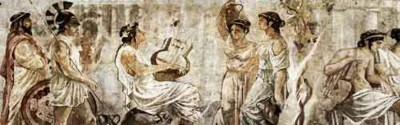

## Песнь Орфея и тень Эвридики

Переселение душ и бессмертие тела. Таинства совокупления и плодородия. Учение об эсхатологии – конце времен. Атлантида и блаженные остова. Певец

Орфей и философ Платон.

Мы сегодня будем говорить об Орфее с его Эвридикой, про весь этот интересный миф и его любопытное отображение в рамках тех тем, которые нас с вами интересуют. Как реальная фигура человека – а он, безусловно, существовал – мифологизировалась и стала мифом. Причем в этом мифе, в самом варианте разночтений, – и в факте их существования, и в качественном отличии этих версий друг от друга – очень четко различаются разные подходы к истолкованию мифа про Орфея и Эвридику.

Орфические мистерии, которые, собственно, по сравнению с тем, что мы уже о мистериях знаем, ничего

особенно нового не содержат. Нас будет интересовать вот что: каким образом Орфей связан с философской традицией с Платоном) и с Прометеем, как это ни странно; ну и поговорим про Блаженные острова, про Атлантиду и этот пласт мифов. Это будет любопытный пласт эзотерических знаний, с которым мы с вами познакомимся, тем более интересных, что орфическая традиция в основном перешла в плоскость поэтическую.

По поводу Орфея и Эвридики. Орфей был музыкант, вдохновенный и великолепный. По его поводу множество, естественно, существует произведений искусства, начиная от греков и кончая современностью. Последняя рок-опера

«Орфей и Эвридика» была написана еще во времена моей юности ансамблем «Поющие гитары». Не спрашивайте меня! Это был шедевр! Ну и бесчисленное количество произведений искусства, естественно: скульптур, картин, опер, ораторий, стихов.

А вот Атлантида в иной плоскости существует. Я не знаю ни одной оперы или балета про Атлантиду. Но зато Атлантида живет в иной плоскости. Ну, Орфей – это миф, и для людей он миф, и люди относятся к нему как к мифологическому персонажу. А вот не то с Атлантидой: в Атлантиду верят, ее ищут, каждый раз находят заново. [Раздаются] новые вопли «Вот нашли!» то там, то здесь, иной раз в местах, офигительно отдаленных от Греции, о которых, конечно, никакой Аполлодор или Платон, которые писали об Атлантиде впервые, знать не могли, – где-то там у побережья Мексики или Колумбии в Южной Америке.

Но Атлантида связана еще с более важным пластом, о котором мы обязательно скажем сегодня, – верой в прошлый золотой век, что все хорошее было позади. То

есть, на самом деле, нужно восстановить прошлую благодать, прошлую гармонию, и в жизни воцарится благо. Атлантида жива, и я скажу вам, где она жива. Может быть, в сердцах и умах современных людей наиболее ярко, выпукло проявляется эта вера. Обязательно об этом скажем.

Давайте начнем с Орфея, тем более, тут рисунки, которые мы подбирали. Старались в основном подбирать аутентичные, а не современную анимацию, как и в прежние разы.

Орфей у фракийцев. Античная посуда из Гелы, V век до н. э. Государственный музей, Берлин.

Вот рисунок на греческой вазе. Видите, стоят суровые воины, склонились и слушают, и Орфей, вдохновенный певец, [поет], кстати, поет он под созвездием, которое называется созвездием Лиры8. Он еще жив, но тут предвосхищена его смерть. Это созвездие потом назовут его именем. А ведь у греков разные были версии: называли ли некое количество звезд именем героя или героини или создавали эти звезды в их честь – это ж тоже большой вопрос. Может быть, он поет под теми звездами, которые в его честь были сформированы.

Орфей по национальности был фракиец, и жил он севернее Греции, но, по большинству сведений, в Грецию пришел, ходил-бродил, отличался изумительным голосом, кротостью нрава, музыкальностью, умением улаживать ссоры между людьми, прекращать свары, войны и великолепно слагал песни и гимны богам. И Аполлон одарил его золотой лирой. Лира была из семи струн, а он [Орфей] прибавил еще две.

Нет на свете музыкальных инструментов, где было бы девять струн, во всяком случае, из древних инструментов, что нам известны. Ну, сейчас-то есть и больше: какой- нибудь «рояль был весь открыт, и струны в нем дрожали» – но из древних инструментов не было ничего такого девятиструнного – трудно было бы играть. А вот он девятиструнной лирой владел. Играл он так, что не только люди – вот эти суровые воины – склоняли головы и плакали рядом с ним, забыв о кровопролитии, но и дикие звери выходили из лесу: кабаны, косули.

Мозаика II века н. э. из Эдессы "Орфей приручает диких животных"

Вот, видите, тут всякое зверье рядом с ним. Это мозаика: там и ворона, и орел, и кабан, и вот тут что-то такое когтистое, типа леопарда какого-нибудь, – все они к нему приходили, вокруг него садились, не трогали друг друга, ибо Орфей был категорическим противником пролития крови. Он был вегетарианец убежденный, не ел мяса и не любил пролития крови. В город, куда он приходил, единственным условием его выступлений

концертов, по-современному говоря) было то, чтобы прекратились войны, поэтому его обожали как миротворца. Это великолепная мысль – искусство прекращает битвы. Когда говорят музы – пушки молчат, когда говорят пушки, наоборот, молчат музы, то есть это очень верно подмеченная идея. Война не есть элемент вдохновения. Там, где льется кровь, там, конечно, музы помалкивают, поэтому Орфей был убежденным противником кровопролития. Те, кто хотел его искусством наслаждаться, должны были войны и распри прекратить. Не только диких зверей и людей, которые хуже любых зверей, как мы знаем, но даже и камни, и деревья он заставлял двигаться, когда он шел и, например, играл некую мелодию, которая увенчивалась словами: «Идите же все за мной, кто любит муз и Аполлона!» А он был

убежденным последователем и жрецом Аполлона, солнечного бога Гелиоса. Так вот, когда он этот припев провозглашал: «Идите все, кто любит Аполлона, за мной!»

– то деревья сами себя вырывали с корнем, как Мюнхгаузен за волосы, вытаскивали себя, камни сдвигались и шли за ним торжественной процессией. То есть он вел за собой огромные полчища разнообразных тварей – людей, зверей, растений, камней. Вот такой у него был дар.

Всем было интересно, кто его вдохновляет. Но вдохновляла его отнюдь не дама, а вдохновлял его как раз бог, бог Аполлон, которому он был предан и не замечал других богов. Особенно не любил Диониса. И вот тут любопытный момент. Помните, мы о Дионисе много говорили в прошлый раз, о сложном, странном существе этого бога? Аполлон был противоположностью Диониса.

Аполлон был бог солнца, солнечного света, ясности, прямоты, бог дня, бог логики и разума, а Дионис, наоборот, – ночи, темноты, сумерек, иррационального, импульсивного, не поддающегося расчету и логике. Так вот, Орфей – музыкант. С нашей точки зрения, музыкант должен, наоборот, быть подвержен страстям и импульсам, а он был человек расчета. И дионисийские всякие штуки – вино, женщин в качестве стимулирующего элемента – отвергал.

му встретилась нимфа Эвридика, которую он полюбил, и они стали жить-поживать, детей у них не было, однако. И все было прекрасно, она была великолепна, он посвящал ей еще более чудесные, лирические песни. Скалы плакали, когда он пел о любви к Эвридике. Но как-то она пошла со своими подругами в лес водить хоровод, а там выбежали нечестивые разбойники, которые сделали ей недвусмысленное предложение. Она его, естественно, отвергла. Тогда они бросились за ней бежать, она в панике бежала, не разбирая дороги, и забежала в места, где обитали ядовитые змеи, и одна из змей ужалила ее в пятку. Обратите внимание, пятка – самое уязвимое место во всех древних мифологиях: в пятку будет поражен

Ахилл, в пятку, по библейскому проклятию, змей будет жалить потомков вы. Пята, то есть то, чем человек соприкасается с землей, пятка – самое уязвимое место.

Она умерла, не сумели никакого противоядия изготовить. Такая какая-то попалась змея – кстати, ядовитых змей в Греции нет реально. Самая ядовитая змея там – гадюка, от которой едва ли может взрослый человек умереть, это миф. Но страх перед змеями был громаден, и не очень понятно, на чем он основывался. Может быть, на сказках с востока, может быть, на контактах с народами востока, которые привозили с собой ядовитых змей. Например, индийские или персидские путешественники, маги, кудесники змей с собой непременно возили – и для устрашения, и для охраны, кстати. Никакая собака не нужна. «Показать, какая змея у меня есть?» Никто в лавку ночью не залезет. Ну и факиры, которые змей усмиряли и умели их как-то дрессировать, это тоже был источник зрелищ и дохода. У греков перед змеями страх был абсолютно иррациональный.

По мифу, померла Эвридика, укушенная змеей и, как все мертвые, отправилась в царство теней, в Аид. А Орфей был безутешен. Подсказали ему боги, в честь которых слагал он песни, что надо ему спуститься в ад. Это, конечно, было ужасно и страшно для любого живого существа – а если не вернешься? Но он так любил свою Эвридику, что бестрепетно пошел. Играл он на своей лире так, что и Цербер помните, трехголовая псина, которая охраняла эти души), и эринии, богини мщения, – они же фурии у римлян – и всякие иные злобные существа, которые во множестве Аид населяли, – все заслушались. И, наконец, сам Гадес-Аид, бог и царь подземного царства,

и Персефона, которая в ту пору обитала с ним, растрогались и сказали: «Ладно, бери свою красавицу и уходи. динственное – ты не должен оглядываться». Вы в курсе, да?

Рубенс. Орфей и Эвридика

Почему нельзя оглядываться? Я на этом фиксирую ваше просвещенное внимание. Никаких условий они ему не ставят: ни принести барана, ни 12 литров жертвенной

крови, ни золота, ни остаться у нас, дать пять бесплатных концертов – нет. Только не оглядываться назад. Это легкое, на первый взгляд, условие, смешное, но они его дают, прекрасно зная, что он его не исполнит, потому что, если бы они знали, что он его выдержит, они, конечно, придумали бы что-нибудь другое.

И он его не исполняет. Когда они идут с Эвридикой по этой длинной дороге – помните наши картинки? – по длинной, каменистой, темной дороге, она же – тень, она молчит. И он ее окликает, но она не дает ему отзыва. Он догадывается, что она идет, но там поворачивает дорога, какие-то темные лабиринты, и в один из моментов у него ощущение, что она не идет за ним, она сбилась с пути, и он оглядывается. И тут она, как тень, в отчаянии исчезает. На этом основана самая патетическая часть оперы Глюка

«Орфей и Эвридика», одна из немногих опер, которую я смотрел.

Ну, как это сделано в опере, у меня нет сил описать, это убивает любое желание сопереживать, – самыми ярмарочными средствами, самодеятельными. В общем, Эвридику пела изумительным, божественным голосом

женщина, которой надо было бы выступить за сборную Китая по толканию ядра. Такое существо и изумительный голос, как всякий тенор, жил у нее глубоко внутри, перекатывался, как сыр в масле. Она ходила медленно по сцене, потому что, если бы она пошла чуть быстрее, она бы снесла все, что стояло вокруг. И когда она изобразила, что ее тянут неведомые силы назад, ей надо было отклониться, – это была тяжелая ошибка. Видимо, находясь в пылу страсти, она немножко амплитуду увеличила, и 14 человек, изображающих духов, – пьяных статистов – пытались ее удержать, изнемогая, сдерживаясь с трудом от мата, потому что она ж падает на них, а это не предусмотрено трудовым кодексом. Тяжело.

Все писали про оперных див. Начал эту традицию Толстой, который описал театр в самых мерзких выражениях, и потом все по этому поводу изощрялись. Великое искусство состоит в том, чтобы заставить поверить, что картонная декорация – это реальная жизнь. Но в этом чудо театра и состоит.

Ну, Эвридика исчезла – и все, второй попытки уже не дается, и безутешный Орфей выбрался наверх. Он хотел даже лиру сломать, но не тут-то было, потому что она – золотая, аполлонова, божественная – не ломается. Тоже интересный штрих, да? Искусство неистребимо. Кто бы его ни хотел истребить, даже сами служители искусства,

которые иной раз в мрачные периоды какого-то помешательства или отчаяния думали о том, что они перестанут служить. Рукописи не горят, реально. Конкретные горят, а вообще литература не уничтожима – искусство всегда живет. И он продолжал петь, песни все более печальные, уже светлой лирики не пел.

И дальше расходятся источники по поводу того, как он помер. Одни источники говорят, что стали к нему приходить женщины, одна прекраснее другой, и говорить о том, что жизнь не кончилась, смотри, какие красавицы вокруг, давай выбирай кого-нибудь, новую. А ему эта мысль была настолько ужасна, что он их всех отверг. И они его, естественно, за это убили, потому что ничего ужаснее отвергнутой женщины быть не может.

Ш. Ф. Жаламбер. Нимфы, слушающие песни Орфея

Вторая версия дополняет первую они как бы по нарастающей идут), что он посмотрел на этих женщин – они были все красавицы и умницы, но, видимо, умницы не очень, иначе бы они не пришли с таким предложением, но красотки, безусловно, были, – и подумал, что ни одна из них не может в его душе оживить такую любовь, какая была к Эвридике. И поэтому поводу он принял решение любить юношей в дальнейшем и научил народ любви мужчины к мужчине. То есть такая вот гомосексуальная

связь. Этого тоже ему, естественно, бабы не простили – убили его за это, по этой версии.

Третья версия, самая грустная, о том, что женщины относились к нему хорошо и не думали его ужасную, грустную скорбь нарушить нечестивыми предложениями про новую связь и новый брак. Нет, они как раз входили в его положение и все усаживались у его ног, подобно диким зверям, от которых, естественно, женщины ушли недалеко, и слушали его песни, которые смягчали их ужасные сердца. Но, когда он пел песни и гимны богам, он все время пропускал Диониса, а наоборот, восхвалял соперника Диониса Аполлона, поэтому Аполлон-то ему помогал, а Дионис его не любил, и потихонечку стал его ненавидеть, и отомстил ему в присущей Дионису манере. Когда в очередной раз он отказался в честь Диониса провозгласить здравицу и спеть гимн, Дионис натравил на него безумствующих вакханок, менад, этих женщин, – мы много говорили о них на прошлом занятии – которые в вакхическом безумии бегают по полям, по лесам. И они, не видя, что перед ними их любимый певец Орфей, а принимая его за кого-то другого, – за льва, не знаю, за какого-нибудь леопарда как в пьесе, помните, у врипида

«Вакханки», когда родная мать не видит, что перед ней сын, а думает, что это лев, и отрывает ему голову в порыве и вносит в город), то есть в таком припадке вакхического

безумия они его разорвали на куски, а потом, конечно, пришли в себя и плакали, но поздно было.

Смерть Орфея. Поль Гюстав Доре

Музы сложили его тело вместе, а оживить уже не вышло. Оживить можно только бога, человека оживить не получается. То есть они хотели поступить с ним, как с Дионисом в свое время, – помните, его тоже разорвали боги [титаны], и только сердце осталось у Реи, но, когда

сложили вместе, то Дионис возродился, – произошел элемент воскрешения. И Осирис в гипте возродился, собранный женой своей Изидой. Но они были богами, а он был человек, Орфей. Правда, он был сыном речного бога Эагра, а некоторые говорят, что сыном самого Аполлона, но Аполлон его не признавал в качестве сына. Но вот Орфею не полагалось воскресения, он умер насовсем.

Такая ужасная смерть хуже всего. Тогда, получается, он стал жертвой мести богов.

Такой миф об Орфее и Эвридике. Сейчас посмотрим еще несколько картинок.

Орфей в окружении животных. Римская мозаика

Видите, тут целый зоопарк вокруг него – это все его, так сказать, покорные рабы. Видите, там они все собрались: собачка, олень, леопард подымают лапу – это знак готовности служить, а он сидит под деревом, вдохновенный певец. То, что у него в правой руке, – это тоже музыкальный инструмент, вроде погремушек, как бы одновременно ритм задает и играет на лире. Такая двурогая лира чаще всего изображается. Реально были такие, такие находят в гробницах. Как правило, раму делали из кости, не из дерева, может быть, для того, чтоб

это лучше звучало, а струны были, конечно, из жил животных. Синтетических материалов не знали тогда.

Вот видите, он смиряет и мужчин, и женщин, а эти дамы остановились, забыли свой долг, несут воду в дом – все слушают его, а он увенчан лавровым венком. Лауреат, то есть «увенчанный лавровым венком», безусловный победитель и триумфатор. Орфей при жизни во всех конкурсах и соревнованиях, где он участвовал, везде выходил победителем. А он путешествовал много: был в

гипте, на Крите, на островах Лемнос и Лесбос, тогда еще там не было никакой Сафо. А как раз Сафо потом – основательница лесбийской любви, вернее, не основательница, а теоретик первый, – как раз приплыла

именно на этот остров, потому что там, по преданию, была голова Орфея. И голова эта, спасенная музами, исторгала из своих уст божественные звуки, и этот остров так великолепно звучал.

Уотерхауз Дж. У. Нимфы находят голову Орфея. 1900

Потому она как любительница поэзии и изящных искусств поселилась вместе со своими девицами именно на этом острове.

Так вот, Орфей принимал участие в разных состязаниях, до которых греки были великие охотники. Они по любому поводу состязания устраивали: музыкальное, поэтическое, в борьбе, в беге, в метании копья или диска, в колесничном беге – то есть они везде стремились выяснить, кто лучше. Дух соревнования очень был присущ грекам. Это потом перешло в западную цивилизацию и совершенно отсутствует на Востоке. Они вообще не понимают, почему надо по любому поводу соревноваться, когда можно выйти на войну, убить и все; почему нужно каждый раз доказывать, кто лучше в какой-то конкретной дисциплине? Орфей и по пению гимнов – по гимнографии, и по знанию древних обрядов, и по умению восславить богов, и по сложению песен, и по песне на заданную тему, например, прославить подвиг героя, и по поводу песни на вольную тему выбирай, какую хочешь) – везде всегда был первым. Вот потому он тут лауреат.

Камиль Коро. «Орфей, выводящий Эвридику из царства мертвых»

Вот они с Эвридикой, еще живой. Ходят там эти нимфы, а он ее ведет через лес. Он ничего не боится, потому что стоит ему заиграть, и любой зверь, самый ужасный, и любой человек, самый мерзкий, лягут у его ног покорно и будут лить слезы.

Вы помните фильм «Парфюмер»? Это типичный Орфей, только в другой плоскости: Орфей – через уши, а

этот – через нос. Никогда бы не пришло в голову человеку не двадцатого века, то есть человеку, который вырос без ванной, что через обоняние можно чего-то достичь. Никогда сроду люди не мылись и не видели в этом никакого кайфа: водою грехов не смоешь. То ли дело страшная сила звука, музыка, – поговорим еще, какое значение греки придавали музыке и стихии звучащей, – но чтобы через запах – это мог выдумать только человек двадцатого века, который понимает, как мерзко пахнет все то, что не он сам. А люди этого совершенно не ощущали и никак не могли подумать, что обоняние мир запахов – это однозначно животная стихия, животные все через запах находят) может к такой власти над ближними привести.

Это Орфей безутешный, когда Эвридика уже померла.

П. Даньян-Бувере. Плач Орфея. 1876

Здесь, в отличие от оперы, которую я описывал, она исчезает, бедная, – ну, тут она изящная девушка – отчаяние написано на их лицах, но сделать уже ничего нельзя. Все.

Эдвард Каспаридес. Орфей и Эвридика. 1896

> Студентка: А он мог попросить ее, чтобы она шла первая?
> Мацих: Нет. То есть попросить-то он мог, но, естественно, никто бы ему навстречу не пошел. му сказали: «Иди. Она пойдет за тобой». Как он мог? А оглядываться ж нельзя, он не мог проверить и потому, снедаемый любопытством, оглянулся.
> Студентка: Это вопрос веры.

> Мацих: Да. Ну, доверия, если хотите. То есть он им не доверял до конца. Важно доверять тем, кто тебя посылает. Это важное качество в нашей жизни.
Мы посмотрим на этот миф с точки зрения его эзотерического бытования.

> Студентка: Это все-таки миф или нет?
> Мацих: Ксюши нет с нами, но дело ее живет. Леночка, конечно, это правда. Любовь Орфея и Эвридики расцвела на озере Селигер, благодаря благотворной деятельности движения «Наши» и лично, мы сами знаем кого. А змея, которая ее ужалила, с долларом на спине и шестиугольной звездой, тоже понятно, откуда приползла, да? Так что вот, все правда.
Это миф, конечно, но, как всякий греческий миф, он великолепно поэтичный, поэтому он так резонирует в нашей душе. Ну что значит «в нашей»? В нашей, так сказать, западной душе. Ведь масса мифов есть и у китайцев, и у индийцев, но они какие-то все немножко иные. Они все больше о богах, и человек там ничтожен. Может быть, потому нам трудно вполне настроиться на один лад с восточной мифологией – индийской, китайской, японской. Человек там – ничто, это дерьмо, это пылинка, это игрушка в руках богов. А вот у греков – нет: любовь может победить смерть. Ну разве такая идея пришла бы в голову восточному человеку? Конечно, нет. Он понимает,

что это невозможно. А греки – мифологическая нация, западная культура и говорит о том, что любовь может победить смерть. Конечно, это миф, к сожалению, но, с другой стороны, только любовь и может победить смерть, ибо любовь воплощается в творчестве.

Например, я вас не огорчу, если скажу вам ужасную вещь: все, что мы видим вокруг, создали мужчины это я вам говорю как феминист), абсолютно все, кроме, собственно, нас с вами, которых родили женщины. Нас всех создал Бог, но всю материальную цивилизацию, в которой мы живем, – от компьютера до унитаза, от автомата Калашникова до пластиковой бутылки – создали мужики. Но для кого они все это делали? Конечно, для женщины. Это, безусловно, так.

Вот всмотритесь в миф. Давайте посмотрим на него внимательно, проанализируем его. Орфей – музыкант, то есть он ничего полезного не делает, он ничего не производит определенного. Он не пастух, он не воин, он не правитель, он не гончар, а у греков гончары занимали в социальной иерархии исключительно высокое место. Квартал Керамикос, пригород Афин, был самым богатым,

ибо не боги горшки обжигают, – это греческая поговорка, – а как раз люди, потому что богам бабки не нужны, а гончарам нужны. И греческие гончары, делавшие огромные сосуды, амфоры, для масла, вина, зерна зерно тогда тоже хранили в глине как в самом лучшем материале), были людьми богатыми, искусными.

А вот он не гончар, и не оружейник, и не кузнец, и не земледелец. Он занимается принципиально бесполезным делом. Ну вот кому, на хрен, нужна музыка? С точки зрения грубого утилитаризма, который сейчас потихоньку торжествует. Или с точки зрения, например, марксистского взгляда на мир, человек, который ничего не производит, он вроде бы как «кто не работает, тот не ест». А он? Что значит «работает»? Струны перебирает? А какая власть над душами и какая власть даже над природой!

Вот как греки понимали устройство мира. Они были очень далеки от примитивных экономических теорий. Они понимали, что миром правит нематериальное. Миром правит совсем иное нечто. Потому Орфей никогда в своей жизни не брал в руки ничего, кроме лиры: ни меча, ни сохи, ни пастушеского посоха, ни гончарного круга, ни руля корабельного. Он играл. А какая власть! То есть, на самом деле, самая большая власть не у производящих, и не у торгующих, и не у воюющих, а у тех, у кого есть непосредственное воздействие на душу. Колоссальная

сила искусства подчеркнута в этом мифе. И какой же народ дал больше образцов великого искусства как ни греки?

Второй момент. сли человек предан какому-то искусству всецело, у него не должно быть детей. Они будут только унижать его дело, ибо они неизбежно будут хуже. Известно, что природа имеет подлый обычай на детях отдыхать. Посмотрите на госпожу Орбакайте и на ее маму. Когда мама открывает рот и бухтит чудовищные глупости – ладно. Но когда она выходит и поет, то, боже ты мой! И посмотрите, как природа отдохнула. Она же могла отдохнуть и поменьше. И это сплошь и рядом! В любых областях: в науке, в спорте, в военном деле, в искусстве. Лучше, когда у великого человека, особенно очень великого, нет детей. Они будут неизбежно мельчить величину и значимость его имени.

Но у великого человека должна быть любовь. Без подлинной любви, всеобъемлющей, не может быть настоящего искусства. В случае с Орфеем – настоящее ли это искусство? Ого-го! ще и какое! И тут есть любовь. Но первичный импульс для искусства – не любовь. Это как бы поддержание костра. А первичный импульс – дар богов: он играет на золотой лире, которую боги подарили. То есть любовь – это момент вдохновения, я скажу по- современному, это катализатор. Но саму реакцию она не

создает. Только боги могут быть вдохновителями искусства.

Любовь побеждает смерть, о чем я вам говорил. Причем она побеждает и страх смерти. И он бестрепетно, не боясь погибнуть сам или подвергнуться мукам, унижению, спускается за тенью своей возлюбленной в Аид. Может ли быть более великолепное поэтичное воплощение силы любви? Ведь на свете до фига баб и тогда было, а вот ему жизнь не мила без его любимой. Может ли быть более прекрасный, поэтичный гимн любви, чем эта история? Искусство, смиряющее самые мрачные силы, в том числе, силы ада.

Здесь есть, конечно, элемент преувеличения. Вот тут, Леночка, миленькая, начинается миф. К сожалению, это не так. сли б это было так, то, например, сыграл бы Ростропович26, и ублюдки перестали бы бомбить

Югославию. А Милошевич перестал бы гнобить албанцев. Немецкие музыканты собрались бы – и Гитлер, расплакавшись, ушел бы в сортир и повесился. Но этого ж ничего не произошло. Ничуть!

Вам известен случай, когда в 42-м году товарищ Сталин

Джугашвили, кликуха у него была Сталин, он управлял тогда Советским Союзом) слушал по радио факт, это не миф) концерт. Играла пианистка Юдина. Позвонил на радио и сказал: «У вас есть запись?» Она играла вживую,

тогда ж звукозапись была в зачаточном состоянии. Сидела и играла. Она была великая пианистка, одна из величайших пианистов, не только пианисток-женщин, но и вообще всех, прикасавшихся к фортепиано в XX веке.

> Студентка: Он ей квартиру потом дал.

> Мацих: Она не нуждалась. Он ей мог дать все, что угодно. Он позвонил на радио и спросил: «У вас есть запись?» Перепугавшийся до смерти директор сказал с перепугу: « сть». Он сказал: «Можно, я завтра пришлю референта? Дайте, пожалуйста, пару пластинок». Тот позвонил Юдиной, объяснил. Они собрали оркестр, сделали несколько экземпляров это можно было только в Советском Союзе) и отдали. Он слушал это до конца своих дней. У него – это реальный факт – на столе лежало две пластинки с ее записями, и одна была заряжена прямо на вертушку в момент, когда он помер. То есть людоед людоедом, а Орфея слушать любил. У него был свой Орфей.

Он послал ей письмо и предложил большую сумму денег, и премию, и все дела. Она была очень верующей женщиной. В те времена это ж не то, что сейчас, – в те времена это было не то, чтоб непопулярно, а это был прямой путь к концу карьеры, если не к тюрьме. А она ни от кого не скрывала, ходила в оставшиеся церкви, держала посты – в общем, вела себя, с точки зрения коллег, абсолютно безумно. Она написала ему письмо о том, что

«Иосиф Виссарионович, я благодарю Вас за дар, который я отдам сиротам, на детские дома. Мне ничего не нужно. Я тронута, что Вас так порадовало мое искусство. Позвольте мне просить Вас об одном. Я прошу у Вас разрешения молить Бога за Вас, за то, чтобы он простил Вам все Ваши великие прегрешения, пролитую кровь и все остальное. С уважением, Юдина». Охренеть! Ну, вы себе представляете такое?

Боже мой! Ну, естественно, это увидели шестерки. Он сказал: «Не трогать блаженную», – после чего, конечно, она стала абсолютно неприкасаемой. Ну, ее, например, не выпустили за границу, куда ее приглашали с концертами, это – нет. Но здесь она была абсолютно уже на пьедестале. Никто не трогал ее. И даже ее в церковь всегда

сопровождало двое энкавэдистов, чтоб, не дай Бог, комсомольцы… На расстоянии шли. Вот такая история.

> Студентка: И у нее не было детей?

> Мацих: И у нее не было детей. Вот вам история Орфея. Вот вам дикий зверь ну, уже что может быть более диким?), и ведь он слушал Юдину! Я не знаю, плакал ли он, вспоминал ли он маму, – что там у него у него ж было человеческое в детстве, в юности)? – какую-то любовь? Он же не рассказывал никому, но, видимо, раз он слушал, он понимал в музыке. То есть он был не идиот, и со вкусом у него был полный порядок. Например, ему не нравился Маяковский как поэт, а нравился Пастернак, то есть он правильно понимал все. Но разве это смягчило его хоть на миллиметр? Нет, конечно. То есть он отдавал ей должное как пианистке; ей лично он оставил жизнь и возможность играть. Ну и что? Разве хоть одного человека это смягчило?
сли бы было так, как в мифе, что вот играет Орфей – и смягчаются сердца, и воины кладут копья, а разбойники кладут свои кистени, а звери с плачем удаляются есть солому, но это не так! Это миф. Это есть некий великолепный идеал, но в жизни, конечно, недостижимый, но существует как некая планка, которая задается искусству, – сыграть так, чтобы смягчить даже самые злобные сердца.

Наконец, ему сказано не оглядываться. Не оглядываться, кстати, сказано было жене Лота в Библии, помните? В Книге Бытия, когда ангелы божьи уничтожают огнем и серой с небес города Содом и Гоморру за их прегрешения, выводят семью Лота: самого Лота, его дочерей и жену. А вот зятьев – женихов этих дочерей они были засватаны, но еще не женились) – не выводят, потому что они усомнились. Жена идет последней. Ну, баба ж с пожитками: «А это кто возьмет?» И сказано – не оглядываться. Но она, конечно, оглянулась и превратилась в соляной столп.

Оглядываться нельзя – это настойчиво повторяемый мотив. Почему? Почему нельзя оглядываться? Почему именно такой запрет? И почему люди обязательно его нарушают? И дура-баба жена Лота, и умница вдохновенный Орфей одинаково на этом прокололись. Все оглядываются, однако. Что за этим стоит? Что этим миф хотел нам сказать? Что есть такого в оглядывании назад?

Это нас подводит к новому уровню разговора: разговору о том, есть ли история человека регресс, деградация или прогресс, дорога достижений. Мы идем вперед или мы идем назад? Мы все больше деградируем и откатываемся, или, наоборот, мы, несмотря на все издержки, идем вперед к достижениям? Это вопрос вопросов для любого человека в принципе. Как бы человек ни был занят повседневными делами, добыванием бабла, выживанием и прочим, он все равно задумывается: «А куда мы идем, собственно?» Это важно для города, для страны и это важно для цивилизации в целом. А есть ли смысл стараться вообще? На фига все эти усилия?

Большинству людей свойственно прошлое идеализировать. «Вот раньше…» – это любимый запев. Вы еще не в таком возрасте, конечно. Это я уже в возрасте восьмидесяти начинаю все чаще говорить: «Боже мой! Вот раньше!» А раньше, я вам скажу, было такое говно, что и вспоминать неохота!

> Студентка: Я в 45 абсолютно такая же: «А раньше…».

> Мацих: Вот видите! Я не помню себя в 45, это было очень давно. Но сейчас, в 80, я думаю, что раньше все было гораздо хуже. И дело не в том, что изобрели мобильники и усовершенствовали унитаз. Хреновая жизнь была в моей молодости, например. Это брежневский застой пресловутый. Ничего хорошего я там не вижу,

кроме того факта, что я сам был молодой, и мои друзья и подруги были такими же.

Я помню свои впечатления, когда я прочел Библию, это было как раз в молодости. И там я натолкнулся на фразу:

«Никогда не говори, – это говорит Соломон, мудрейший из людей, – о том, что прежние дни были лучше нынешних, ибо не от мудрости ты говоришь это»33.

Но все люди говорят одинаково: как раньше было классно. сть момент идеализации прошлого и у каждого человека, и у общества в целом. Оглядываться – это, конечно, идеализировать прошлое. Вот это оглядываться назад. Не надо, нельзя оглядываться! Оглянулся – пропал.

Оглянулся – либо потерял то, за чем шел, как с Эвридикой Орфей, или оглянулся – совсем пропал, как с женой Лота. Но, в любом случае, как только оглянулся, так тебе и конец. Иди вперед смело, бей в барабан и не бойся. Вот если бы люди научились это делать… Но, с другой стороны, как хорошо сказал Жванецкий: «Как я могу смотреть вперед, когда весь опыт сзади?» Научиться не оглядываться – исключительно важная штука. Не оглядываться, идти вперед.

Те, кстати говоря, общества, которые не обременены грузом прошлого, гораздо динамичнее развиваются. Не по этому ли пути пошли большевики, которые все прошлое

зачеркнули? Оказалось тоже тупиковым вариантом. Прошлое нужно какое-то. Тогда вопрос какое? Все это – бесконечно сложная цепь рассуждений: нужно ли нам прошлое, что значит «не оглядываться», но урок мифа заключается в том, что, как только ты оглянулся, с этого момента ты пропал. Вот подумайте над этим.

В греческой мысли – в мифологии, в философии, в эзотерике – были разные взгляды насчет того, когда было лучше: прежде, при золотом веке, или золотой век еще впереди? А как вы думаете? Золотой век впереди, или мы от него удаляемся?

> Студентка: Сзади тоже нет.

> Мацих: Сзади нет?

> Студентка: Конечно, впереди, хочется верить.

> Мацих: Да. «И хотя нам прошлого немножко жаль, лучшее, конечно, впереди». Нет, я уверен, что это так. Я не знаю, как вы думаете, я уверен, что это так, безусловно. Движение человечества – это движение вперед, от некоей заданной точки – вперед. Не одни сплошные достижения, как нас пытаются уверить наши друзья, конечно, очень много потерь, издержек, глупостей, трагедий ужасных, тупиков, но, в принципе, надо идти вперед. Нет назад дороги.

Об этом любопытнейшим образом рассказывает миф о Прометее, который удивительным образом с историей Орфея связан. Вот у вас Прометей с чем ассоциируется?

> Студентка: С огнем, который он дал людям.

> Мацих: Интересно. Оля показала вот так, а Оксана – так.
Огонь – это так? А его надо держать в руках.

Прометей? Да, факелом! С криком «Fuck you!», сказал он богам: « ак ел» – и вперед! Я вам расскажу правду. Или не надо рассказывать правду?

На самом деле все было не так. Огонь, по греческим мифам, люди научились сами добывать. Он у них был уже. Опять-таки, есть разные версии мифов. Помните, я вам рассказывал, да? Разные версии мифов о Дионисе, разные версии мифа о смерти Орфея и вот тут тоже разные.

Некоторые говорят, что Прометей научил всему, люди вообще ничего не умели, жили как животные в норах, которые рыли ногтями, не знали моногамного брака, не знали одежды, не умели соль использовать. Соль и весло – два главных признака цивилизации для греков. Соль, весло, а потом к ним добавилось вино, потому что животные или примитивные племена не солят пищу, не умеют грести по морю, разве только на какой-нибудь маленькой лодочке, кораблей не строят, и не изготовляют вина. Соль, весло, вино.

Прометей – такой культурный герой, который всем этим изобретениям людей научил. А другие версии говорят:

«Нет, это все было, и люди неплохо жили». Вот эта вторая версия очень любопытна. Она говорит: человечество жило единой семьей, но оно было принципиально отлично от нынешнего. В чем? Женщин не было.

> Студентка: Как не было?

> Мацих: А-а-а, я ожидал такой реакции! Заметьте, Иннуля молчала все это время. Чего для нее стоило все это время молчать! Но этого она простить не может. Ну, ничего себе – нет женщин!? Я, кстати, закричал бы еще громче.
Не, их не было. По этой версии, существовало общество одних мужчин, которые жили прекрасно, ибо им не из-за чего было ссориться. По-братски, как братья, делили они плоды поля, плоды моря, плоды охоты, и все у них было нормально. А как род человеческий продолжался? А рожали мужчины. Да, рожали и ничего страшного в этом не видели. Любопытный штрих. Некий золотой век, при котором гомосексуальные отношения есть норма, а, собственно, никаких других и быть не может, и без баб живется очень неплохо.

Прометей был титаном, который сходил время от времени к этим самым людям. Они в честь него устраивали спортивные игры, до которых он был охотник,

пели песни, плясали и приносили ему жертвы. А он был такой хитрец, трикстер такой, трюкач. И он придумал обмануть богов и сказал, что когда будут приносить в жертву несколько быков, – а был такой обычай: огромные бычьи туши – это вершина жертвоприношения. Греки богам приносили жертвоприношения по восходящей: сначала голубей, потом кроликов, потом крупных птиц – каких-нибудь лебедей, гусей. Рыбу – никогда. Потом козлят, потом баранов, потом телят и, наконец, быков. Апофеоз. Так вот когда этих быков приносят в жертву, он сказал: «Вы возьмите себе весь ливер, потроха всякие и мясо, а кости натрите жиром, чтобы они блестели и покажите это богам. Боги ж – лохи. Потом зажгите этот самый жир, но добавьте благовония, чтобы аппетит возбудить». Как в шашлычных делают – поворачивают блюдо, чтобы оно пахло, и народ привлекался.

Так они и сделали. Науськанные, наученные Прометеем спросили люди у богов: «Какую часть жертвы вы хотите?» Вот это мясо, всякое барахло, которое они замаскировали под негодное, или вот эти блестящие, великолепные,

чудесные кости? «Конечно, кости», – сказали боги. Ну и берите. И так они остались без мяса.

За это Прометей был наказан, потому что боги очень быстро обнаружили обман. Провели розыск – люди, конечно, сдали Прометея тут же, сказали: «Это он научил». И за это Прометей был наказан, вы знаете чем, да? Он же пожалел ливер, поэтому у него ливер, то есть печень, орел…

> Студентка: ...и склевал.

> Мацих: Да, да. И клевал долгое время. А по поводу людей, что они повелись на такое подлое дело Прометея, Зевс решил устроить им испытание и спросил: «А как вы дальше собираетесь? Какую часть туши вы собираетесь отдавать в дальнейшем для жертвоприношения богам?» Они сказали: «То, что вам понравилось, то есть кости». –
«Ах, гады! – сказал Зевс. – Ну, я и раньше был о вас не очень хорошего мнения, но теперь – не обижайтесь!» И он послал им самое ужасное зло. Какое же?

> Студентка: Женщин?

> Мацих: Ну конечно! Как ее звали, эту конкретно?

> Студентка: Горгона.

> Мацих: Не.

> Студентка: Медуза какая-нибудь.

> Мацих: Не-не. Пандора. е звали Пандора. Пандора, во- первых, потому, что каждый из богов что-то ей дал от себя.

Пандора – «дар всех». А с другой стороны, она всем дает – тут тоже понятно, да? Существо, с одной стороны, необыкновенно привлекательное, ибо боги создали ее очень красивой, как пишет переводчик мифов в дореволюционной России, «приманчивая красота ея».

«Приманчивая» – ах, хорошее слово какое! Но дура, естественно. Дали они ей ларец, вы помните, наполненный несчастьями, и она его, естественно, открыла. Несчастья расплодились, и с тех пор род человеческий впал в такое бедственное состояние. Таким образом, Прометей, если по этой версии мифа идти, не только не способствовал прогрессу человечества, а наоборот – он ответственный за его нынешнее жалкое состояние и упадок, ибо теперь мужики ничего без женщины сделать не могут. Все, что они создали, включая электрические лампочки, только ради них, а ради себя не хотят стараться, а только пьют пиво.

Кроме того, из-за женщин, естественно, все на свете неприятности, поскольку ради чего ссорятся, по большому счету? Из-за женщин, конечно, в той или иной степени. А когда уже мужчины выходят из состояния, когда они ссорятся из-за женщин, они уже, как правило, ничего не решают.

По этой истории, Золотой век человечества – в прошлом. Золотым веком человечества являются

отношения педерастии – гомосексуализма. И, если оглядываться назад, можем ли мы достичь того состояния первозданной гармонии, которое было до Прометея? Нет. Нет! Кстати, люди, когда открылся обман Прометея, обнаружили, что до того, как послал им бабу в качестве наказания, Зевс еще и украл у людей огонь. Украл огонь, почему? Потому что огонь был повинен в том, что принесли в жертву не ту часть туши. И огонь он у них забрал. А Прометей украл огонь назад, и эту часть мифа мы знаем как наиболее поэтичную и прекрасную.

Совершенно непонятно из-за чего, собственно, Прометей питал к людям такую страсть. сли мы гомосексуальный момент примем во внимание, нам становится значительно более понятно, чего это он так о них пекся. Но вот именно тогда Прометей-то первым и сказал: «Нельзя оглядываться назад!» Люди поначалу – почему он им огонь-то принес – стали говорить: «Ну, не беда! Мы и с этим состоянием справимся». ще без всяких женщин, но и без огня. Оказавшись без огня, они впали в состояние первобытной дикости: они не могут ни варить, ни жарить, ни приносить жертвы богам, то есть два главных состояния, которые цивилизованных людей – эллинов – от дикарей и варваров отличают. Употребление в пищу жареного приготовленного, а не сырого), соленого и почитание богов как новый духовный уровень. А без огня

ни то, ни другое невозможно. Очаги их запустели, и они вдруг стали находить для себя в этом приятность. Они стали деградировать. Они оглянулись назад и стали деградировать. Тут-то он им огонь назад и принес, и вот за это вся суровость наказания на него и обрушилась. Значит, назад оглядываться нельзя.

Теперь, хорошо ли живется с женщинами? Ну, по- разному! Но без них уже нельзя – привыкли. То есть желать опять того, прежнего, состояния – это впасть в ту же первобытную дикость. Надо идти вперед! Усовершенствовать отношения, улучшать их, а не возвращаться к той первозданной жизни, потому что так можно дойти до полной дикости и первобытности: без огня, с поеданием сырого и с житьем в норах, которые люди в песке роют себе ногтями. Вот что такое «не оглядываться» в этой системе. Иди вперед.

Джованни да Болонья. Меркурий. 1580.

Флоренция. Национальный музей Барджелло

Гермес – известный вам персонаж. Гермес – самый прогрессивный из греческих богов. Он-то как раз, в силу своих наклонностей, сторонник прогресса. Он покровительствует тем людям, которые менее всего смотрят назад, которые охотней всего внедряют разные инновации. Он покровительствует торговцам, ворам, которые очень охотно внедряют всякие технологические

штуки. Посмотрите на распространение пиратской индустрии – диски и все прочее. Не те пираты, которые у Сомали, а те пираты, которые фигачат в миллионах копий фильм, который еще не вышел на экран, чем абсолютно подрывают и музыкальную индустрию, и кино. сли не будут приняты меры – об этом говорят все крупнейшие продюсеры – просто свернется производство. Нет смысла вкладывать такое бабло в вещи, которые заранее не окупятся. Вот вам пиратство. Это не безобидные вещи. А страны, в которых пиратство процветает, и совершенно очевидно поддерживается государством, ничего не хотят делать для того, чтобы пиратские воровские технологии свернуть. Эти страны, прежде всего, конечно, Китай, и еще есть одна – Северный Китай, но не Корея. Так вот, Гермес – покровитель всякого рода инноваций, он, наоборот, призывает идти вперед. Он летит! Он не стоит. Вот прообраз делового человека, у которого ни секунды свободного времени. Он все время занят каким-нибудь бизнесом.

У него крылатый жезл – кадуцей, видите, на нем крылья и на нем змея. С помощью этого крылатого жезла он может давать процветание в торговых ли сделках, во всяких коммерческих операциях. В воровстве, кстати, тоже, если его ублажить. То есть он – существо беспринципное, каким и должен быть торговец. му все равно, на основе чего складывается прибыль. Ну, современные банки, конечно, не таковы, но в греческие времена беспринципность была просто бичом.

Какое из общественных движений могло взять Гермеса в качестве своего излюбленного покровителя? Как это ни странно – масоны. И не потому, что они были склонны к

воровству. Они не видели этой ипостаси Гермеса, они все больше упирали на торговлю и говорили о том, что без торговли как связи между народами невозможен общественный прогресс. Торговля есть вещь, которая уничтожает межнациональные перегородки. Ведь теоретически все равно, с кем торговать, и практически, кстати, тоже. сли вам один и тот же товар предлагает, допустим, индиец, араб, еврей, немец и русский, причем русский самую большую цену просит, араб – вторую, и этот проклятый индиец или, страшно сказать, еврей продает дешевле всего. Торговец купит у того, кто продает дешевле. Идеологические соображения его не интересуют. В этом смысле торговля – главный враг всех идеологий, поскольку ее интересует только прибыль.

Джамбаттиста Тьеполо. Гермес

Гермес. Смотрите, сколько у него крыльев: крылья на жезле, на сандалиях и на шлеме, то есть он весь такой летучий! А это и есть торговля, преодолевающая любые границы, любые расстояния. Для нее никаких преград нет: сквозь любые заборы, ворота, шлагбаумы торговая прибыль пробьет себе дорогу.

Гермес – существо, которое, будучи привнесено в мистерии, дает совершенно другую окраску всему, что там происходит. Это стремление преуспеть в этом мире. Не

только думать о бессмертии, как во время дионисийских мистерий. Не только размышлять о высоком, например, о том, что искусство смиряет нравы, и любовь побеждает смерть, как в случае орфических мистерий. Орфические мистерии не отличались принципиально от дионисийских: тоже таинство разрывания, тоже оплакивание. Блуждание Орфея в лабиринтах Аида в поисках Эвридики точно так же, как блуждание души Диониса перед его разрыванием жестокими титанами, то есть, принципиально, все то же самое повторялось. Но! Мистерии Диониса завершались тем, что он воскрес, и Бог торжествует, а мистерии Орфея завершались жалобной нотой, трагической о том, что нет, он не воскрес и Эвридику он потерял. Лишь одна голова его, унесенная музами на остров Лесбос, продолжает своими золотыми устами изрекать божественные звуки. В орфических трагедиях больше элемент трагизма бытия.

А Гермес, вот он же. Тут он еще и с кувшинчиком масла благовонного, вон его жезл кадуцей в другой руке. Такой популярный персонаж. Гермес весь устремлен к этому миру. Вы изображение Гермеса можете увидеть на банках, на торговых конторах, на мореходных всяких фирмах. Очень много изображений Гермеса на домах в Питере. Очень много. В Москве – нет, потому что он же чуждый языческий бог, и, естественно, православие, которое тут торжествовало, норовило его соскоблить, сломать, соскрести, и очень преуспели, но кое-где есть.

Изображения бога нет, конечно, но кадуцей кое-где есть. Вот если вы меня будете сильно просить, я вам даже адрес скажу. Недалеко, кстати, на Чистых прудах, на улице Чаплыгина и на других есть дома, где были в начале двадцатого и в конце девятнадцатого веков торговые предприятия разнообразные, и там этот самый кадуцей сохранился еще, даже в Москве. Ну а где-нибудь в Риге или в Лондоне, Брюсселе, Нью-Йорке – городах, которые выросли на торговле, там этих знаков, кадуцеев, величайшее множество.

Элемент декора на доме Дюршмидта. Нижний Новгород

И там никто не видел в этом никакого противоречия с христианством: с католичеством, протестантством и прочим. Но православию, как известно, все мешает.

Вот орфический символ, который во множестве мистерий средневековых многообразно использовался, – Орфическое яйцо это называется. Яйцо, оплетенное змеей. Картина Дали есть – «Рождение геополитического младенца», где из огромного яйца рождается человек.

Сальвадор Дали. Геополитический младенец, наблюдающий за рождением нового человека

Реальный человек, взрослый, как-то выходит из этого яйца, как мог бы выходить из какого-нибудь скафандра. Мир в состоянии зародыша в этом яйце.

Змея как мудрейшее из существ, каковой она описана в Библии: «…змей был хитрей всех зверей полевых». Такова змея-мудрость на жезле Гермеса – кадуцее, потому что он самое мудрое существо берет себе в советчики. Не

какого-нибудь там тигра кровожадного, не волка, не рыбу тупую, а змею, потому что со змеей можно посоветоваться.

Отчего змея считалась такой умной, вы помните? Змея считалась существом, овладевшим тайной бессмертия, ибо она меняет кожу. Змея реально линяет – это факт, это не миф. Она скидывает шкуру, но она не овладела тайной бессмертия, она все равно помрет после нескольких линек. Но когда люди видели, как змея меняет кожу, то они были в полном убеждении, что змея перерождается, она овладела тайной бессмертия. Может ли быть величайшая мудрость на свете? Вот почему змей у множества средиземноморских народов почитался самым мудрым из животных. Хотя, реально, змеи рептилии, довольно тупые существа и совсем примитивные по сравнению с высшими животными: собаками, лошадьми – никакого сравнения нет. А это вот чисто мифологический сюжет. То есть какую-то часть змеиной жизни – сбрасывание шкуры, люди принимали за то, что змея уже овладела тем, к чему все человеческие умы так стремятся,

– тайной бессмертия.

Змея, проглотившая собственный хвост, – вот эта фигура, уроборос она называется.

Уроборос – символ вечного циклического движения времени, ибо «циклос» по-гречески «колесо». Кто овладел мудростью змеи, тот вечно будет перерождаться, вечно будет двигаться, как чешуйки по бесконечному телу змеи, и тот никогда не умрет, не исчезнет. Овладеть змеиной

мудростью – одна из целей людей, принимавших участие в орфических мистериях, и в древности, и в Средние века.

> Студентка: В орфических?

> Мацих: Да. В орфических. Орфические мистерии в Средневековье были очень популярны среди части алхимиков. Мы дойдем до этого в нашем курсе, только попозже. Они назывались «алхимическая свадьба» или
«химическая свадьба», когда человек как бы перерождался. И это как раз отсылает к орфическим мистериям: когда человек становится змеей, а змея меняет кожу, человек меняет облик, перерождается и, таким образом, обретает бессмертие.

> Студентка: Ну, Орфей и мудрость?!

> Мацих: Орфей и мудрость – несовместимые, по- вашему, вещи?

> Студентка: Но в чем мудрость-то Орфея?

> Мацих: Знал секреты управления всеми живыми существами. Не к этому ли люди стремятся в повседневных своих манипуляциях? Давайте эту связь проследим. Вот смотрите. Орфей, как мы его знаем из мифов, жил себе прекрасной, такой пасторальной, пастушеской жизнью при своей Эвридике. Орфей как персонаж мифов второго порядка. То есть тех мифов, о которых уже свои мифы сложены. Понимаете ситуацию? Он стал мыслиться людьми как существо, которое над

всем в природе имеет власть. К чему стремится человек, который хочет преуспеть?

> Студентка: Он же вышел из ада.

> Мацих: И из ада он вышел, и животные к его ногам склонялись, и дубы столетние за ним шли, и разбойники его не трогали, и воины склоняли перед ним мечи и копья. Вот к чему тут Гермес? Гермес – бог этого мира. го не интересует, что там будет в следующем [мире], его интересует здесь побольше бабла, богатства, а раз богатство, то есть и власть. Он, Гермес, приобретает власть самым, я бы сказал, конвенциональным путем. Что такое власть над людьми? Это деньги. Гермес понимает, что власть денег гораздо круче, чем власть оружия, безусловно. Но мы-то с вами знаем об этом? Вам как работникам «почтового ящика» это понятно. Поэтому совсем простые люди понимают власть как власть царскую или власть воинскую. Люди хитрые понимают власть как власть денежную, власть финансовую, имущественную. И, наконец, мудрые понимают подлинную власть как власть над душами. То есть Орфей взял у Гермеса змею как символ мудрости. Вот вам, пожалуйста, Орфей, оплетенный змеей.

Вот он там с факелом, а вокруг него якобы зодиакальный круг, это те животные, которых он приручил, которые, скажем, по знаку его лиры готовы на все, что он попросит. Вот он оплетен змеею как символом мудрости. Он взял у Гермеса символ мудрости, но власть, которую он, Орфей, приобрел над людьми, это власть совершенно иного, высшего порядка.

Запомните эту трехчастную схему: простаки воюют. Воюют кулаком, дубиной, автоматом, копьем – они так понимают власть над людьми. Хитрые или умные, что,

возможно, одно и то же, – копят бабло, имущественную силу: движимое-недвижимое имущество, золото, деньги, активы, ну и так далее. А по-настоящему мудрые приобретают власть над душами. И эта власть самая сильная.

Вот чему нас учит эта песня. То есть настоящая власть не у Гермеса, подлинная мудрость открывается тем из орфиков, из тех поклонников орфического культа,

которые вышли за пределы этого мира. Этот мир, собственно, весь войной и деньгами исчерпывается, по большому счету. А они приобрели иное измерение.

Ну, вот философы, видите, обходятся без женщин. Слушают, обсуждают судьбы мира. И что, плохо им живется, скажите?

> Студентка: Хорошо что ли?

> Мацих: «Пришел домой, там ты сидишь», да? Нет, я думаю, что им не очень хорошо живется, конечно. Они тяготятся.
Вот вам классическая пифагорейская орфическая мистерия.

14

Конечно, рисунок не аутентичный, рисунок где-то XIX-XX века, но рисунок воспроизводит довольно точно изображение орфической мистерии. Прежде всего, посмотрите, как посвящаемый расположен, то есть, мы бы сказали, распят на кресте, который мы называем Андреевским, – в форме латинской «х». Но тогда это, конечно, никаким распятием не было. Этот человек приобретает новое качество, новое естество. Горят факелы, вот жрец в рогатой змеиной короне со скипетром, ибо всякий жрец есть пастырь душ, а у пастуха жезл – неотъемлемая часть его атрибута. Поэтому отсюда жезлы, скипетры у всех монархов и у всех духовных лидеров. И у епископов жезлы, ибо это пастыри. Он называется иерофант40, вокруг стоят приверженцы, люди разного рода, я думаю, что все сплошь мужчины. И подвергается этот испытуемый разного рода, я бы не сказал, пыткам, скорее, испытаниям, да? Испытуемый-испытания – нехорошо звучит. Ну, кандидат, тот, который хочет пройти посвящение, его подвергают разного рода испытаниям, есть и физические.

Но, должен вам сказать, что ведь во всех практиках духовных обязательно физические испытания присутствуют. В буддийских монастырях перед тем как

перейти в монахи, юноша три года работал послушником: уборка отхожих мест, ранний подъем, колка дров, таскание воды. сли после трех лет этого тяжелого самого неблагодарного труда, он продолжал хотеть быть монахом, тогда его брили наголо а так он носил волосы, короткие, но носил, а монах волосы сбривал) и ему на свежесбритую лысину ставили толстую свечу. Она горела, и он должен был прямо стоять – она же стекает и горячая. Это не смертельно, но попробуйте. И он должен, не дрогнув…

> Студентка: Вы предлагаете побриться наголо?

> Мацих: Как вариант. И он должен стоять, не моргнув глазом, и в прямом, и в переносном смысле, и никак не выдав ни боли, ни волнения, ни страха, ну, в общем, никак, совершенно спокойно, не повышая голоса, не дергаясь, беседовать на духовные темы. го спрашивает наставник и братья, он должен отвечать. Вот вам, пожалуйста. Это что такое, как ни испытание, причем довольно жесткое. Он не умрет от этого, это не страшные страдания, но попробуйте, не ахнуть, не крикнуть. Вот какое самообладание требуется. А не прошел – извини, значит, ты в монахи не годишься. Вот такие были требования.
Суровые, кстати, говоря, вещи проходили и католические монахи. В некоторых монастырях по уставу полагалось перед тем, как пройти пострижение - новицию,

то есть послушнику, перед тем, как он станет монахом, пройти через очень суровые вещи. Как вам нравится такая штука в ордене святого Бруно41: сажали человека в такую специальную клетку, ее по-хитрому делали, – у нее нет равновесия, она все время в состоянии неустойчивого равновесия, она все время меняет свое положение – и надо сутки в ней прожить. Это чудовищная вещь. Народ сходил с ума через несколько часов. Но надо в изменчивом мире не потерять равновесие. Сутки надо было там провести. Это может быть хуже, чем любое прижигание факелом голых пяток. Суровый был отбор, поэтому чего это вас удивляет? Не каждого брали – на этом стоит эзотерика.

Помните, мы с вами схемку рисовали, красивую, цветную? См. Приложение) Помните, по объему зеленый сектор был насколько меньше всего остального? Потому что отбор был совершенно иной. Абсолютно иные качественные требования предлагались кандидатам. Вот потому эзотерика и жива до сих пор, в отличие, скажем, от многих религий и церквей, которые абсолютно сгнили изнутри. Отбор был другой. изические испытания,

Картезианский орден лат. Ordo Cartusiensis, OCart), также называемый Орденом Св. Бруно — монашеский орден Римско-католической церкви, основанный в 1084 святым Бруно Кёльнским в Шартрезских горах близ Гренобля ранция). Официально орден картезианцев был утверждён папой римским Иннокентием III в 1133 году. Название ордена происходит от названия первой обители — фр. La Grande Chartreuse лат. Cartusia).

особенно для мужчины, – вещь необходимая. Женщине тоже предстоят испытания ужасные: одни роды чего стоят, не дай Бог. Попробуй, попроси мужика родить, я бы на него посмотрел. Но для мужчины считается необходимым условием его мужского статуса умение переносить боль. Воин, охотник, как он без этого? Поэтому это вас удивлять не должно. А такие посвящение именно в высокую степень братства, значит, братья должны тебе доверять. Такие дела.

Кстати, отсюда Андреевский крест. Видите, как много в христианстве, к которому мы медленно подбираемся, вещей заимствовано из греческой практики, которую потом христианство объявило языческой, все это уничтожило, естественно, все святилища были сожжены и разрушены, традиция предана забвению и проклята. Так люди поступают со своими учителями и духовными наставниками. У вас есть ученики? Старайтесь для них побольше.

Богиня Церера-Персефона, покровительница мистерий. Вот перед ней два льва. Заметьте, два льва, зеркало и корона. На три элемента ее декора обратим внимание.

Кибела – мать богов

На троне царя Соломона в Иерусалимском храме тоже были подлокотники из двух львов, причем иной раз они становились живыми, чем безумно пугали придворных. Но царь умел сказать слово, и они опять застывали. Зеркало потому, что какая же она женщина без зеркала? И корона. Вот богиня – повелительница мистерий. Многие вещи прямо ей посвящались, и в Элевсинских мистериях, с которых мы начали наш разговор, она главная героиня.

На зеркало обратите внимание. Зеркало – любопытнейшее человеческое изобретение. У животных ведь зеркал нет, да и на фига бы они им были нужны? Животные смотрятся в зеркала? Нет? Они осознают, что это они? Не начинают лаять на этого гада? Знаменитый мультик помните? Он гавкает и тот из воды на него лает.

«А ты улыбнись!» Такая притча про то, как ты к миру, так и мир к тебе.

На самом деле, зеркало – вещь абсолютно чудовищная. Вы не догадываетесь о том, какой негодяй это все изобрел? Зеркала же все хуже со временем. Вот, я помню, в советское время, о котором ничего хорошего я сказать не могу, зеркала-то были ничего. Так пройдешь – ничего так рожа. Сейчас – ужас. То есть мобильный мобильником, а зеркала страшные. Нет, ну, не может же быть такого! Вот вам, пожалуйста.

Зеркало у богини не зря. Зеркало – атрибут богини, ибо богиня всегда остается молодой, и в этом ее насмешка над смертными женщинами. А смертные женщины прибавляют [в возрасте]? Нет, они только лучше, конечно, становятся, но возраст прибавляют, то есть им после восемнадцати становится двадцать один, потом двадцать

два, двадцать два и так долго-долго до двадцати шести. Вот после двадцати шести – по-разному.

Зеркало – вещь исключительного коварства. Богиня, с одной стороны, покровительствует людям, направляет их на путь мистерии, на путь обретения бессмертия, с другой стороны, она тремя своими атрибутами показывает разницу в своем божественном положении по сравнению с человеческим. Люди могут щелкнуть пальцами, и звери превратятся в каменные изваяния и начнут их слушаться? Нет. Только Орфей, но он единственный такой. А она может этих львов, рыкающих, не бояться.

Люди не увенчаны короной, а на ней корона есть. Она – королева подземного царства. Она может жить – вы же помните Персефону-Цереру – она живет и у мужа своего в мрачном царстве теней, в аду, среди мертвых, и здесь, среди людей. А люди, увы, – или там, или здесь. А она может в двух состояниях.

И, наконец, зеркало. Зеркало – это власть над временем. Вот над ней время не властно, она всегда молодая, у богов же нет возраста. «Ветреная Геба, кормя Зевесова орла, громокипящий кубок с неба, смеясь, на землю пролила». Геба – всегда девушка юная, она всегда и будет девой, никогда не станет женщиной, а

остальные богини – зрелые дамы, они никогда не состарятся, не станут злобными, желчными матронами. Нет. Мужчины – все в расцвете сил, в самом соку. Гермес вечно юн, никогда не постареет, не одумается.

Зеркало – это победа над временем. У античных женщин, у греческих и римских, – римляне заимствовали это все у греков, конечно, – был обычай, и поэтичный, и такой щемяще-грустный одновременно. Состоял он в том, что женщина посвящала свое зеркало богине Венере, Афродите. Тут сидят барышни и дамы, вы можете сосчитать, сколько у вас в жизни было зеркал? Это ж страшно сказать. И вам придет в голову их считать? Потому что оно стоит копейки. В те времена зеркала стекла не знали и секрета амальгамы не знали, это все гораздо позже изобрели мужчины для вас же) делались из металла: из дорогой бронзы и серебра. Ведь его надо было отшлифовать соответствующим образом, а всякая шлифовка – это, знаете, какой труд! И все ж руками и тщательнейшим образом, чтобы кривизна была [соответствующая]. Это охренительная работа, потому оно такое было дорогое. Потом, где ж еще и само по себе серебро высокой пробы или бронзу хорошую возьмешь, то есть зеркала стоили очень большого бабла. И зеркало было у женщины одно. Я даже не знаю, с чем сравнить сейчас, сейчас всего настолько много... Кольцо, например,

которое от бабушки перешло, фамильное, с этим зеркало можно было сравнить.

Дарили зеркало, как правило, девушке во время первых менструаций или чуть позже, во время ее обручения, в самом худом случае – на свадьбу. Ну, конечно, как правило, гораздо раньше. Как же она до свадьбы будет? Во что будет смотреться? И зеркало с ней шло всю ее жизнь. Даже рабыням высокопоставленным, каким- нибудь служанкам знатных дам, иной раз оставляли зеркала. Такое было уважение к предмету. И с этим зеркалом женщина проходила все стадии своей жизни. И когда она уже смотрелась в него и понимала, что зеркало совсем не выполняет свои функции, скурвилось зеркало окончательно, она его посвящала Венере. Как они реально делали? Может они его бросали в жертвенный огонь, и оно там переплавлялось, и из него делали новое. Такой символический момент. Огонь и очищает, и дает новое качество.

Женщина отказывалась от зеркала. Это символический момент: она выходит из числа женщин-соблазнительниц, красавиц. е внешность уже не интересует, больше пугает, и она уже главным вопросом женской сущности – как я выгляжу? – не озабочена. Очень грустный и тяжелый, на самом деле, обычай.

Множество поэтов писали по этому поводу. И от лица якобы женщин поэты-мужчины писали стихи, как себя чувствует женщина в этот момент. И созерцая, как какие-то красавицы былых времен, по которым все убивались, и он это помнит – Боже мой! – сейчас она стоит и смотрит в зеркало, и черты ее он описывать даже и не хочет, такой она стала, и она это зеркало дарит Венере. А почему Венере? Венера-то всегда молодая.

А какое зеркало предлагали дарить красавицам христианские монахи? То зеркало, которое бы никогда не врало, а всегда напоминало бы женщинам об истинном положении вещей, – череп, ибо вот к чему мы все придем. Вот, мол, череп прекраснейшей из жительниц Афин. Хороший подарок, правда? По большому счету, так оно и есть, но никто почему-то брать не хотел.

Так что зеркало у богини – это победа над временем, которой, возможно, посвященный в мистерию и может добиться. Но, скорее, это атрибут богов. Это не атрибут смертных людей.

К чему стремились люди в мистериях? Чтобы приобрести свойства, которые есть атрибуты богов, но не людей: бессмертие, или какую-то неслыханную удачу или вечную красоту и вечную молодость. Во всех сказках, у всех народов о чем просят? Вечная красота и молодость. Как только слово «вечное», так тут привкус мифа. Этого не

может быть. Именно потому этого так страстно желают, ибо вечное, вневременное – это атрибут богов. Как только человек просит вечного чего-то, он хочет перейти в категорию богов. Этого ауст просит у Мефистофеля –

«остановись мгновение» – он просит вечного, и Мефистофель понимает, что этого не может быть, но как дьявол говорит: «Хорошо, я сделаю», – понимая сам, конечно, что врет, он его обманывает. Но когда тот поймет, будет поздно. Мы договорились о времени, и время нас и подкузьмило.

Ритуальная маска.

В трактатах алхимических была изображена маска божества, маска богини. По мнению автора трактата, такую маску следовало посвященным во время мистерий надевать. И это человека на этот момент отождествляло с богом.

Вам известно слово «персона»? Что оно означает?

> Студентка: Индивидуальность человека.

> Мацих: Индивидуальность человека. Запомним эти слова. сть какие-то другие мнения?

> Студентка: Личность.

> Мацих: Персона – это маска, это личина. То есть, если вы говорите об этом, как о личности или как об индивидуальности, то значит, вы в хорошей компании, большинство людей так считает и ошибается. Персона – это личина. Это то, что носили люди, которые истинную свою морду хотели по каким-то причинам скрыть. Ту маску, которую надевали, например, в театрах. А для нас персона – это личность, то есть мы все носим маски, реально. И то, что слово «персона» стало символом индивидуальности, личности есть вещь далеко не случайная, потому что люди не стремятся узнать, кто реально перед ними, а довольствуются маской, и чем эта маска лучше выполнена, тем оно и красивее.

Это вот одна из таких масок, которую носили и в театре, и во время публичных представлений, и во время жертвоприношений, и во время мистерий.

Какую маску мы носим? Мы носим маску того существа, за которое мы бы хотели, чтобы нас принимали. То есть мы не таковы, но носим маску. Ну, скажем, я ношу маску доброго дядюшки. Получается у меня?

> Студентка: Плохо.

> Мацих: Плохо? То есть клыки видны все равно, уши торчат острые, покрытые шерстью?

> Студентка: И хвостик с копытами.

> Мацих: Такие дела. Каждый носит маску некую. У вас, я думаю, не одна в запасе.

> Студентка: Целый гардероб.

> Мацих: Конечно. И эти маски какие? Редко кто носит маску человека, чертами которого он не хотел бы обладать. Как правило, все носят маски для этих людей привлекательные. Носить маску – это означает себя отождествить с персонажем, чью маску ты носишь.
Например, детишки в детском саду, да иной раз и в школе, входят в образ: вот они зайчики, снежинки, медведики – на них приятно смотреть. В этот момент полностью дите себя отождествляет с этим медвежонком или там зайчиком.

> Студентка: Персонаж.

> Мацих: Да, «персонаж» от «персоны», конечно. Такое театральное слово. «Персонаж» – чисто французское слово. Все, что заканчивается на суффикс «ж», на наш любимый, это французские окончания.
Как-то поехали мы в молодости моей с друзьями отдыхать на море и как-то очень быстро все деньги потратили. Там продавали дело было под Одессой) белое вино. И как-то через неделю уже – и все, денег нет. Надо было резко подрабатывать. И вот мы начали, кто чем. Мы им зафигачили в лагерях пионерских тогда это был распространенный вид отдыха) праздники Нептуна. Кто

играл Нептуна вполне понятно – она ж тогда черная была, борода, – они изображали свиту и всякое такое. И русалки были. В общем, было хорошо. Платили мало, но как-то угощали. В общем, классно.

И в одном из лагерей все остальные у меня слились в одно, а этот я как-то четко запомнил) я с этой бородой и еще с дополнительной, в простыне – ну, Нептун! Мы откуда-то выплыли, пришли. Все визжат. Были ребятишки постарше, а здесь совсем младшие. И один прибился к нам, хотел быть в свите Нептуна. Он нес простыни. Куда ж его? А мы репликами в полголоса обмениваемся:

«Быстрее пошли! Вот это вот сюда!» – а потом громко вслух говорили текст, в традициях школы Станиславского. Я другу Грише говорю, мол: «Надо побыстрей, потому что еще лагерь через полтора часа, а нужно же еще по вину. Зачем мы сюда пришли? Представление делать что ли?» Надо идти в следующий лагерь. «Давай, давай!» А пацанчик смотрит с удовольствием, как русалки с пиратами танцуют и все прочее. И тут Гриша, который то ли старший пират, то ли хрен кто, водяного изображал – и так хорошо изображал, страшно! – смотрит на часы и говорит мне: «Да не переживай!» Ну, он так, по-другому сказал: не переживай, мол, совсем, не волнуйся. Все, мол, будет класс, времени еще много. Я перевожу на русский язык, удобоваримый. Пацан облез. Он думал, а как я

отреагирую? А как Нептун, как я должен был поступить? Испепелить, ударить жезлом, да? А я вместо этого сказал:

«Да, все класс», – это я тоже перевожу. Все, мол, типа, будет хорошо. И попросил его заколоть тут мне невидимочкой такой, которую дала одна русалка, чтобы не слезал парик. И он заколол. Пацан умер от ужаса. Все для него померкло. Мы забрали у него ощущение маски, ощущение причастности. Суки мы.

Вот это один из самых ужасных поступков, которые мы совершили, я думаю. И если Старик когда-нибудь спросит, то он спросит прежде всего: «А зачем вы, гады, тогда пацану?..» Из-за вина все проклятого! Пьянству – бой! Вот такая штуковина. Это такой полный, изумительный случай вхождения человека в состояние сопереживания. Я думаю, для современного театрального зрителя это невозможно, потому что дистанция всегда есть. Это сохраняется только в том случае, если человек чувствует себя вовлеченным.

Помните, я вам рассказывал в начале еще того, прежнего курса про пляски шаманов на Ольхоне, которые я лично видел. Про мексиканскую процессию, когда там народ живет в этом. В античные времена, мне кажется, слияние персонажа с маской было полным. Человек на тот момент, когда он эту маску носил, себя чувствовал богом или богиней, это неважно. В греческом театре ведь все женские роли играли мужчины, это их как раз совершенно

не смущало. Для них это не было барьером. И он себя богиней чувствовал, какой-нибудь Церерой или Персефоной, Герой. Именно вот так.

Маска – это способ сменить индивидуальность, сменить личину. Это то же самое, только без химической свадьбы,

– помните, змею? – без чешуек перевоплощений. А вот на время стать другим – исключительно привлекательная для человека стихия, потому живой театр никогда не умрет, потому что любой будет в это вовлекаться. В целлулоидную пленку мы так не вовлечемся, какие бы ни были эффекты компьютерные, звук, хоть запах пойдет из четвертого ряда, – ничто не даст такого эффекта. Особенно, если непосредственно ты видишь живого человека. Живого, реально, с жилкой у виска, что-то отстегнулось, хриплость, пот, который выступил над бровями, – это все просто безумно вовлекает человека в ощущение единого пространства переживания. В этом – корень мистерии. Поэтому маска – это персона. Это возможность свою личность на чужую на время поменять, стать иным.

Кто из вас хочет преуспеть в мистериях, подумайте, какую бы маску вы могли носить, скажем, в течение трех часов. Прийти на работу и какую-то совершенно иную маску надеть. Представляете, что бы вам сказали коллеги? Но зато как было бы интересно. Ну, а кто хочет по-

настоящему преуспеть в мистериях, я тем еще задам вопросец один.

Это, видите, едет богиня.

Что обычно влечет колесницу смертных – мулы, ослы, кони, быки, если это медленно. А тут львы! Как они выступают чинно. Тут, видимо, некий жрец, ибо у него посох, а это ритуальный элемент жреца и, по-видимому, я так думаю, это бубен какой-то, в который он бьет для привлечения народа, для того чтобы задавать некий ритм. И она бьет в такой же, но в свой, божественный, и мерно колесница [катится], видите, как львы выступают, вот так потихонечку она въезжает в город.

Музыка, то, о чем мы должны были поговорить, я вам обещал с самого начала. Музыкальная стихия для греков была исключительно важна. Перечитайте Библию – там про музыку ничего не сказано, кроме как в псалмах какие- то странные музыкальные инструменты [названы]: какие- то кимвалы, тимпаны, цитры. Это все русский перевод, исключительно, вероятно, неудачный. Что такое кимвал или тимпан? Мы с трудом себе представляем.

сть названия этих инструментов на иврите, и даже есть попытка их реконструкции. Мы примерно представляем, что это было, и как оно звучало. Но, в принципе, стихия музыкального звука совершенно в Библии не представлена. Это несмотря на то, что Бог как раз словом общается. Главная молитва начинается со слова

«Слушай!»: «Слушай, Израиль! Бог един». Бог говорит с людьми словесно, но это именно словесное общение, как, знаете, приемник: речь передает – музыку нет, то есть весь огромный пласт музыкальной культуры для людей, писавших Библию, был, видимо, вполне чужд.

А для греков – нет. Они разработали лады различные – дорийский, ионический. Мы еще дойдем до Пифагора. Пифагор вычислил математически время и тон звучания каждой струны. Определил, на каком расстоянии надо порожки эти делать, чтобы по-разному лады звучали. Все это греческие изобретения. И разными ладами музыкальными выводили они людей в абсолютно разные состояния: от лирической расслабленности, от полной апатии до воинственной мобилизованности, агрессии, желания немедленно идти в бой.

Была музыка, которую предписывалось слушать юношеству, воинам, выступавшим на битву, а была музыка, специально для дев. сли это еще девы, а не женщины, то какую-то музыку они могут слушать, а какую- то – нет. То есть более жесткий запрет, чем сейчас на любую порнографию и на любые видеопродукты. Вот как серьезно греки относились к музыке.

Нам это в голову не придет, правда? Мы можем следить за тем, у кого есть дети) чтобы дите не то не смотрело, по сайтам не шарилось, чтоб дите не видело. А что дите слышит? Вы когда-нибудь задумывались над таким вопросом? Что мы слышим? Что слышит дите? Вот если бы мы относились с такой же неразборчивостью к еде, любой из нас давно бы помер. Для нас звуковая стихия утратила свою значимость.

Это из-за чего? Из-за христианства, конечно, потому что оно не уделяет музыкальной стихии никакого такого внимания, какое было у греков. И мы живем в полной какофонии. Звук дерьма нас окружает. Абсолютное дерьмо вокруг, чудовищное. Какие звуки мы слушаем, вы только вспомните: лязг, грохот, визг, эти машины – и ничего страшного.

Когда мы говорим про экологию, обычно говорим, что плохо пахнет или высокая концентрация веществ, но про шум никто никогда не вспоминает, а это ж страшно угнетающая вещь. Отсюда рост депрессий в городах. Почему депрессий гораздо больше в крупных городах и мегаполисах, чем в городах мелких? Из-за шума. Это настоящий шумовой террор, натуральный. Это террор, который не то, что кто-то специально делает, а просто никто не обращает внимание. Представьте себе, если бы все люди поступали бы, например, как жители

монгольских улусов или городов. А по ламаизму, гадить, испражняться человек может в любом месте, лучше всего на зеленую траву, чтобы часть тебя сразу становилась частью природы. Вот теперь представьте, что люди идут по большому городу, типа Москвы, и где приспичило, там оно и в кайф. И причем все ищут зеленую траву, которой не так много в центре. Ну, кто победней – на асфальте. Вы представляете, во что наша жизнь превратится? Вот вы спроецируйте эту ситуацию, если каждый будет вести себя в этой сфере, как ему хочется. Со звуками люди ведут себя ровно так. Никто не считается с чувствами окружающих, мы это просто не замечаем.

Я привожу это сравнение для того, чтобы вы поняли, насколько далеко наша нынешняя цивилизация – тоже цивилизация, конечно, – отстоит от греческой. Греки в этом плане были гораздо мудрее нас. И достичь власти над душами, над сердцами людей, конечно, музыкально проще и эффективнее, чем словесами.

Слово обращается к разуму, и пока оно доходит, – это ж столько преград! Да и сколько мы понимаем в этом слове, как мы его истолковываем? Вот я вам что-то такое говорю, а вы что-то такое слушаете. А если бы я, не дай Бог, вас спросил? Я иной раз спрашиваю, что народ пишет? Читают

– это ж страшное дело: ничего такого я никогда в жизни не говорил да и не мог сказать. Но народ пишет, причем с

усердием. А музыка воспринимается людьми вполне однозначно.

> Студентка: Вам надо петь.

> Мацих: Ну, я пытаюсь, пытаюсь. Сейчас мы попробуем Кобзона и Киркорова вытеснить с большой эстрады, и день этот недалек.

> Студентка: Неужели вам не приходит в голову, что музыка – это отражение окружающей действительности и что в данный момент она не может быть другой? И в то же время это какая-то защита. Вы представьте себе – извините, можно я одну секунду скажу? Для меня классическая музыка, если я какую-нибудь лютневую музыку сейчас поставлю, да я буду рыдать три дня. Но я не могу себе позволить. Я абсолютно не защищена перед ней. Не могу я себя ввергнуть в такое эмоциональное состояние. И лучше какой-нибудь Кобзон с Киркоровым.

> Мацих: Не, я говорил не столько о Кобзоне с Киркоровым, сколько о звуках однозначно вредных: про шум строительства, про автомобили, про грохот, про ругань, про крики. Я говорил в основном про такого рода звуки – строительные, промышленные, транспортные. Кобзон? Ну, какие времена – такие и песни. Кобзон мне нравится чуть больше, Киркоров – совсем нет, но это дело вкуса. Как раз об этом я не говорил. У кого-то Киркоров вызывает слезы, почему я должен его судить? Пусть она

плачет. У него есть дивная песня – « сли ты меня разлюбишь, в тот же вечер я умру». Я думаю, неужели, его, блин, никто не разлюбил? Вот его любят до сих пор, как это жалко. Красавицы-женщины, что же вы его не разлюбили?

> Студентка: Да не женщины его любят.

> Мацих: Женщины, женщины, к сожалению. В этом проблема. Такие-то дела.
Я говорил, в основном, о шумовом терроре, который вы легко можете вообразить, особенно в таком шумнейшем городе как Москва.

сли говорить об Орфее, владыке человеческих душ, то ведь он этого добивался звуками. Может ли такое быть? Возможно ли, чтобы человек как-то заиграл... сть рассказ у Паустовского «Слепой повар». Не читали? Где Моцарт заходит случайно – советский рассказ – к умирающему повару, его дочка просит утешить, принять исповедь у своего слепого отца. Тот играет на старом клавесине – с каких хренов клавесин, стоивший огромных бабок по тем временам, у повара? Ну, советский рассказ. И тот видит и свою невесту Марту, еще молодую, и яблоневый сад, в общем, такая поэтическая фикция. Наверное, можно это воссоздать, я не знаю. Как человек абсолютно глухой, я много интересовался тем, как реагируют слышащие. Я

тоже слушающий, но неслышащий. Как слышащие реагируют на звуки? И некоторые говорили как вы, очень поэтично. Одна женщина сказала: «Меня музыкой можно пытать». Вот как вы. И всякие такие поэтические вещи я слышал. Наверное, это правда.

Почему советская власть так упорно боролась с джазом? Хрен ли ей джаз? Что, не было других забот? Но джаз – это музыка свободы. Это свобода, импровизация и отсутствие авторитета. Что может быть ужаснее для иерархического, закрытого, структурированного, авторитарного общества? Свобода. Поэтому джаз вызывал такую дикую ненависть, совершенно непропорциональную. Ну что? Причем же негры, вроде угнетенные. В этом что-то есть, конечно.

И, мне кажется, если говорить о мистериях, колоссальный эффект достигался именно подбором звучащей музыки. На тренингах, которые я делаю, я ставлю иной раз некие мелодии и смотрю, как люди реагируют. Люди прямо на ходу меняются. Ну, дикие звери остаются дикими зверями, и баран не превращается в мыслителя, но люди меняются на ходу: улыбки появляются, они расслабляются, когти втягивают у многих даже трехметровые бывают – раз – и назад); закрывают пасть, а, казалось, – никогда, да? Вот такие клыки, и вдруг раз – улыбка. То есть происходит некое непосредственное

воздействие. Думаю, что если эту тему разрабатывать, можно очень многого достичь. И у людей, которые идут по этому пути, самая большая власть над душами.

Среди всех религий и их музыкальных практик, которые я по мере сил изучал, конечно, самого колоссального воздействия добился католицизм как наиболее образованная из ветвей религии. Вся европейская образованность – это ж католицизм. Он ее создал, и он же ее порождение – это такой взаимообусловленный процесс. Когда звучит в соборе орган, то что тут можно добавлять? Посмотрите, как по-разному ведут себя люди в разных храмах. Очень интересно смотреть. Как ведут себя простенькие баптисты, которые поют свои великолепные простые слова на мотив популярных песен. Например, они поют про духа святого на мотив «Парней так много холостых» или «Подмосковные вечера». И как звучит латынь, непонятная, непостижимая, небесная латынь, сопровождаемая звуками органа! Мне кажется, в мистериях это учитывалось. И в некоторых мистериях требовалось, чтобы люди знали греческий язык, ибо им нужно было какие-то части текста говорить осмысленно, а в другом случае принципиально использовалась старая речь, как писал Эсхил, «гомерово наречье». Для него это уже была седая древность, старше, чем для нас «Слово о

полку Игореве»: «Не лепо ли ны бяшеть». И это производило сильнейшее впечатление. Совсем не понятно

– тоже плохо если по-китайски бы молились). Полупонятные слова, когда что-то пробивается, и флер непонятности, но в то же время ты осознаешь, о чем идет речь. С музыкальной стихией. Это, мне кажется, самое мистериальное музыкальное окружение. Ведь Орфей не только играл, он же и пел. Мне кажется, он многое пел на непонятном для них языке. Звери же не понимали, о чем он пел, он пел по-гречески. Не все звери знают по- гречески, некоторые – по-болгарски, по-сербски, там, по- македонски, но они же плакали. Мне кажется, он производил точно такое впечатление, как хорист и орган, латинские звуки, латинская месса в католическом соборе, когда все понимают, что говорит Бог, но, что он именно говорит, они не понимают, но то, что говорит Бог, – сомнения нет.

Мне казалось важным сказать вам эти слова о музыке как о составной части мистерии. Без этого и греческая культура, и греческий мистериальный культ были бы для нас непонятны.

Это понятно – Персефона и Деметра.

Как вы истолкуете такой рисунок?

Современный человек рисует свое ощущение после мистерии – вот нечто является.

Помните, мы с вами прошлый раз видели рисунок – свечу и некий девичий профиль, видение такое. Ви дение и виде ние. Эти две красавицы – одна, видимо, поет в экстазе, слизывая мед со своих пальцев, – та, которая слева, – а вторая поет. Заметьте, поют женщины, что уже само по себе нехорошо. Но вот тут именно они, да?

> Студентка: Это же русалки.

> Мацих: А с чего вы взяли, что это русалки?

> Студентка: У них хвосты.

> Мацих: Ну, хвосты. Могут быть русалки, они же, кстати говоря, и сирены, сирены тоже великолепно пели и завлекали. Разве они тут завлекают кого? Вот это существо, которое там в середине, это кто? Тоже, кстати, с хвостом? Кто это такова? Царица русалочья?

> Студентка: Кто ее знает.

> Мацих: Вот в том-то и дело.

> Студентка: Больное воображение того, кто рисовал.

> Мацих: О больном воображении забудьте. Больное воображение – это биржа труда. Тут нет ничего больного. Так человек представляет себе. И вроде бы как и хвосты и, с другой стороны, такой экстаз. Русалки же такие холодные существа, они же, как рыбы. Они хладнокровные, как рыбы, и память у них, как у рыбки, – только до следующей встречи с акулой. Рыба же все забывает. Почему рыба не сходит с ума после встречи со столькими хищниками? Забывает сразу все. Вот если бы вы встретили акулу, вы забыли бы об этом, как вы думаете? А она – сразу, и опять все по-прежнему. А тут такой экстаз и вдохновение. Мне показался интересным этот рисунок. Я не знаю, как его истолковать. И кто рисовал его? Мужчина или какая-то девушка с наклонностью к девушкам же? Женщины изображены очень комплементарно, луна над какими-то волнами. Почему-то у меня этот рисунок ассоциируется с

мистериями: что-то такое таинственное, непонятное, загадочное и не могущее быть до конца объяснимым, потому что, если мистерию можно объяснить до конца, это не мистерия.

. Тут смотрите, какая штука, в этом сложность моей миссии и прелесть этого рисунка. Словами не все можно исчерпать.

Спросили как-то у замечательного режиссера Завадского, почему он так не любит театральных критиков. Он сказал, что критики – это люди, которые уничтожают всякую тайну, они пытаются словами все объяснить. Ничего более гадкого на свете быть не может. А театр, он весь из тайны состоит, из недоговоренности, недосказанности, намеков, полутени, полутонов. В этом, собственно, искусство и состоит. А оно все пересказывается. Представьте себе, что ваше любовное свидание – пылкость чувств, неловкость пальцев,

«смелость глаз и робость рук» –какие там еще слова говорят? – все это начинает быть описано протокольным

языком, таким полумедицинским, полуюридическим: «В этот момент произошло…» – это будет ужасно.

Слова вытаскивают все на поверхность, и свет все убивает. «Мысль изреченная есть ложь». сть вещи, которые нужно думать, но не произносить. А мы же с вами все пытаемся, ну, я пытаюсь, вы меня не останавливаете вовремя, я пытаюсь все в слова облечь, что, конечно, изначально задача невозможная и ненужная на самом деле, потому что получается роль того же гнусного театрального критика, который мешал Юрию Завадскому. Тайну нельзя в слова обратить. Мистерию надо пережить, я думаю. Вот этот опыт, мы с вами заканчиваем уже потихонечку, сейчас еще несколько слов про Атлантиду.

Об Атлантиде мы скажем. Это остров.

Перед тем, как мы перейдем к Атлантиде и Блаженным островам скажем о них буквально пару слов), я хочу закончить эмоционально-чувствительную часть. Видите ли, если вам удастся испытать мистериальное переживание, это будет здорово, и это ощущение ничем заменить нельзя. Надо именно пережить, вот как первую любовь. Но где? Как сложится. Кто-то чувствителен к музыке, для кого- то – театральное переживание, для кого-то – чувственное: влюбиться или, наоборот, разбитое сердце, «разбитое сердце мое». Это очень сильные вещи, которые на людей воздействие такого рода оказывают. Либо в церкви, но в церкви сейчас…, может быть, в каком-то храме не своей религии, а зайти, например, в пагоду, условно, и там что-то такое. Для меня это самый короткий путь к переживанию мистерии. Попробуйте, этот опыт вас исключительно обогатит.

Мы сейчас с вами говорим, как устроен велосипед, как на нем ездить и как на нем хорошо, и ветер свистит в ушах, а вы попробуйте поехать, это совершенно другое чувство. А если вы поедете на этом велосипеде, то ваш опыт жизненный станет несравненно богаче.

Таня, которая присутствует здесь, – лучший в мире преподаватель танго, и сама она великолепно танцует и

учит лучше всех. Это правда и это факт. А я никогда в жизни не пробовал. сли б попробовал потанцевать, то, я думаю, количество учениц у Тани уменьшилось бы раза в четыре. Калеки, они ж не танцуют. Зато я взялся на спор рассказывать людям, что чувствует человек, который танцует танго. И в припадке красноречия довольно хорошо описал. Я опирался на латиноамериканских авторов, на Борхеса в меньшей степени, но на латиноамериканскую поэзию.

> Студентка: А своих впечатлений у вас нет?

> Мацих: Я никогда не танцевал танго – я жалел женщин. Я всегда их любил очень, и поэтому мне их было жалко. Я представлял, что с ними будет в процессе танца. сли топтаться, я могу, но танцевать танго – там же сложные движения. Это будет как бронетранспортер на детской площадке, такое ощущение – много движения, пыли и сплошные крики.
И вот мне сказала девушка одна: «Как у вы замечательно рассказываете! Сразу чувствуется, что вы опытный танцор». Видите как, мне удалось эту красотку обмануть, хотя у меня не было такой цели, я просто так, для эксперимента.

> Студентка: Вы все время меня обманываете: вы описываете абсолютно точно переживания человека, который в течение данного фестиваля танцует ночи

напролет, скажем, дней пять. Это, разумеется, пост, потому что есть некогда, как-то не до того; разумеется, немного вина, потому что надо как-то себя поддерживать; это, разумеется, едва понятные звуки – все же на испанском. Ну, ты понимаешь, про что: там есть масса песен про бедную маму, про лошадь, которая опоздала, – неважно, все равно про любовь. Эта музыка, фантастическая. В общем, мистерия абсолютная, я сейчас слушаю и – откуда вы все знаете?

> Мацих: Ну вот, потому что я опытный танцор. Такие дела.
Это я к чему? Иной раз прочитанное, услышанное воспринимается как пережитое, я это очень хорошо знаю, я сейчас вам скажу, почему. А это – ложный опыт. Я представляю себе, как оно должно было бы быть или могло бы быть, но сам я этого не переживал. А, может, если переживу, это будет иное совсем – лучше, или хуже, или более интенсивно, но иное. Вот эта проблема у нас с вами. Мы ведь давно оторвались от внешнего круга – помните? – мы уже давно в кругу внутреннем, мы говорим о вещах сокровенных, но это уже проблема иного уровня, иного порядка. Одна из наших проблем – мы об очень многом знаем теоретически, но практически не прочувствовали, не пережили, не пропустили через себя, то есть сплошное теоретизирование. Как говорила старая

дева Эльза в одном замечательном романе: «Я столько слышала о любви, что мне кажется, я сама была неоднократно влюблена», – между тем, это убежденнейшая старая дева.

Один рассказ Бабеля, замечательный, начинается дивной фразой: «Я был лживый мальчик. Это происходило от чтения». Вот от многой информации, особенно в юности, у людей создается впечатление – я это наблюдал на себе – ну, как будто я [все это испытал]. А на самом деле ничего этого не было.

> Студентка: Извините, у меня был опыт в детстве – я очень рано приобщилась к Бальзаку. Мне было лет семь- восемь. Прочла всю «Человеческую комедию». И вот этот опыт в семь-восемь лет, когда ты читаешь такие страницы,
– восемьдесят страниц сплошного текста описания чувств людей, которые тебя в три раза старше, – действительно происходит какой-то катарсис в детской душе, и действительно получается, что это твой жизненный опыт, но он – ложный.

> Мацих: Но он ложный, конечно.

> Студентка: Но он – опыт, тем не менее.

> Мацих: Но он – опыт, но он ложный – тут я подписываюсь под обеими фразами. Именно начать их нужно словом «но»: но он – опыт, но он ложный. И то и

другое верно на самом деле, имейте в виду, чтобы не складывалось у вас обманчивое впечатление, что, поскольку вы об этом слышали – вы об этом знаете. Это не так. Это та часть знания, которая приобретается только через переживание.

Ну что, про Острова Блаженных? Это связано с частью нашей лекции, где мы говорили с вами о том, впереди ли золотой век или сзади.

Острова Блаженных и Атлантида – это однозначно ретроградный, регрессивный миф о том, что раньше все было хорошо. Атлантиду ищут и ищут Шамбалу, а находят только камбалу, да и то в томате, блин, – редкая мерзость. Ищут всякие страны. Греки помещали своих богов на гору Олимп, очень быстро на нее забрались – там нет ничего, как и на Парнасе. Индийцы поумнее – загнали богов в Гималаи, туда попробуй заберись, но, однако, и там исследовано все, какая уж там Шамбала.

Это для чего все? Какая психологическая и теологическая подоплека рассуждений про Острова Блаженных?

Эта красотка живет, видите, на тех Блаженных островах. Видите, какие там красавицы живут, необыкновенные, неземные, а среди нас разные ходят.

Ллойд К. Таунсенд. Атланты

А дальше Атлантида. Видите, она еще стоит, это, видимо, храм, вон людишки спасаются, сооружения… Люди, как горох, гигантская волна накрывает.

Ну, во-первых, теперь уже понятно, таких волн не может быть. Даже самое грандиозное цунами не может такого размера достичь. Цунами берет не столько высотой волны, сколько тем, что вода непрерывно прибывает. Эти все страсти рождались в воспаленном мозгу о том, что волна высотой выше самых высоких скал, в природе такого просто не бывает, даже во время самых больших штормов. Кроме того, самые большие шторма не доходят до побережья, они гаснут в открытом море. Чем ближе к побережью, тем меньше волна. Кроме того, Средиземное море, извините меня, при его мелкости... А по-настоящему большие шторма бывают на больших глубинах, потому что большую массу надо поднять. В Средиземном море, при

всем уважении к нему, никаких таких страстей быть не может. А Атлантиду и Аполлодор [Диодор], и Платон помещали именно там, поэтому это, конечно, воображение.

И следующая картинка. Ну, тут уже, видите, она затоплена.

Все великолепно сохранилось. Тут какие-то крабы, акулы, косяки рыб среди статуй, масок, колонн храма, всякое такое. Это, конечно, людское воображение, ничего такого нет. То, что нашли, нашли какие-то обломки статуй, нашли амфоры, но это, по-видимому, результаты кораблекрушений. Может быть, какие-то городки прибрежные действительно и смыло какими-то ужасными волнами или дождями вниз, но Атлантида как идеальное государство, наверное, никогда не существовала. Это выдумка.

Оно же, это государство, как описано Платоном и Аполлодором [Диодором], абсолютно идеальное: там нет вражды. Это как в прометеевы времена до проклятых баб, а тут было до проклятой волны, то есть до чего-то проклятого, которое вмешивается в этот золотой век. Такого не может быть. Наш мир так устроен, что не бывает в нем ничего идеального: и идеального государства, по Платону, не может быть, и идеальной земли Атлантиды, и Блаженных островов с их незаходящим солнцем, четырьмя урожаями, людьми, которые улыбаются друг другу все время. Там отсутствует ревность, зависть, насилие, жестокость. Этого не может быть потому, что в человеческой природе заложено, все эти черты, которые и нам не нравятся. Поэтому нету Атлантиды.

Но почему люди ищут ее, не умерла эта страсть искать ее в самых дальних краях? Почему так упорно ищут Шамбалу? Почему ищут какие-то там затерянные миры? Это психологически отсылает нас к той же самой мысли – раньше было лучше. Вот если мы поймем, как у них было, мы восстановим предустановленную гармонию, и тогда вся эта жизнь, как шелуха, спадет, а мы вернемся к тем прекрасным, блаженным временам. Это ерунда, такого не может быть. Это иллюзия. Это не миф, это – иллюзия, причем вредная очень. Точно так же, как Острова Блаженных или Шамбала отсылают к идее, что боги вмешаются, и наша жизнь пойдет по-другому, – а они не будут вмешиваться. Счастья бояться не надо – его нет. Боги не станут вмешиваться. Людям надо брать на себя свою собственную судьбу, но это как раз больше всего и страшит, и миф об Атлантиде и Блаженных островах перекликается с допрометеевым, якобы счастливым состоянием.

Оно навсегда потеряно, и по этому поводу как раз более права Библия: людей изгнали из рая из-за баб, конечно, – мы не будем сейчас это акцентировать, но мы знаем, из-за чего там все это было). Теперь есть вход в рай? Нет. Ангел с пылающим мечом заграждает дорогу. Ты сколько хочешь оглядывайся – ты уже туда не попадешь. Вот это правильная идея.

Ты можешь сколько угодно сожалеть, вспоминать, ностальгировать по поводу, как там было классно, но попасть ты туда не попадешь, – ангел с пылающим мечом тебя не пустит. Все – иди вперед.

Вот на этом я хотел бы сегодняшнюю часть разговора закончить, перейдя к вашим вопросам. Мы с вами некоторый круг мистерий исчерпали. Мы говорили об орфических, о дионисийских и об элевсинских мистериях. Как мне кажется, поняли, к чему стремились люди во время этих мистерий, что хотели они обрести, почему идея мистерий жива по сию пору, почему она жива до сих пор, что есть власть над душами, и что побуждало людей, и в древние времена, и сейчас, так внимательно мистериальный опыт изучать. Что за этим стоит: мечта о бессмертии, мечта о золотом веке, мечта об изменении человеческой природы, и, конечно, мечта о власти над душами – все это в мистериальном опыте есть. Такие дела, мои дорогие, какие у вас вопросы по сегодняшнему разговору?

> Студентка: А вот несмотря на нашу любовь к политэкономии, по-моему, в теорию об Атлантиде

социалисты-утописты – Сен-Симон, Оуэн, урье – очень хорошо вписываются, с этой точки зрения.

> Мацих: С точки зрения, так сказать, первобытного коммунизма якобы, какого тоже никогда не было на самом деле. Они его придумали. Они же придумали себе целый мир все эти Сен-Симон, урье, Оуэн и Маркс потом с Энгельсом. Они придумали иной, некий новый мир, которого в реальности нет, он существует только в их воображении. А потом эту утопию постарались осуществить. Нет, не Маркс, а уже его последователи, конечно. По их мнению, да, был некий первобытный коммунизм, когда все якобы делилось поровну между членами племен, и люди жили в состоянии некоторого равенства, а потом имущественное расслоение людей испортило. Это взгляд Руссо на первобытного дикаря, на

дикаря неиспорченного. Руссо и Шатобриан – это конец XVIII века – рассуждали, что цивилизация людей портит, а первозданная жизнь на природе делает дикаря благородным, совестливым, подельчивым. Ничего подобного. Когда познакомились реально с существовавшими на ту пору дикарями – в Амазонии, в Австралии, в Африке, в Канаде, кстати, то обнаружили, что это злобнейшие и мерзкие существа, и ничего похожего на этого первобытного дикаря и коммунистическую подельчивость у них нет. Никакой такой сознательности. И в этих племенах все живут по-разному. Точно так же, как живут и в наших городах, просто формы владения собственностью разные и количество этой собственности разное, это понятно. А так-то человеческую природу никак не изменишь.

Про Атлантиду любили вспоминать те, кто также говорил про Утопию, – Томас Мор «Утопия». Хотя он жил

в Англии уже в Средние века, он понимал, что никакой Атлантиды нет. Выдумал он это все, Утопию. Для чего? Чтобы показать, как низко пал нынешний мир, как мы все погрязли в жадности, в скаредности, в меркантилизме, жестокости, черствости друг по отношению к другу, и как прекрасно можно жить, когда ничего этого нет. А оно всегда будет! Надо не пытаться мечтать о золотом веке и не пытаться кастрировать людей, чтобы не было сексуальных преступлений, а надо воспитывать в людях лучшее и иметь дело с тем человеком, который реально существует на свете, каким его создал Бог, а не пытаться улучшать. Вот в этом проблема. Но это не очень осознается людьми.

Последний опыт Атлантиды и Шамбалы – не могу не поделиться с вами, мои дорогие, но это последнее, – это, конечно, космос. Белка и Стрелка. Знакомы вам такие члены партии, летчики-космонавты? Полетели, потом Гагарин. Графского рода. Как человек с такой фамилией в пролетарском государстве мог стать первым космонавтом? Не Петров и не Хреноглотов, а Гагарин. А это ж княжеская фамилия, между прочим, даже не графская, а княжеская.

Из столбовых дворян. О чем, кстати говоря, история умалчивает. Вот оно ведь как любопытно. Кто постарше, помнит, какой был бум в 60-х годах по поводу космонавтики: «На Марсе будут яблони цвести». И вот мы прилетим, а нас там встречают братья по разуму и всякое такое. И тут оказалось, что нигде никого нет, блин, все ушли на фронт или на дискотеку. Ни в Солнечной системе, ни дальше – нету никого нигде, и интерес к космосу моментально увял. То есть он продержался лет десять-пятнадцать, пока была надежда встретить жизнь. А без жизни нам космос не нужен. Даже больше того, если мы встретим жизнь – ну, встретили, да, на Марсе есть бактерии, это доказано. Ну а что нам бактерии? Нам нужна разумная жизнь, Аэлита какая-нибудь.

Вот разлито кактусной пол-литра, И на Марс уносится изба.

Мужики! Ищите Аэлиту. – А почему? – Аэлита – лучшая из баб.

Вот в этом смысле – как разумная жизнь – нам нужен космос. Жизни там не оказалось – в тех пределах, которые мы можем обозреть даже с помощью радиотелескопов, – общественный интерес моментально упал. Это были поиски Шамбалы, это были поиски Атлантиды, некоего разума, который прилетит и все решит. Скажет: «О, ребята, вы уже полетели в космос! Какие вы классные! А теперь слушайте! Мы вас научим остальному». А они, блин, не летят. Никак.

Последнее из Атлантиды – это разговоры про UFO, про НЛО, про якобы инопланетян, которые тут кишат и делать им больше не хрен, кроме как нам помогать. Ну вы бы на их месте нам стали бы помогать? А они же еще хуже. Это последний всплеск разговоров про Атлантиду, только в ином качестве: не подводном и не подземном, и не каком- то там горно-воздушном, а уже совершенно космическом.

Вот так, мои дорогие. сть еще вопросы?

> Студентка: Да! Один уточняющий.

> Мацих: Ну, давайте!

> Студентка: Возвращаясь к волшебным временам Прометея. В те времена, когда на Земле жили только мужчины, они понятие «женщина» вообще не знали?

> Мацих: Не, они не знали.

> Студентка: А богини ж были женщины.

> Мацих: Ну, богини были далеко.

> Студентка: Нет, то есть они знали: там есть женщины, а здесь – нету?

> Мацих: Не знаю, воспринимали ли они богинь как женщин, но во всяком случае не завидовали в этом плане богам.

> Студентка: Они не знали, что с ними можно делать.

> Мацих: Да-да-да. И что женщины будут делать с ними – вот чего они не знали.

> Студентка: Это было некое нарицательное понятие.

> Мацих: Я думаю, это миф. Люди всегда знали про женщин. Это миф о том, вот как бы классно мужикам жилось, если бы проклятых баб не было. То есть как хорошо бы жилось, если бы не было чего-то проклятого, – это люди всегда повторяют. Вот представляете, если убрать жидов, как было бы лучше! Убрали жидов – оказалось только хуже. Спросите азербайджанцев, почему они живут так плохо? Из-за армян. Убрали армян из Баку – и вся бакинская торговля рухнула. Спросите у любого соседа: почему? Сосед виноват: для украинца – поляк, для поляка – немец и так далее. Ну а самый генеральный враг, конечно, бабы. Как бы мы, мужики, классно без баб бы жили! Да никак – мы бы сдохли сразу. Но это одна из таких невероятных иллюзий, что вот если бы нечто убрать, то мы бы тогда бы!.. Плохому танцору всегда ж что-то мешает.
сли нет женщин, так это можно и убрать. Представляете,

как бы мы танцевали без этого всего? А? Не хочется даже думать. Но танго бы – нет, не могли бы. Какие-то другие, воинственные танцы.

Это мифологическая иллюзия, которая на кого-то перекладывает ответственность. Вот мы сейчас живем плохо. Почему? Из-за женщин, конечно. Из-за них мы ссоримся. А так мы, мужики, какие классные! Как бы мы зажили без женщин по-братски, Боже ж мой!

Так, мои дорогие! Тогда я с вами прощаюсь до следующей среды.

Приложение

Ересь

Подменяет собой церковь Назначает новую иерархию Ослабляет связь с ядром доктрины

формирует новые мифы, легенды, биографии

формирует новые религиозные представления

– «золотую легенду»

Узурпирует название доктрины, претендует на всю полноту истины

Не сотрудничает с внешним миром.

Религия

Целостная доктрина мира

Цель жизни спасение души) Система базовых ценностей Этика, мораль, поведение

Вероучение и культ

Литургика богослужение) и религиозный опыт Эстетические представления

Отношение к ДРУГИМ – конфессиям, нациям, людям.

Церковь

Община верных, принадлежность ко множеству, силе Ощущение истинности своего учения

Молитвенное единение Служение ближним

Ритуал и обычай

Праздники и литургический год

Пребывание среди своих, «мы» и «они»

Отношения с внешним миром, сотрудничество и оппозиция

Оккультизм

Обращается к немногим избранным, посвященным Ищет тайных знаний и скрывает их

формирует свои ритуалы, систему символов, знаков.

Секта

Сохраняет связь с доктриной, но порывает с церковью Требует новшества и реформ

Требует вернуться к «первозданной чистоте учения»

Требует покончить со злоупотреблениями и богатством церкви Требует убрать посредников между людьми и Богом

